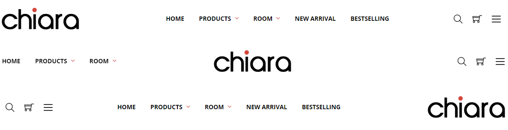
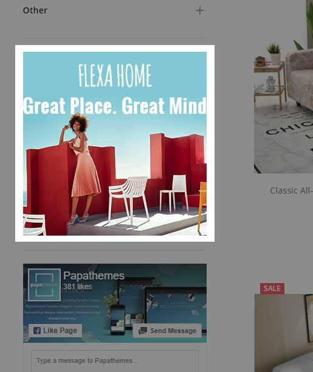
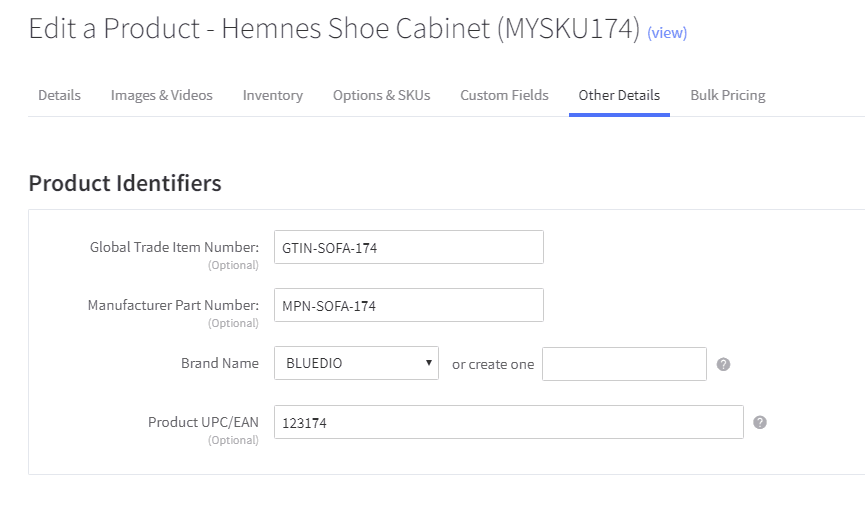
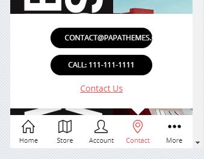

<div ng-app="app">
  <!-- Modal -->
  <div class="modal fade" id="chiara_home_banner1_modal" tabindex="-1" role="dialog" aria-labelledby="chiara_home_banner1_modal_label">
    <div class="modal-dialog" role="document">
      <div class="modal-content">
        <div class="modal-header">
          <button type="button" class="close" data-dismiss="modal" aria-label="Close"><span aria-hidden="true">&times;</span></button>
          <h4 class="modal-title" id="chiara_home_banner1_modal_label">Code Generator: Homepage 5 Banners</h4>
        </div>
        <div class="modal-body">
          <form>
            <div class="panel-group" id="chiara_home_banner1_accordion" role="tablist" aria-multiselectable="true">
              <div class="panel panel-default">
                <div class="panel-heading" role="tab" id="chiara_home_banner1_item1_heading">
                  <h4 class="panel-title">
                    <a role="button" data-toggle="collapse" data-parent="#chiara_home_banner1_accordion" href="#chiara_home_banner1_item1_collapse" aria-expanded="true" aria-controls="chiara_home_banner1_item1_collapse">
                      Banner 1
                    </a>
                  </h4>
                </div>
                <div id="chiara_home_banner1_item1_collapse" class="panel-collapse collapse in" role="tabpanel" aria-labelledby="chiara_home_banner1_item1_heading">
                  <div class="panel-body">
                    <div class="form-group">
                      <label for="chiara_home_banner1_item1_img_bg">Background Image URL:</label>
                      <input ng-model="item1_img_bg" type="text" class="form-control" id="chiara_home_banner1_item1_img_bg" ng-init="item1_img_bg='https://cdn7.bigcommerce.com/s-g0pakqdzwl/product_images/uploaded_images/furniture-banner1.jpg?t=1534872898'">
                    </div>
                    <div class="form-group">
                      <label for="chiara_home_banner1_item1_img_fg">Front Image URL:</label>
                      <input ng-model="item1_img_fg" type="text" class="form-control" id="chiara_home_banner1_item1_img_fg" ng-init="item1_img_fg='https://cdn7.bigcommerce.com/s-g0pakqdzwl/product_images/uploaded_images/furniture-banner1a.png?t=1534872899'">
                    </div>
                    <div class="form-group">
                      <label for="chiara_home_banner1_item1_alt">Image Alt:</label>
                      <input ng-model="item1_alt" type="text" class="form-control" id="chiara_home_banner1_item1_alt">
                    </div>
                    <div class="form-group">
                      <label for="chiara_home_banner1_item1_link">Link URL:</label>
                      <input ng-model="item1_link" type="text" class="form-control" id="chiara_home_banner1_item1_link">
                    </div>
                  </div>
                </div>
              </div>
              <div class="panel panel-default">
                <div class="panel-heading" role="tab" id="chiara_home_banner1_item2_heading">
                  <h4 class="panel-title">
                    <a class="collapsed" role="button" data-toggle="collapse" data-parent="#chiara_home_banner1_accordion" href="#chiara_home_banner1_item2_collapse" aria-expanded="false" aria-controls="chiara_home_banner1_item2_collapse">
                      Banner 2
                    </a>
                  </h4>
                </div>
                <div id="chiara_home_banner1_item2_collapse" class="panel-collapse collapse" role="tabpanel" aria-labelledby="chiara_home_banner1_item2_heading">
                  <div class="panel-body">
                    <div class="form-group">
                      <label for="chiara_home_banner1_item2_img_bg">Background Image URL:</label>
                      <input ng-model="item2_img_bg" type="text" class="form-control" id="chiara_home_banner1_item2_img_bg" ng-init="item2_img_bg='https://cdn7.bigcommerce.com/s-g0pakqdzwl/product_images/uploaded_images/furniture-banner2.jpg?t=1534872900'">
                    </div>
                    <div class="form-group">
                      <label for="chiara_home_banner1_item2_img_fg">Front Image URL:</label>
                      <input ng-model="item2_img_fg" type="text" class="form-control" id="chiara_home_banner1_item2_img_fg" ng-init="item2_img_fg='https://cdn7.bigcommerce.com/s-g0pakqdzwl/product_images/uploaded_images/furniture-banner2a.png?t=1534872900'">
                    </div>
                    <div class="form-group">
                      <label for="chiara_home_banner1_item2_alt">Image Alt:</label>
                      <input ng-model="item2_alt" type="text" class="form-control" id="chiara_home_banner1_item2_alt">
                    </div>
                    <div class="form-group">
                      <label for="chiara_home_banner1_item2_link">Link URL:</label>
                      <input ng-model="item2_link" type="text" class="form-control" id="chiara_home_banner1_item2_link">
                    </div>
                  </div>
                </div>
              </div>
              <div class="panel panel-default">
                <div class="panel-heading" role="tab" id="chiara_home_banner1_item3_heading">
                  <h4 class="panel-title">
                    <a class="collapsed" role="button" data-toggle="collapse" data-parent="#chiara_home_banner1_accordion" href="#chiara_home_banner1_item3_collapse" aria-expanded="false" aria-controls="chiara_home_banner1_item3_collapse">
                      Banner 3
                    </a>
                  </h4>
                </div>
                <div id="chiara_home_banner1_item3_collapse" class="panel-collapse collapse" role="tabpanel" aria-labelledby="chiara_home_banner1_item3_heading">
                  <div class="panel-body">
                    <div class="form-group">
                      <label for="chiara_home_banner1_item3_img_bg">Background Image URL:</label>
                      <input ng-model="item3_img_bg" type="text" class="form-control" id="chiara_home_banner1_item3_img_bg" ng-init="item3_img_bg='https://cdn7.bigcommerce.com/s-g0pakqdzwl/product_images/uploaded_images/furniture-banner2.jpg?t=1534872900'">
                    </div>
                    <div class="form-group">
                      <label for="chiara_home_banner1_item3_img_fg">Front Image URL:</label>
                      <input ng-model="item3_img_fg" type="text" class="form-control" id="chiara_home_banner1_item3_img_fg" ng-init="item3_img_fg='https://cdn7.bigcommerce.com/s-g0pakqdzwl/product_images/uploaded_images/furniture-banner2a.png?t=1534872900'">
                    </div>
                    <div class="form-group">
                      <label for="chiara_home_banner1_item3_alt">Image Alt:</label>
                      <input ng-model="item3_alt" type="text" class="form-control" id="chiara_home_banner1_item3_alt">
                    </div>
                    <div class="form-group">
                      <label for="chiara_home_banner1_item3_link">Link URL:</label>
                      <input ng-model="item3_link" type="text" class="form-control" id="chiara_home_banner1_item3_link">
                    </div>
                  </div>
                </div>
              </div>
              <div class="panel panel-default">
                <div class="panel-heading" role="tab" id="chiara_home_banner1_item4_heading">
                  <h4 class="panel-title">
                    <a class="collapsed" role="button" data-toggle="collapse" data-parent="#chiara_home_banner1_accordion" href="#chiara_home_banner1_item4_collapse" aria-expanded="false" aria-controls="chiara_home_banner1_item4_collapse">
                      Banner 4
                    </a>
                  </h4>
                </div>
                <div id="chiara_home_banner1_item4_collapse" class="panel-collapse collapse" role="tabpanel" aria-labelledby="chiara_home_banner1_item4_heading">
                  <div class="panel-body">
                    <div class="form-group">
                      <label for="chiara_home_banner1_item4_img_bg">Background Image URL:</label>
                      <input ng-model="item4_img_bg" type="text" class="form-control" id="chiara_home_banner1_item4_img_bg" ng-init="item4_img_bg='https://cdn7.bigcommerce.com/s-g0pakqdzwl/product_images/uploaded_images/furniture-banner2.jpg?t=1534872900'">
                    </div>
                    <div class="form-group">
                      <label for="chiara_home_banner1_item4_img_fg">Front Image URL:</label>
                      <input ng-model="item4_img_fg" type="text" class="form-control" id="chiara_home_banner1_item4_img_fg" ng-init="item4_img_fg='https://cdn7.bigcommerce.com/s-g0pakqdzwl/product_images/uploaded_images/furniture-banner2a.png?t=1534872900'">
                    </div>
                    <div class="form-group">
                      <label for="chiara_home_banner1_item4_alt">Image Alt:</label>
                      <input ng-model="item4_alt" type="text" class="form-control" id="chiara_home_banner1_item4_alt">
                    </div>
                    <div class="form-group">
                      <label for="chiara_home_banner1_item4_link">Link URL:</label>
                      <input ng-model="item4_link" type="text" class="form-control" id="chiara_home_banner1_item4_link">
                    </div>
                  </div>
                </div>
              </div>
              <div class="panel panel-default">
                <div class="panel-heading" role="tab" id="chiara_home_banner1_item5_heading">
                  <h4 class="panel-title">
                    <a class="collapsed" role="button" data-toggle="collapse" data-parent="#chiara_home_banner1_accordion" href="#chiara_home_banner1_item5_collapse" aria-expanded="false" aria-controls="chiara_home_banner1_item5_collapse">
                      Banner 5
                    </a>
                  </h4>
                </div>
                <div id="chiara_home_banner1_item5_collapse" class="panel-collapse collapse" role="tabpanel" aria-labelledby="chiara_home_banner1_item5_heading">
                  <div class="panel-body">
                    <div class="form-group">
                      <label for="chiara_home_banner1_item5_img_bg">Background Image URL:</label>
                      <input ng-model="item5_img_bg" type="text" class="form-control" id="chiara_home_banner1_item5_img_bg" ng-init="item5_img_bg='https://cdn7.bigcommerce.com/s-g0pakqdzwl/product_images/uploaded_images/furniture-banner2.jpg?t=1534872900'">
                    </div>
                    <div class="form-group">
                      <label for="chiara_home_banner1_item5_img_fg">Front Image URL:</label>
                      <input ng-model="item5_img_fg" type="text" class="form-control" id="chiara_home_banner1_item5_img_fg" ng-init="item5_img_fg='https://cdn7.bigcommerce.com/s-g0pakqdzwl/product_images/uploaded_images/furniture-banner2a.png?t=1534872900'">
                    </div>
                    <div class="form-group">
                      <label for="chiara_home_banner1_item5_alt">Image Alt:</label>
                      <input ng-model="item5_alt" type="text" class="form-control" id="chiara_home_banner1_item5_alt">
                    </div>
                    <div class="form-group">
                      <label for="chiara_home_banner1_item5_link">Link URL:</label>
                      <input ng-model="item5_link" type="text" class="form-control" id="chiara_home_banner1_item5_link">
                    </div>
                  </div>
                </div>
              </div>
            </div>
            <div hljs include="'/samples/chiara_home_banner1.txt'" compile="true" id="chiara_home_banner1_code" class="highlight-code"></div>
          </form>
        </div>
        <div class="modal-footer">
          <button type="button" class="btn btn-default" data-dismiss="modal">Close</button>
          <button type="button" class="btn btn-primary" data-clipboard-target="#chiara_home_banner1_code">Copy Code</button>
        </div>
      </div>
    </div>
  </div><!-- modal #chiara_home_banner1_modal -->
  <!-- Modal -->
  <div class="modal fade" id="chiara_home_banner2_modal" tabindex="-1" role="dialog" aria-labelledby="chiara_home_banner2_modal_label">
    <div class="modal-dialog" role="document">
      <div class="modal-content">
        <div class="modal-header">
          <button type="button" class="close" data-dismiss="modal" aria-label="Close"><span aria-hidden="true">&times;</span></button>
          <h4 class="modal-title" id="chiara_home_banner2_modal_label">Code Generator: Homepage Fullwidth Banner</h4>
        </div>
        <div class="modal-body">
          <form>
            <div class="panel-group" id="chiara_home_banner2_accordion" role="tablist" aria-multiselectable="true">
              <div class="panel panel-default">
                <div class="panel-heading" role="tab" id="chiara_home_banner2_item1_heading">
                  <h4 class="panel-title">
                    <a role="button" data-toggle="collapse" data-parent="#chiara_home_banner2_accordion" href="#chiara_home_banner2_item1_collapse" aria-expanded="true" aria-controls="chiara_home_banner2_item1_collapse">
                      Banner
                    </a>
                  </h4>
                </div>
                <div id="chiara_home_banner2_item1_collapse" class="panel-collapse collapse in" role="tabpanel" aria-labelledby="chiara_home_banner2_item1_heading">
                  <div class="panel-body">
                    <div class="form-group">
                      <label for="chiara_home_banner2_item1_img_bg">Background Image URL:</label>
                      <input ng-model="item1_img_bg" type="text" class="form-control" id="chiara_home_banner2_item1_img_bg" ng-init="item1_img_bg='https://cdn7.bigcommerce.com/s-g0pakqdzwl/product_images/uploaded_images/furniture-banner6.jpg?t=1534874551'">
                    </div>
                    <div class="form-group">
                      <label for="chiara_home_banner2_item1_img_fg">Front Image URL:</label>
                      <input ng-model="item1_img_fg" type="text" class="form-control" id="chiara_home_banner2_item1_img_fg" ng-init="item1_img_fg='https://cdn7.bigcommerce.com/s-g0pakqdzwl/product_images/uploaded_images/furniture-banner6a.png?t=1534874552'">
                    </div>
                    <div class="form-group">
                      <label for="chiara_home_banner2_item1_alt">Image Alt:</label>
                      <input ng-model="item1_alt" type="text" class="form-control" id="chiara_home_banner2_item1_alt">
                    </div>
                    <div class="form-group">
                      <label for="chiara_home_banner2_item1_link">Link URL:</label>
                      <input ng-model="item1_link" type="text" class="form-control" id="chiara_home_banner2_item1_link">
                    </div>
                  </div>
                </div>
              </div>
            </div>
            <div hljs include="'/samples/chiara_home_banner2.txt'" compile="true" id="chiara_home_banner2_code" class="highlight-code"></div>
          </form>
        </div>
        <div class="modal-footer">
          <button type="button" class="btn btn-default" data-dismiss="modal">Close</button>
          <button type="button" class="btn btn-primary" data-clipboard-target="#chiara_home_banner2_code">Copy Code</button>
        </div>
      </div>
    </div>
  </div><!-- modal #chiara_home_banner2_modal -->
  <!-- Modal -->
  <div class="modal fade" id="chiara_home_banner3_modal" tabindex="-1" role="dialog" aria-labelledby="chiara_home_banner3_modal_label">
    <div class="modal-dialog" role="document">
      <div class="modal-content">
        <div class="modal-header">
          <button type="button" class="close" data-dismiss="modal" aria-label="Close"><span aria-hidden="true">&times;</span></button>
          <h4 class="modal-title" id="chiara_home_banner3_modal_label">Code Generator: Images Carousel</h4>
        </div>
        <div class="modal-body">
          <form>
            <div class="panel-group" id="chiara_home_banner3_accordion" role="tablist" aria-multiselectable="true">
              <div class="panel panel-default">
                <div class="panel-heading" role="tab" id="chiara_home_banner3_item1_heading">
                  <h4 class="panel-title">
                    <a role="button" data-toggle="collapse" data-parent="#chiara_home_banner3_accordion" href="#chiara_home_banner3_item1_collapse" aria-expanded="true" aria-controls="chiara_home_banner3_item1_collapse">
                      Image 1
                    </a>
                  </h4>
                </div>
                <div id="chiara_home_banner3_item1_collapse" class="panel-collapse collapse in" role="tabpanel" aria-labelledby="chiara_home_banner3_item1_heading">
                  <div class="panel-body">
                    <div class="form-group">
                      <label for="chiara_home_banner3_item1_img">Background Image URL:</label>
                      <input ng-model="item1_img" type="text" class="form-control" id="chiara_home_banner3_item1_img" ng-init="item1_img='https://cdn7.bigcommerce.com/s-esi1aufjsk/product_images/uploaded_images/brand01.png'">
                    </div>
                    <div class="form-group">
                      <label for="chiara_home_banner3_item1_alt">Image Alt:</label>
                      <input ng-model="item1_alt" type="text" class="form-control" id="chiara_home_banner3_item1_alt">
                    </div>
                    <div class="form-group">
                      <label for="chiara_home_banner3_item1_link">Link URL:</label>
                      <input ng-model="item1_link" type="text" class="form-control" id="chiara_home_banner3_item1_link">
                    </div>
                  </div>
                </div>
              </div>
              <div class="panel panel-default">
                <div class="panel-heading" role="tab" id="chiara_home_banner3_item2_heading">
                  <h4 class="panel-title">
                    <a class="collapsed" role="button" data-toggle="collapse" data-parent="#chiara_home_banner3_accordion" href="#chiara_home_banner3_item2_collapse" aria-expanded="false" aria-controls="chiara_home_banner3_item2_collapse">
                      Image 2
                    </a>
                  </h4>
                </div>
                <div id="chiara_home_banner3_item2_collapse" class="panel-collapse collapse" role="tabpanel" aria-labelledby="chiara_home_banner3_item2_heading">
                  <div class="panel-body">
                    <div class="form-group">
                      <label for="chiara_home_banner3_item2_img">Background Image URL:</label>
                      <input ng-model="item2_img" type="text" class="form-control" id="chiara_home_banner3_item2_img" ng-init="item2_img='https://cdn7.bigcommerce.com/s-esi1aufjsk/product_images/uploaded_images/brand02.png'">
                    </div>
                    <div class="form-group">
                      <label for="chiara_home_banner3_item2_alt">Image Alt:</label>
                      <input ng-model="item2_alt" type="text" class="form-control" id="chiara_home_banner3_item2_alt">
                    </div>
                    <div class="form-group">
                      <label for="chiara_home_banner3_item2_link">Link URL:</label>
                      <input ng-model="item2_link" type="text" class="form-control" id="chiara_home_banner3_item2_link">
                    </div>
                  </div>
                </div>
              </div>
              <div class="panel panel-default">
                <div class="panel-heading" role="tab" id="chiara_home_banner3_item3_heading">
                  <h4 class="panel-title">
                    <a class="collapsed" role="button" data-toggle="collapse" data-parent="#chiara_home_banner3_accordion" href="#chiara_home_banner3_item3_collapse" aria-expanded="false" aria-controls="chiara_home_banner3_item3_collapse">
                      Image 3
                    </a>
                  </h4>
                </div>
                <div id="chiara_home_banner3_item3_collapse" class="panel-collapse collapse" role="tabpanel" aria-labelledby="chiara_home_banner3_item3_heading">
                  <div class="panel-body">
                    <div class="form-group">
                      <label for="chiara_home_banner3_item3_img">Background Image URL:</label>
                      <input ng-model="item3_img" type="text" class="form-control" id="chiara_home_banner3_item3_img" ng-init="item3_img='https://cdn7.bigcommerce.com/s-esi1aufjsk/product_images/uploaded_images/brand02.png'">
                    </div>
                    <div class="form-group">
                      <label for="chiara_home_banner3_item3_alt">Image Alt:</label>
                      <input ng-model="item3_alt" type="text" class="form-control" id="chiara_home_banner3_item3_alt">
                    </div>
                    <div class="form-group">
                      <label for="chiara_home_banner3_item3_link">Link URL:</label>
                      <input ng-model="item3_link" type="text" class="form-control" id="chiara_home_banner3_item3_link">
                    </div>
                  </div>
                </div>
              </div>
              <div class="panel panel-default">
                <div class="panel-heading" role="tab" id="chiara_home_banner3_item4_heading">
                  <h4 class="panel-title">
                    <a class="collapsed" role="button" data-toggle="collapse" data-parent="#chiara_home_banner3_accordion" href="#chiara_home_banner3_item4_collapse" aria-expanded="false" aria-controls="chiara_home_banner3_item4_collapse">
                      Image 4
                    </a>
                  </h4>
                </div>
                <div id="chiara_home_banner3_item4_collapse" class="panel-collapse collapse" role="tabpanel" aria-labelledby="chiara_home_banner3_item4_heading">
                  <div class="panel-body">
                    <div class="form-group">
                      <label for="chiara_home_banner3_item4_img">Background Image URL:</label>
                      <input ng-model="item4_img" type="text" class="form-control" id="chiara_home_banner3_item4_img" ng-init="item4_img='https://cdn7.bigcommerce.com/s-esi1aufjsk/product_images/uploaded_images/brand02.png'">
                    </div>
                    <div class="form-group">
                      <label for="chiara_home_banner3_item4_alt">Image Alt:</label>
                      <input ng-model="item4_alt" type="text" class="form-control" id="chiara_home_banner3_item4_alt">
                    </div>
                    <div class="form-group">
                      <label for="chiara_home_banner3_item4_link">Link URL:</label>
                      <input ng-model="item4_link" type="text" class="form-control" id="chiara_home_banner3_item4_link">
                    </div>
                  </div>
                </div>
              </div>
              <div class="panel panel-default">
                <div class="panel-heading" role="tab" id="chiara_home_banner3_item5_heading">
                  <h4 class="panel-title">
                    <a class="collapsed" role="button" data-toggle="collapse" data-parent="#chiara_home_banner3_accordion" href="#chiara_home_banner3_item5_collapse" aria-expanded="false" aria-controls="chiara_home_banner3_item5_collapse">
                      Image 5
                    </a>
                  </h4>
                </div>
                <div id="chiara_home_banner3_item5_collapse" class="panel-collapse collapse" role="tabpanel" aria-labelledby="chiara_home_banner3_item5_heading">
                  <div class="panel-body">
                    <div class="form-group">
                      <label for="chiara_home_banner3_item5_img">Background Image URL:</label>
                      <input ng-model="item5_img" type="text" class="form-control" id="chiara_home_banner3_item5_img" ng-init="item5_img='https://cdn7.bigcommerce.com/s-esi1aufjsk/product_images/uploaded_images/brand02.png'">
                    </div>
                    <div class="form-group">
                      <label for="chiara_home_banner3_item5_alt">Image Alt:</label>
                      <input ng-model="item5_alt" type="text" class="form-control" id="chiara_home_banner3_item5_alt">
                    </div>
                    <div class="form-group">
                      <label for="chiara_home_banner3_item5_link">Link URL:</label>
                      <input ng-model="item5_link" type="text" class="form-control" id="chiara_home_banner3_item5_link">
                    </div>
                  </div>
                </div>
              </div>
              <div class="panel panel-default">
                <div class="panel-heading" role="tab" id="chiara_home_banner3_item6_heading">
                  <h4 class="panel-title">
                    <a class="collapsed" role="button" data-toggle="collapse" data-parent="#chiara_home_banner3_accordion" href="#chiara_home_banner3_item6_collapse" aria-expanded="false" aria-controls="chiara_home_banner3_item6_collapse">
                      Image 6
                    </a>
                  </h4>
                </div>
                <div id="chiara_home_banner3_item6_collapse" class="panel-collapse collapse" role="tabpanel" aria-labelledby="chiara_home_banner3_item6_heading">
                  <div class="panel-body">
                    <div class="form-group">
                      <label for="chiara_home_banner3_item6_img">Background Image URL:</label>
                      <input ng-model="item6_img" type="text" class="form-control" id="chiara_home_banner3_item6_img" ng-init="item6_img='https://cdn7.bigcommerce.com/s-esi1aufjsk/product_images/uploaded_images/brand02.png'">
                    </div>
                    <div class="form-group">
                      <label for="chiara_home_banner3_item6_alt">Image Alt:</label>
                      <input ng-model="item6_alt" type="text" class="form-control" id="chiara_home_banner3_item6_alt">
                    </div>
                    <div class="form-group">
                      <label for="chiara_home_banner3_item6_link">Link URL:</label>
                      <input ng-model="item6_link" type="text" class="form-control" id="chiara_home_banner3_item6_link">
                    </div>
                  </div>
                </div>
              </div>
              <div class="panel panel-default">
                <div class="panel-heading" role="tab" id="chiara_home_banner3_item7_heading">
                  <h4 class="panel-title">
                    <a class="collapsed" role="button" data-toggle="collapse" data-parent="#chiara_home_banner3_accordion" href="#chiara_home_banner3_item7_collapse" aria-expanded="false" aria-controls="chiara_home_banner3_item7_collapse">
                      Image 7
                    </a>
                  </h4>
                </div>
                <div id="chiara_home_banner3_item7_collapse" class="panel-collapse collapse" role="tabpanel" aria-labelledby="chiara_home_banner3_item7_heading">
                  <div class="panel-body">
                    <div class="form-group">
                      <label for="chiara_home_banner3_item7_img">Background Image URL:</label>
                      <input ng-model="item7_img" type="text" class="form-control" id="chiara_home_banner3_item7_img" ng-init="item7_img='https://cdn7.bigcommerce.com/s-esi1aufjsk/product_images/uploaded_images/brand02.png'">
                    </div>
                    <div class="form-group">
                      <label for="chiara_home_banner3_item7_alt">Image Alt:</label>
                      <input ng-model="item7_alt" type="text" class="form-control" id="chiara_home_banner3_item7_alt">
                    </div>
                    <div class="form-group">
                      <label for="chiara_home_banner3_item7_link">Link URL:</label>
                      <input ng-model="item7_link" type="text" class="form-control" id="chiara_home_banner3_item7_link">
                    </div>
                  </div>
                </div>
              </div>
              <div class="panel panel-default">
                <div class="panel-heading" role="tab" id="chiara_home_banner3_item8_heading">
                  <h4 class="panel-title">
                    <a class="collapsed" role="button" data-toggle="collapse" data-parent="#chiara_home_banner3_accordion" href="#chiara_home_banner3_item8_collapse" aria-expanded="false" aria-controls="chiara_home_banner3_item8_collapse">
                      Image 8
                    </a>
                  </h4>
                </div>
                <div id="chiara_home_banner3_item8_collapse" class="panel-collapse collapse" role="tabpanel" aria-labelledby="chiara_home_banner3_item8_heading">
                  <div class="panel-body">
                    <div class="form-group">
                      <label for="chiara_home_banner3_item8_img">Background Image URL:</label>
                      <input ng-model="item8_img" type="text" class="form-control" id="chiara_home_banner3_item8_img" ng-init="item8_img='https://cdn7.bigcommerce.com/s-esi1aufjsk/product_images/uploaded_images/brand02.png'">
                    </div>
                    <div class="form-group">
                      <label for="chiara_home_banner3_item8_alt">Image Alt:</label>
                      <input ng-model="item8_alt" type="text" class="form-control" id="chiara_home_banner3_item8_alt">
                    </div>
                    <div class="form-group">
                      <label for="chiara_home_banner3_item8_link">Link URL:</label>
                      <input ng-model="item8_link" type="text" class="form-control" id="chiara_home_banner3_item8_link">
                    </div>
                  </div>
                </div>
              </div>
              <div class="panel panel-default">
                <div class="panel-heading" role="tab" id="chiara_home_banner3_item9_heading">
                  <h4 class="panel-title">
                    <a class="collapsed" role="button" data-toggle="collapse" data-parent="#chiara_home_banner3_accordion" href="#chiara_home_banner3_item9_collapse" aria-expanded="false" aria-controls="chiara_home_banner3_item9_collapse">
                      Image 9
                    </a>
                  </h4>
                </div>
                <div id="chiara_home_banner3_item9_collapse" class="panel-collapse collapse" role="tabpanel" aria-labelledby="chiara_home_banner3_item9_heading">
                  <div class="panel-body">
                    <div class="form-group">
                      <label for="chiara_home_banner3_item9_img">Background Image URL:</label>
                      <input ng-model="item9_img" type="text" class="form-control" id="chiara_home_banner3_item9_img" ng-init="item9_img='https://cdn7.bigcommerce.com/s-esi1aufjsk/product_images/uploaded_images/brand02.png'">
                    </div>
                    <div class="form-group">
                      <label for="chiara_home_banner3_item9_alt">Image Alt:</label>
                      <input ng-model="item9_alt" type="text" class="form-control" id="chiara_home_banner3_item9_alt">
                    </div>
                    <div class="form-group">
                      <label for="chiara_home_banner3_item9_link">Link URL:</label>
                      <input ng-model="item9_link" type="text" class="form-control" id="chiara_home_banner3_item9_link">
                    </div>
                  </div>
                </div>
              </div>
              <div class="panel panel-default">
                <div class="panel-heading" role="tab" id="chiara_home_banner3_item10_heading">
                  <h4 class="panel-title">
                    <a class="collapsed" role="button" data-toggle="collapse" data-parent="#chiara_home_banner3_accordion" href="#chiara_home_banner3_item10_collapse" aria-expanded="false" aria-controls="chiara_home_banner3_item10_collapse">
                      Image 10
                    </a>
                  </h4>
                </div>
                <div id="chiara_home_banner3_item10_collapse" class="panel-collapse collapse" role="tabpanel" aria-labelledby="chiara_home_banner3_item10_heading">
                  <div class="panel-body">
                    <div class="form-group">
                      <label for="chiara_home_banner3_item10_img">Background Image URL:</label>
                      <input ng-model="item10_img" type="text" class="form-control" id="chiara_home_banner3_item10_img" ng-init="item10_img='https://cdn7.bigcommerce.com/s-esi1aufjsk/product_images/uploaded_images/brand02.png'">
                    </div>
                    <div class="form-group">
                      <label for="chiara_home_banner3_item10_alt">Image Alt:</label>
                      <input ng-model="item10_alt" type="text" class="form-control" id="chiara_home_banner3_item10_alt">
                    </div>
                    <div class="form-group">
                      <label for="chiara_home_banner3_item10_link">Link URL:</label>
                      <input ng-model="item10_link" type="text" class="form-control" id="chiara_home_banner3_item10_link">
                    </div>
                  </div>
                </div>
              </div>
            </div>
            <div hljs include="'/samples/chiara_home_banner3.txt'" compile="true" id="chiara_home_banner3_code" class="highlight-code"></div>
          </form>
        </div>
        <div class="modal-footer">
          <button type="button" class="btn btn-default" data-dismiss="modal">Close</button>
          <button type="button" class="btn btn-primary" data-clipboard-target="#chiara_home_banner3_code">Copy Code</button>
        </div>
      </div>
    </div>
  </div><!-- modal #chiara_home_banner3_modal -->
  <!-- Modal -->
  <div class="modal fade" id="chiara_sidebar_category_banner1_modal" tabindex="-1" role="dialog" aria-labelledby="chiara_sidebar_category_banner1_modal_label">
    <div class="modal-dialog" role="document">
      <div class="modal-content">
        <div class="modal-header">
          <button type="button" class="close" data-dismiss="modal" aria-label="Close"><span aria-hidden="true">&times;</span></button>
          <h4 class="modal-title" id="chiara_sidebar_category_banner1_modal_label">Code Generator: Sidebar Category Banner 1</h4>
        </div>
        <div class="modal-body">
          <form>
            <div class="panel-group" id="chiara_sidebar_category_banner1_accordion" role="tablist" aria-multiselectable="true">
              <div class="panel panel-default">
                <div class="panel-heading" role="tab" id="chiara_sidebar_category_banner1_item1_heading">
                  <h4 class="panel-title">
                    <a role="button" data-toggle="collapse" data-parent="#chiara_sidebar_category_banner1_accordion" href="#chiara_sidebar_category_banner1_item1_collapse" aria-expanded="true" aria-controls="chiara_sidebar_category_banner1_item1_collapse">
                      Image
                    </a>
                  </h4>
                </div>
                <div id="chiara_sidebar_category_banner1_item1_collapse" class="panel-collapse collapse in" role="tabpanel" aria-labelledby="chiara_sidebar_category_banner1_item1_heading">
                  <div class="panel-body">
                    <div class="form-group">
                      <label for="chiara_sidebar_category_banner1_item1_img">Image URL:</label>
                      <input ng-model="item1_img" type="text" class="form-control" id="chiara_sidebar_category_banner1_item1_img" ng-init="item1_img='https://cdn7.bigcommerce.com/s-esi1aufjsk/product_images/uploaded_images/brand01.png'">
                    </div>
                    <div class="form-group">
                      <label for="chiara_sidebar_category_banner1_item1_alt">Image Alt:</label>
                      <input ng-model="item1_alt" type="text" class="form-control" id="chiara_sidebar_category_banner1_item1_alt">
                    </div>
                    <div class="form-group">
                      <label for="chiara_sidebar_category_banner1_item1_link">Link URL:</label>
                      <input ng-model="item1_link" type="text" class="form-control" id="chiara_sidebar_category_banner1_item1_link">
                    </div>
                  </div>
                </div>
              </div>
            </div>
            <div hljs include="'/samples/chiara_sidebar_category_banner1.txt'" compile="true" id="chiara_sidebar_category_banner1_code" class="highlight-code"></div>
          </form>
        </div>
        <div class="modal-footer">
          <button type="button" class="btn btn-default" data-dismiss="modal">Close</button>
          <button type="button" class="btn btn-primary" data-clipboard-target="#chiara_sidebar_category_banner1_code">Copy Code</button>
        </div>
      </div>
    </div>
  </div><!-- modal #chiara_sidebar_category_banner1_modal -->
  <!-- Modal -->
  <div class="modal fade" id="chiara_sidebar_category_banner2_modal" tabindex="-1" role="dialog" aria-labelledby="chiara_sidebar_category_banner2_modal_label">
    <div class="modal-dialog" role="document">
      <div class="modal-content">
        <div class="modal-header">
          <button type="button" class="close" data-dismiss="modal" aria-label="Close"><span aria-hidden="true">&times;</span></button>
          <h4 class="modal-title" id="chiara_sidebar_category_banner2_modal_label">Code Generator: Sidebar Category Banner 2</h4>
        </div>
        <div class="modal-body">
          <form>
            <div class="panel-group" id="chiara_sidebar_category_banner2_accordion" role="tablist" aria-multiselectable="true">
              <div class="panel panel-default">
                <div class="panel-heading" role="tab" id="chiara_sidebar_category_banner2_item1_heading">
                  <h4 class="panel-title">
                    <a role="button" data-toggle="collapse" data-parent="#chiara_sidebar_category_banner2_accordion" href="#chiara_sidebar_category_banner2_item1_collapse" aria-expanded="true" aria-controls="chiara_sidebar_category_banner2_item1_collapse">
                      Image
                    </a>
                  </h4>
                </div>
                <div id="chiara_sidebar_category_banner2_item1_collapse" class="panel-collapse collapse in" role="tabpanel" aria-labelledby="chiara_sidebar_category_banner2_item1_heading">
                  <div class="panel-body">
                    <div class="form-group">
                      <label for="chiara_sidebar_category_banner2_item1_img">Image URL:</label>
                      <input ng-model="item1_img" type="text" class="form-control" id="chiara_sidebar_category_banner2_item1_img" ng-init="item1_img='https://cdn7.bigcommerce.com/s-esi1aufjsk/product_images/uploaded_images/brand01.png'">
                    </div>
                    <div class="form-group">
                      <label for="chiara_sidebar_category_banner2_item1_alt">Image Alt:</label>
                      <input ng-model="item1_alt" type="text" class="form-control" id="chiara_sidebar_category_banner2_item1_alt">
                    </div>
                    <div class="form-group">
                      <label for="chiara_sidebar_category_banner2_item1_link">Link URL:</label>
                      <input ng-model="item1_link" type="text" class="form-control" id="chiara_sidebar_category_banner2_item1_link">
                    </div>
                  </div>
                </div>
              </div>
            </div>
            <div hljs include="'/samples/chiara_sidebar_category_banner2.txt'" compile="true" id="chiara_sidebar_category_banner2_code" class="highlight-code"></div>
          </form>
        </div>
        <div class="modal-footer">
          <button type="button" class="btn btn-default" data-dismiss="modal">Close</button>
          <button type="button" class="btn btn-primary" data-clipboard-target="#chiara_sidebar_category_banner2_code">Copy Code</button>
        </div>
      </div>
    </div>
  </div><!-- modal #chiara_sidebar_category_banner2_modal -->
  <!-- Modal -->
  <div class="modal fade" id="chiara_sidebar_brand_banner1_modal" tabindex="-1" role="dialog" aria-labelledby="chiara_sidebar_brand_banner1_modal_label">
    <div class="modal-dialog" role="document">
      <div class="modal-content">
        <div class="modal-header">
          <button type="button" class="close" data-dismiss="modal" aria-label="Close"><span aria-hidden="true">&times;</span></button>
          <h4 class="modal-title" id="chiara_sidebar_brand_banner1_modal_label">Code Generator: Sidebar Brand Banner 1</h4>
        </div>
        <div class="modal-body">
          <form>
            <div class="panel-group" id="chiara_sidebar_brand_banner1_accordion" role="tablist" aria-multiselectable="true">
              <div class="panel panel-default">
                <div class="panel-heading" role="tab" id="chiara_sidebar_brand_banner1_item1_heading">
                  <h4 class="panel-title">
                    <a role="button" data-toggle="collapse" data-parent="#chiara_sidebar_brand_banner1_accordion" href="#chiara_sidebar_brand_banner1_item1_collapse" aria-expanded="true" aria-controls="chiara_sidebar_brand_banner1_item1_collapse">
                      Image
                    </a>
                  </h4>
                </div>
                <div id="chiara_sidebar_brand_banner1_item1_collapse" class="panel-collapse collapse in" role="tabpanel" aria-labelledby="chiara_sidebar_brand_banner1_item1_heading">
                  <div class="panel-body">
                    <div class="form-group">
                      <label for="chiara_sidebar_brand_banner1_item1_img">Image URL:</label>
                      <input ng-model="item1_img" type="text" class="form-control" id="chiara_sidebar_brand_banner1_item1_img" ng-init="item1_img='https://cdn7.bigcommerce.com/s-esi1aufjsk/product_images/uploaded_images/brand01.png'">
                    </div>
                    <div class="form-group">
                      <label for="chiara_sidebar_brand_banner1_item1_alt">Image Alt:</label>
                      <input ng-model="item1_alt" type="text" class="form-control" id="chiara_sidebar_brand_banner1_item1_alt">
                    </div>
                    <div class="form-group">
                      <label for="chiara_sidebar_brand_banner1_item1_link">Link URL:</label>
                      <input ng-model="item1_link" type="text" class="form-control" id="chiara_sidebar_brand_banner1_item1_link">
                    </div>
                  </div>
                </div>
              </div>
            </div>
            <div hljs include="'/samples/chiara_sidebar_brand_banner1.txt'" compile="true" id="chiara_sidebar_brand_banner1_code" class="highlight-code"></div>
          </form>
        </div>
        <div class="modal-footer">
          <button type="button" class="btn btn-default" data-dismiss="modal">Close</button>
          <button type="button" class="btn btn-primary" data-clipboard-target="#chiara_sidebar_brand_banner1_code">Copy Code</button>
        </div>
      </div>
    </div>
  </div><!-- modal #chiara_sidebar_brand_banner1_modal -->
  <!-- Modal -->
  <div class="modal fade" id="chiara_sidebar_brand_banner2_modal" tabindex="-1" role="dialog" aria-labelledby="chiara_sidebar_brand_banner2_modal_label">
    <div class="modal-dialog" role="document">
      <div class="modal-content">
        <div class="modal-header">
          <button type="button" class="close" data-dismiss="modal" aria-label="Close"><span aria-hidden="true">&times;</span></button>
          <h4 class="modal-title" id="chiara_sidebar_brand_banner2_modal_label">Code Generator: Sidebar Brand Banner 2</h4>
        </div>
        <div class="modal-body">
          <form>
            <div class="panel-group" id="chiara_sidebar_brand_banner2_accordion" role="tablist" aria-multiselectable="true">
              <div class="panel panel-default">
                <div class="panel-heading" role="tab" id="chiara_sidebar_brand_banner2_item1_heading">
                  <h4 class="panel-title">
                    <a role="button" data-toggle="collapse" data-parent="#chiara_sidebar_brand_banner2_accordion" href="#chiara_sidebar_brand_banner2_item1_collapse" aria-expanded="true" aria-controls="chiara_sidebar_brand_banner2_item1_collapse">
                      Image
                    </a>
                  </h4>
                </div>
                <div id="chiara_sidebar_brand_banner2_item1_collapse" class="panel-collapse collapse in" role="tabpanel" aria-labelledby="chiara_sidebar_brand_banner2_item1_heading">
                  <div class="panel-body">
                    <div class="form-group">
                      <label for="chiara_sidebar_brand_banner2_item1_img">Image URL:</label>
                      <input ng-model="item1_img" type="text" class="form-control" id="chiara_sidebar_brand_banner2_item1_img" ng-init="item1_img='https://cdn7.bigcommerce.com/s-esi1aufjsk/product_images/uploaded_images/brand01.png'">
                    </div>
                    <div class="form-group">
                      <label for="chiara_sidebar_brand_banner2_item1_alt">Image Alt:</label>
                      <input ng-model="item1_alt" type="text" class="form-control" id="chiara_sidebar_brand_banner2_item1_alt">
                    </div>
                    <div class="form-group">
                      <label for="chiara_sidebar_brand_banner2_item1_link">Link URL:</label>
                      <input ng-model="item1_link" type="text" class="form-control" id="chiara_sidebar_brand_banner2_item1_link">
                    </div>
                  </div>
                </div>
              </div>
            </div>
            <div hljs include="'/samples/chiara_sidebar_brand_banner2.txt'" compile="true" id="chiara_sidebar_brand_banner2_code" class="highlight-code"></div>
          </form>
        </div>
        <div class="modal-footer">
          <button type="button" class="btn btn-default" data-dismiss="modal">Close</button>
          <button type="button" class="btn btn-primary" data-clipboard-target="#chiara_sidebar_brand_banner2_code">Copy Code</button>
        </div>
      </div>
    </div>
  </div><!-- modal #chiara_sidebar_brand_banner2_modal -->
</div>


# Customization


## Header



Theme supports 3 header with logo position left, right or center. It is configured in **Theme Editor** > **Header & Footer** > **Logo position**.

You can configure Header style, logo size, colors, fonts in **Theme Editor** > **Header & Footer**.

## Mega Menu vs. Standard Menu


Theme supports both Mega Menu and Standard Menu. You can configure in **Theme Editor** > **Header & Footer** > **Main Navigation** > **Navigation design**.

The menu is automatically popuplated from your product categories and web pages (in **Storefront** > **Web Pages**). You can hide all web pages on this menu by tick on the option **Hide web pages in main navigation** in **Theme Editor** > **Header & Footer**.

## Top Banner


You can edit the top banner on the homepage, category pages, product pages in **Marketing** > **Banner Manager**.


## Footer


Configure the footer in **Theme Editor** > **Footer** section.

* You can change colors.
* Show/hide web page links, categories, brands.
* Add custom links in maximum 3 columns.
* Newsletter form support top or right position of the footer.
* Change colors of the copyright section.
* Show/hide copyright links.
* Show/hide payment icons.


## Home Page

### Customizing Sections

You can customize the content display on Home Page, rearrange content blocks, show or hide them from **Theme Editor** > **Home Page** > **Sections**.

Check out this video for quick start:

<iframe width="560" height="315" src="https://www.youtube.com/embed/CvSspnJlfTo" frameborder="0" allow="accelerometer; autoplay; encrypted-media; gyroscope; picture-in-picture" allowfullscreen></iframe>


### Main Carousel


Main carousel displays on the home page can be input in **Storefront** > **Home Page Carousel**.

You can configure carousel settings in **Theme Editor** > **Home Page** > **Carousel** section. Here you can turn on/off this carousel, configure colors, content position and so on.

Our recommended image size is **1920x770px**.


### 5 Banners below the main carousel


#### New Solution: Using Widgets

Install [PapaThemes Widgets](https://www.bigcommerce.com/apps/papathemes-widgets/) app to your store. In PapaThemes Widgets app, install all widgets.

Go to **Page Builder** > **Widgets** tab, drag and drop 2 **Flex Banners | PapaThemes Chiara** widget into a particular widget region.

Configure the widget like the screenshot below:


#### Old Solution: Using Marketing Banners

Create a new banner in **Marketing** > **Banners**.

* **Banner Name**: `5 banners below the main carousel (home-banner1)`
* **Banner Content**: Click on the HTML to edit HTML source.

```html
<div class="chiara-section chiara-section--banners" data-local-banner-position="chiara-home-banner1">
    <div class="chiara-banners">
        <ul class="chiara-banners-list">
            <li class="chiara-banners-item"><a href="#"></a></li>
            <li class="chiara-banners-item"><a href="#"></a></li>
            <li class="chiara-banners-item"><a href="#"></a></li>
        </ul>
        <ul class="chiara-banners-list">
            <li class="chiara-banners-item"><a href="#"></a></li>
            <li class="chiara-banners-item"><a href="#"></a></li>
        </ul>
    </div>
</div>
```

Or use button below to generate HTML code with your custom content:

<!-- Button trigger modal -->
<button type="button" class="btn btn-primary btn-lg" data-toggle="modal" data-target="#chiara_home_banner1_modal">
  Launch Banner Code Generator
</button>

* **Show on Page**: `Home Page`
* **Location**: `Top of Page`

Our recommended image size is **496x431px** for the first row and **747x430px** for the second row.

Check out the video step by step how to create these banners:

<iframe width="560" height="315" src="https://www.youtube.com/embed/m8wSJxzYJJI" frameborder="0" allow="accelerometer; autoplay; encrypted-media; gyroscope; picture-in-picture" allowfullscreen></iframe>


### Fullwidth Banner


#### New Solution: Using Widgets

Install [PapaThemes Widgets](https://www.bigcommerce.com/apps/papathemes-widgets/) app to your store. In PapaThemes Widgets app, install all widgets.

Go to **Page Builder** > **Widgets** tab, drag and drop **Flex Banners | PapaThemes Chiara** widget into a particular widget region. Delete other slides, keep the first slide only.

Configure the widget like the screenshot below:


#### Old Solution: Using Marketing Banners

Create a new banner in **Marketing** > **Banners**.

* **Banner Name**: `Full width banner (home-banner2)`
* **Banner Content**: Click on the HTML to edit HTML source.

```html
<div class="chiara-section chiara-section--banners" data-local-banner-position="chiara-home-banner2">
    <div class="chiara-banners">
        <ul class="chiara-banners-list">
            <li class="chiara-banners-item"><a href="#"></a></li>
        </ul>
    </div>
</div>
```

Or use button below to generate HTML code with your custom content:

<!-- Button trigger modal -->
<button type="button" class="btn btn-primary btn-lg" data-toggle="modal" data-target="#chiara_home_banner2_modal">
  Launch Banner Code Generator
</button>

* **Show on Page**: `Home Page`
* **Location**: `Top of Page`

Our recommended image size is **1500x306px**.


### New / Featured / Bestselling Products

**Default style:**


**Parallax style:**


Configure New Products, Featured Products, Bestselling Products showing on the home page in **Theme Editor** > **Homepage**:

* Number of products to display.
* Heading of the new, featured, bestselling product blocks.
* Sub-heading.
* Columns (number of products per row).
* Columns on tablet.
* Columns on mobile.
* Type (Grid or List).
* Style (default or parallax).

Our recommended parallax background image size is **1720x450px**.


### Categories List


Configure categories list in **Theme Editor** > **Homepage** > **Categories List**:

* **Categories ID**: input your category IDs seperated by a comma. If not specify, categories will be display in default order automatically. Example: `40,25`. Also check [How to find category ID](https://bit.ly/2LrjUjh).
* **Number of categories** to display.
* **Number of sub-categories** to display.
* **Heading**
* **Subheading**
* **Show banners?** If checked, input the banner image urls in the below input boxes to display beside the category names.
* **Banner 1** to **Banner 10**: Upload your banner images in **Storefront** > **Image Manager** and copy links to here. Example: `/product_images/uploaded_images/furniture-home-cat1.jpg`. Recommended image size is **400x572px**. For **Fashion** style, recommended image size is **400x454px**.
* **Show on desktop?**
* **Show on tablet?**
* **Show on mobile?**


Check out this video how to display the images:

<iframe width="560" height="315" src="https://www.youtube.com/embed/FQ06yPF5qwY" frameborder="0" allow="accelerometer; autoplay; encrypted-media; gyroscope; picture-in-picture" allowfullscreen></iframe>


### Recent Blog Posts


Configure Recent Blog section on the home page in **Theme Editor** > **Home Page** > **Recent Blog**:

* **Number of posts**
* **Display Type**
* **Heading**
* **Subheading**

All blog images should have same size to have the best visual display. No image size is restricted.


### Instagram Photos Feed


The old Instagram API has been retired from Oct 15 2019. We've built another tool: <https://papathemes.com/embed-instagram-photos-on-bigcommerce-shopify-wordpress/>

Please use this tool to generate the custom code snippet. For example your generated code is:

```html
<script>!function(){var e=document.createElement("script");e.defer=!0,e.src="https://papathemes.s3.amazonaws.com/instagramapp/assets/js/embed-1.0.1.js",e.onload=function(){PapathemesInstagramApp.init({account_id:"XXXXXXXXXXXXXXXXXXXX",element_id:"papainstagram-render",limit:"12",preset:"grid"})},document.body.appendChild(e)}();</script>
```

Create a new banner in **Marketing** > **Banners** > click <button disabled>**Create a Banner**</button> button.

Click <button disabled>**HTML**</button> in **Banner Content** editor to open **HTML Source Editor**:

Insert to code below:

```html
<h2 class="page-heading">INSTAGRAM</h2>
<p class="page-subheading">Follow us on instagram</p>
<div id="papainstagram-render">&nbsp;</div>

<script type="text/javascript">// <![CDATA[
(function() {
var style = document.createElement('style');
style.innerHTML = '.banners[data-banner-location="bottom"] { background-color: transparent } .papainstagram-card-body { display: none }';
document.head.appendChild(style);
})();
// ]]></script>
```

Then insert the generated code after:

```html
<script>!function(){var e=document.createElement("script");e.defer=!0,e.src="https://papathemes.s3.amazonaws.com/instagramapp/assets/js/embed-1.0.1.js",e.onload=function(){PapathemesInstagramApp.init({account_id:"XXXXXXXXXXXXXXXXXXXX",element_id:"papainstagram-render",limit:"12",preset:"grid"})},document.body.appendChild(e)}();</script>
```

The banner content code should like below screenshot:


Click <button disabled>**Update**</button>.


Choose other options:

- **Show on Page**: `Home Page`
- **Visible**: `Yes`
- **Location**: `Bottom of Page`

Then click <button disabled>**Save**</button> to save your banner.


### Images Carousel or Brands Carousel


#### New Solution: Using Widgets

Install [PapaThemes Widgets](https://www.bigcommerce.com/apps/papathemes-widgets/) app to your store. In PapaThemes Widgets app, install all widgets.

Go to **Page Builder** > **Widgets** tab, drag and drop **Flex Banners | PapaThemes Chiara** widget into a particular widget region.

Configure the widget like the screenshot below:


#### Old Solution: Using Marketing Banners

To display the images carousel, create a new banner in **Marketing** > **Banners**:

* **Banner Name**: `Brands carousel (home-banner3)`
* **Banner Content**: Click on the HTML to edit HTML source.

```html
<div class="chiara-section chiara-section--brandsCarousel" data-local-banner-position="chiara-home-banner3">
    <div class="chiara-brandsCarousel">
        <ul class="chiara-brandsCarousel-slider" data-brands-slick="">
            <li class="chiara-brandsCarousel-item"><a href="#"></a></li>
            <li class="chiara-brandsCarousel-item"><a href="#"></a></li>
            <li class="chiara-brandsCarousel-item"><a href="#"></a></li>
            <li class="chiara-brandsCarousel-item"><a href="#"></a></li>
            <li class="chiara-brandsCarousel-item"><a href="#"></a></li>
            <li class="chiara-brandsCarousel-item"><a href="#"></a></li>
            <li class="chiara-brandsCarousel-item"><a href="#"></a></li>
            <li class="chiara-brandsCarousel-item"><a href="#"></a></li>
            <li class="chiara-brandsCarousel-item"><a href="#"></a></li>
            <li class="chiara-brandsCarousel-item"><a href="#"></a></li>
        </ul>
    </div>
</div>
```

Or use button below to generate HTML code with your custom content:

<!-- Button trigger modal -->
<button type="button" class="btn btn-primary btn-lg" data-toggle="modal" data-target="#chiara_home_banner3_modal">
  Launch Banner Code Generator
</button>

* **Show on Page**: `Home Page`
* **Location**: `Top of Page`

Our recommended image size is **220x100px**.

### Products By Category Widget

To display products by category, drag the HTML widget to any region. Input the code below to the HTML widget content:

```html
<div class="chiara-section chiara-section--products chiara-section--productsByCategory" data-products-by-category data-url="/new-arrival" data-type="carousel">
    <div class="chiara-products" data-content>
        <h2 class="page-heading">CATEGORY NAME</h2>
        <p class="page-subheading">Short description here</p>
        <div data-loader style="height:300px;display:flex;align-items:center;justify-content:center;text-align:center">
            </span>
        </div>
    </div>
</div>
```

- Replace `CATEGORY NAME` by the category name.
- Replace `Short description here` by your custom text.
- Edit the category URL in `data-products-by-category data-url="/new-arrival"`. In this example, the category URL is `/new-arrival`.
- Edit the products display type in `data-type="carousel"`. Support `carousel` and `grid`.

**New Solution**: Alternately, you can use Products Feed widget from our PapaThemes Widgets app.


## Category & Brand Pages

To display custom banners on category pages or brand pages, create a new banner in **Marketing** > **Banners**:

### Top & bottom banners on all categories


- In **Banner Content**, click HTML button to input HTML code:

```html
<!--
  -- TOP BANNER ABOVE PRODUCTS LIST
  -->
<div data-remote-banner-position="chiara-category-banner1"><a href="#"></a></div>

<!--
  -- BOTTOM BANNER BELOW PRODUCTS LIST
  -->
<div data-remote-banner-position="chiara-category-banner3"><a href="#"></a></div>
```

- **Show on Page**: choose `Search Results Page` - **IMPORTANT**.
- **Location**: `Top of Page`.


Our recommended image size is **1500x360px**.


Watch this video for a step by step tutorial:

<iframe width="560" height="315" src="https://www.youtube.com/embed/he297sHxfKA" frameborder="0" allow="accelerometer; autoplay; encrypted-media; gyroscope; picture-in-picture" allowfullscreen></iframe>


### Top & bottom banners on a specific category

Edit the category, in **Description** field, click HTML button to input HTML code:

```html
<!--
  -- TOP BANNERS ABOVE PRODUCTS LIST
  -->
<div class="chiara-banners u-hiddenVisually-mobile" data-local-banner-position="chiara-category-banner2">
<ul class="chiara-banners-list">
<li class="chiara-banners-item"><a href="#"></a></li>
<li class="chiara-banners-item"><a href="#"></a></li>
<li class="chiara-banners-item"><a href="#"></a></li>
</ul>
</div>

<!--
  -- BOTTOM BANNERS BELOW PRODUCTS LIST
  -->
<div class="chiara-banners u-hiddenVisually-mobile" data-local-banner-position="chiara-category-banner4">
<ul class="chiara-banners-list">
<li class="chiara-banners-item"><a href="#"></a></li>
<li class="chiara-banners-item"><a href="#"></a></li>
<li class="chiara-banners-item"><a href="#"></a></li>
</ul>
</div>
```

Our recommended image size is **670x520px**.


### Top banner on all brands

- In **Banner Content**, click HTML button to input HTML code:

```html
<div data-remote-banner-position="chiara-brand-banner1"><a href="#"></a></div>
```


- **Show on Page**: `Search Results Page`
- **Location**: `Top of Page`


### Custom banners on the sidebar

Theme support custom banners display on the sidebar for category pages and brand pages.

To enable these banners, open **Theme Editor** > **Sidebar**, tick on these options:

* **Show banner #1 on category pages**
* **Show banner #2 on category pages**
* **Show banner #1 on brand pages**
* **Show banner #2 on brand pages**

Create a new banner in **Marketing** > **Banners**:

#### Banner 1 on category pages



* **Banner Name**: `Sidebar banner on category pages (chiara-sidebar-category-banner1)`
* **Banner Content**: Click on the HTML to edit HTML source.

```html
<p data-remote-banner-position="chiara-sidebar-category-banner1"><a href="#"></a></p>
```
Or use button below to generate HTML code with your custom content:

<!-- Button trigger modal -->
<button type="button" class="btn btn-primary btn-lg" data-toggle="modal" data-target="#chiara_sidebar_category_banner1_modal">
  Launch Banner Code Generator
</button>

* **Show on Page**: `Search Results Page`
* **Location**: `Top of Page`

Our recommended image size is **302x302px**.


#### Banner 2 on category pages


* **Banner Name**: `Sidebar banner on category pages (chiara-sidebar-category-banner2)`
* **Banner Content**: Click on the HTML to edit HTML source.

```html
<p data-remote-banner-position="chiara-sidebar-category-banner2"><a href="#"></a></p>
```
Or use button below to generate HTML code with your custom content:

<!-- Button trigger modal -->
<button type="button" class="btn btn-primary btn-lg" data-toggle="modal" data-target="#chiara_sidebar_category_banner2_modal">
  Launch Banner Code Generator
</button>

* **Show on Page**: `Search Results Page`
* **Location**: `Top of Page`

Our recommended image size is **302x500px**.


#### Banner 1 on brand pages

* **Banner Name**: `Sidebar banner on brand pages (chiara-sidebar-brand-banner1)`
* **Banner Content**: Click on the HTML to edit HTML source.

```html
<p data-remote-banner-position="chiara-sidebar-brand-banner1"><a href="#"></a></p>
```
Or use button below to generate HTML code with your custom content:

<!-- Button trigger modal -->
<button type="button" class="btn btn-primary btn-lg" data-toggle="modal" data-target="#chiara_sidebar_brand_banner1_modal">
  Launch Banner Code Generator
</button>

* **Show on Page**: `Search Results Page`
* **Location**: `Top of Page`


#### Banner 2 on brand pages

* **Banner Name**: `Sidebar banner on brand pages (chiara-sidebar-brand-banner2)`
* **Banner Content**: Click on the HTML to edit HTML source.

```html
<p data-remote-banner-position="chiara-sidebar-brand-banner2"><a href="#"></a></p>
```
Or use button below to generate HTML code with your custom content:

<!-- Button trigger modal -->
<button type="button" class="btn btn-primary btn-lg" data-toggle="modal" data-target="#chiara_sidebar_brand_banner2_modal">
  Launch Banner Code Generator
</button>

* **Show on Page**: `Search Results Page`
* **Location**: `Top of Page`


### New Products on sidebar


Configure in **Theme Editor** > **Sidebar**:

* **New products**: number of products to display.


### Facebook likes & chat box


Configure in **Theme Editor** > **Sidebar**, input your facebook page name in **Facebook page** text box. If your facebook page URL is `https://facebook.com/papathemes`, input only `papathemes`. Make sure your Facebook page is public for anyone in order to display on your store.


## Product Page

### Custom content placement


#### Display custom content on all product pages under product ratings:

Create a new banner in **Marketing** > **Banners**:

-- **Banner Content** click HTML button to input HTML code:

```html
<div data-remote-banner-position="chiara-productpage-banner1">
  ADD YOUR CUSTOM CONTENT HERE...
</div>
```

- **Show on Page**: `Search Results Page`
- **Location**: `Top of Page`


#### Display custom content on a specific product page under product ratings:

Edit a product, in **Description** field, click HTML button to input HTML code:

```html
<div data-local-banner-position="chiara-productpage-banner2">
  ADD YOUR CUSTOM CONTENT HERE...
</div>
```


#### Display custom content on all product pages under add to cart button:

Create a new banner in **Marketing** > **Banners**:

-- **Banner Content** click HTML button to input HTML code:

```html
<div data-remote-banner-position="chiara-productpage-banner3">
  ADD YOUR CUSTOM CONTENT HERE...
</div>
```

- **Show on Page**: `Search Results Page`
- **Location**: `Top of Page`


#### Display custom content on a specific page under add to cart button:


Edit a product, in **Description** field, click HTML button to input HTML code:

```html
<div data-local-banner-position="chiara-productpage-banner4">
  ADD YOUR CUSTOM CONTENT HERE...
</div>
```

### Add to Cart & Buy Now button

Theme allows to display **Add to Cart** or **Buy Now** button or both. Configuring this option in **Theme Editor** > **Storewide** > **Purchase Options** > **Show Add to Cart & Buy Now** as the screenshot below:


#### Buy Now button color

Buy Now button color is the primary color. You can change the primary color in **Theme Editor** > **Storewide** > **Primary color**.

If you want Buy Now button color separately, you can insert the custom CSS to **Storefront** > **Footer Scripts**. Example to change the button to green:

```html
<style>
  /* Default state */
  .button--buyNow,
  .card-figcaption-body .button--buyNow:not([disabled]) {
    background-color: green;
    border-color: green;
    color: white;
  }

  /* Hover and click state */
  .button--buyNow:not([disabled]):focus,
  .button--buyNow:not([disabled]):hover,
  .card-figcaption-body .button--buyNow:not([disabled]):focus,
  .card-figcaption-body .button--buyNow:not([disabled]):hover {
    background-color: white;
    border-color: green;
    color: green;
  }
</style>
```


### Product description

#### Display product description in tab


Go to **Theme Editor** > **Products** > **Product page** > tick on **Show description in tab**.

#### Display product description below product details


Go to **Theme Editor** > **Products** > **Product page** > untick on **Show description in tab**.


### Product Info

The built-in product properties such as **SKU**, **UPC**, **MPN**, **Availibility**, **Weight**, .... can be display in **Info** tab or display before the product options.

Input these product properties by editing the product, input **SKU**, **UPC**, **MPN** and other properties in **Details** tab and **Other Details** tabs:




#### Display product properties in Info tab


In **Theme Editor** > **Products** > **Product pages** > tick on **Show properties in tab**.

#### Display product properties inline under ratings


### Specifications tab

**Specificaitions** tab shows the product custom fields. You can create any product custom fields by editing the product, open tab **Custom Fields**:


#### Display product custom fields in Specifications tab


In Theme Editor > Products > Product pages > tick on **Show custom fields in tab**.

#### Display product custom fields together with product properties


In **Theme Editor** > **Products** > **Product pages** > untick on **Show custom fields in tab**.


### Warranty tab


To display warranty content in the tab, editing your product, enter Warranty Information.


### Reviews

#### Display reviews in tab


In **Theme Editor** > **Products** > **Product pages** > tick on **Reviews Show in tab**.


#### Display reviews below description


In **Theme Editor** > **Products** > **Product pages** > untick on **Reviews Show in tab**.

### Frequently Bought Together


Enable this feature in **Theme Editor** > **Products** > **Product Pages** > tick on **Show Buy Together**.

Configure **Get products from**:

- `Related products`: to display the related products here.
- `Similiar by views`: to display the similiar by views products here.
- `Custom fields`: to display the specific products from the product custom fields, by adding a custom field name `__alsobought` and value as the frequently bought product ID:


To find the **product ID**, edit the product, then look at the URL address box on your web browser, the number between `products/` and `/edit` is the product ID.


### Product page settings

Configure settings for product pages in **Theme Editor** > **Products**.


## Checkout Page

### Show full header & footer

If you are using [Optimized One-Page Checkout](https://support.bigcommerce.com/s/article/Optimized-Single-Page-Checkout), our theme allows to display full header and footer of your store. Enable it in **Theme Editor** > **Optimized Checkout** > tick **Show full header & footer**.


### Colors & Style

Configure colors and style in **Theme Editor** > **Optimized Checkout** section.


## Settings & Features


### Infinite product loading

Theme support infinite product loading or infinite scroll on category pages, brand pages and search results pages. It is automatically enabled by default. You can configure this option in **Theme Editor** > **Products** > **Infinite Scroll**:

* **Category pages**
* **Brands pages**
* **Brand pages**
* **Search pages**


### Product Card & Color Swatches


Configure how products display on listing in **Theme Editor** > **Products** > **Product cards**:

* **Product title color & hover color**.
* **Button text color & background color**.
* **Show brand**
* **Show color swatches**: To display color swatches for product options with type "Swatches".


### Bottom bar on mobile


Configure this bottom bar in **Theme Editor** > **Footer** > **Bottom bar on mobile**:

* **Background color**
* **Text color**
* **Active color**
* **Icon size**
* **Font size**
* **Show Shop by Brands in Store panel**: Display "Show by Brands" link in the menu panel when lick on the Store icon.

#### Contact info



Configure contact info to display when click the Contact icon in **Theme Editor** > **Storewide** > **Contact info**:

* **Email**
* **Phone number**
* **Call text**
* **Contact page URL**
* **Contact link text**


## Popup Banner

(Coming soon in version 1.8)

To display a popup banner, create a new web page. Input the web page content or using BigCommerce Page Builder to drag and drop any widgets to the main content region.

Create a script in Storefront > Script Manager. Input:

- **Location** = `Footer`
- **Select pages where script will be added** = `All pages`
- **Script category** = `Essential`
- **Script type** = `Script`

Enter **Script contents** with below code:

```html
<script>
    window.chiaraSettings = {
        popupBanner: {
            delay: 3,
            expire: 86400,
            url: '/popup-banner/',
            width: 800,
            cookieName: 'CHIARA_POPUPBANNER'
        }
    };
</script>
```

- `url`: Replace `/popup-banner/` by the web page URL that you've just created above.
- `delay`: Seconds to display the popup banner after the page is loaded.
- `expire`: Seconds to not display the banner again.
- `width`: Popup banner width in pixel.
- `cookieName`: A unique cookie name. No need to change.


## Quick Search - Keyword Suggestions

The keyword suggestions feature enhances the search experience by displaying popular keyword suggestions when users interact with the search box. This feature includes autocomplete functionality similar to Google Search and keyboard navigation support.


### Quick Start

1. **Generate keywords**:
    - Go to **[BC Tools](https://bc-tools.papathemes.com/)** and click **"Keyword Extractor"** menu item
    - Enter your store URL and extract keywords (includes free credits)
    - Download the generated CSV files

2. **Upload CSV files**:
    - Upload the downloaded files to BigCommerce WebDAV `/content/` folder
    - Or upload to your own server/CDN

3. **Enable feature**:
    - Go to **Theme Editor** > **Header** > **Quick search**
    - Enable **"Enable keyword suggestions"**
    - Configure the CSV file paths
    - Save & Publish

4. **Test**: Try searching on your storefront!

### Features

- **Smart Display**: Shows top 10 popular keywords when focusing on the search box
- **Realtime Filtering**: Updates suggestions as users type, matching keywords that start with the search query
- **Inline Autocomplete**: Like Google Search, displays suggested completion directly in the search input
    - Type "bo"  Shows "bo**ok**" with "ok" dimmed
    - Press Right Arrow () to accept and continue suggesting
- **Keyboard Navigation**:
    - `` (Right Arrow): Accept autocomplete suggestion
    - `/`: Navigate between suggestions
    - `Enter`: Select highlighted suggestion
    - `Esc`: Clear selection and autocomplete
- **Responsive Design**: Adapts to mobile and desktop layouts
- **Smart Loading**: Uses lazy loading for optimal performance

### Configuration

#### Enable/Disable the Feature

Go to **Theme Editor** > **Header** > **Quick search** section:

1. Enable **Enable keyword suggestions** checkbox
2. Configure CSV file paths (see below)
3. Save & Publish

#### CSV File Configuration

You can specify up to 3 CSV files containing keywords:

- **Keywords file 1**: Single-word keywords (e.g., "laptop", "phone")
- **Keywords file 2**: Two-word keywords (e.g., "gaming laptop", "wireless mouse")
- **Keywords file 3**: Three+ word keywords (e.g., "best gaming laptop 2024")

**File Path Options:**

You can use either relative paths or full URLs:

```
Relative path: /content/suggest-keywords-1.csv
Full URL: https://example.com/data/suggest-keywords-1.csv
```

**Note about Lazy Loading:**

- If **any** file uses a relative path, CSV files load only when users focus on search (lazy loading) - except on the search page where they load immediately
- If **all** files use full URLs, CSV files load immediately on page load
- Lazy loading reduces traffic since BigCommerce servers don't support browser cache headers

#### To Disable

**Method 1**: Uncheck "Enable keyword suggestions" in Theme Editor

**Method 2**: Leave all 3 file paths empty

### CSV File Format

Each CSV file should have 2 columns **without a header row**:

1. **Keyword** (text)
2. **Rank** (number - **higher rank = better match, higher priority**)

**Example CSV file:**

```csv
laptop,80000
phone,70000
tablet,60000
computer,50000
monitor,40000
```

**Important:** Higher rank numbers mean the keyword will appear first in suggestions. Keywords are sorted by rank in descending order.

### Creating CSV Files

#### Method 1: Use the Keyword Extractor Tool (Recommended)

The easiest way to create keyword CSV files is to use our **Keyword Extractor** tool:

**Step-by-step instructions:**

1. **Open BC Tools**:
    - Go to **[https://bc-tools.papathemes.com/](https://bc-tools.papathemes.com/)**
    - Click on the **"Keyword Extractor"** menu item to access the tool

2. **Extract Keywords**:
    - Enter your BigCommerce store URL in the input field
    - Click the extract button
    - The tool will automatically analyze your store's products and extract relevant keywords
    - Keywords will be organized by word count with appropriate rank values

3. **Download CSV Files**:
    - Once extraction is complete, download the generated CSV files
    - You'll typically get 3 files:
        - `suggest-keywords-1.csv` (single-word keywords)
        - `suggest-keywords-2.csv` (two-word keywords)
        - `suggest-keywords-3.csv` (three+ word keywords)

4. **Upload to Your Store**:
    - **Option A - Upload to BigCommerce WebDAV**:
        - Connect to your store via WebDAV
        - Create a `/content/` folder if it doesn't exist
        - Upload the 3 CSV files to `/content/` folder

    - **Option B - Upload to Your Own Server/CDN**:
        - Upload the CSV files to your own hosting/CDN
        - Use the full URLs in Theme Editor settings (e.g., `https://yourdomain.com/keywords/suggest-keywords-1.csv`)

5. **Configure in Theme Editor** (see Configuration section above)

This tool analyzes your actual product data and generates keyword suggestions with appropriate rank values automatically.

**Note:** The Keyword Extractor tool includes a few free credits to extract keywords. If you need to extract more keywords beyond the free credits, you'll need to purchase additional credits.

#### Method 2: Create Manually

If you prefer to create CSV files manually:

1. **Create the CSV files** on your computer using the format above
2. Use a spreadsheet program (Excel, Google Sheets) or text editor
3. Save as CSV format with 2 columns: keyword, rank (no header row)
4. Name your files:
    - `suggest-keywords-1.csv` (single-word keywords)
    - `suggest-keywords-2.csv` (two-word keywords)
    - `suggest-keywords-3.csv` (three+ word keywords)

**Then upload using one of these options:**

- **Upload to BigCommerce WebDAV**:
    - Connect to your store via WebDAV
    - Create a `/content/` folder if it doesn't exist
    - Upload the 3 CSV files to the `/content/` folder
    - Use relative paths in Theme Editor: `/content/suggest-keywords-1.csv`

- **Upload to Your Own Server/CDN**:
    - Upload to your hosting or CDN service
    - Use full URLs in Theme Editor: `https://yourdomain.com/keywords/suggest-keywords-1.csv`

After uploading, configure the file paths in **Theme Editor** > **Header** > **Quick search** section.

**Sample Data (based on actual demo data):**

**suggest-keywords-1.csv** (single words):

```csv
set,80023
usb,70042
travel,70002
new,60028
wireless,60016
original,60007
fashion,60004
men,60000
high,50044
bag,50013
phone,45000
laptop,40000
tablet,35000
computer,30000
monitor,25000
keyboard,20000
mouse,15000
camera,12000
watch,10000
shoes,8000
```

**suggest-keywords-2.csv** (two words):

```csv
micro sd,30007
high heels,30000
sd card,20010
card reader,20008
memory card,20007
gaming laptop,18000
wireless mouse,16000
bluetooth headphone,14000
mechanical keyboard,12000
usb cable,10000
running shoes,8000
smart watch,7000
leather bag,6000
phone case,5000
laptop stand,4000
```

**suggest-keywords-3.csv** (three+ words):

```csv
micro sd card,20006
breathable mesh men,20000
cotton baby hat,10001
baby hat scarf,10001
gaming laptop 2024,9000
wireless gaming mouse,8000
noise cancelling headphone,7000
mechanical keyboard rgb,6000
fast charging cable,5000
leather travel bag,4000
running shoes men,3000
smart watch women,2500
phone case clear,2000
laptop stand adjustable,1500
```

**Live Examples:** You can download actual working CSV files from the demo site:

- [suggest-keywords-1.csv](http://chiara-furniture-demo.mybigcommerce.com/content/suggest-keywords-1.csv)
- [suggest-keywords-2.csv](http://chiara-furniture-demo.mybigcommerce.com/content/suggest-keywords-2.csv)
- [suggest-keywords-3.csv](http://chiara-furniture-demo.mybigcommerce.com/content/suggest-keywords-3.csv)

### How It Works

1. **On Page Load**:
    - If using full URLs: CSV files load with low priority (doesn't block page)
    - If using relative paths: Waits until user focuses on search box (or on search page)

2. **On Search Focus**: Displays top 10 keywords sorted by rank

3. **While Typing**:
    - Filters keywords that **start with** the typed text
    - Shows inline autocomplete suggestion (first match)
    - Updates in realtime (debounced 100ms)

4. **Selecting Keyword**: Fills the search box and triggers quick search

### Advanced Configuration

For advanced users who want to use external CDN or customize file paths, you can:

1. Upload CSV files to your own CDN
2. Use full URLs in the Theme Editor settings
3. This enables immediate loading with browser caching support

**Example with CDN:**

```
Keywords file 1: https://cdn.yourstore.com/keywords/single-words.csv
Keywords file 2: https://cdn.yourstore.com/keywords/two-words.csv
Keywords file 3: https://cdn.yourstore.com/keywords/three-words.csv
```

### Tips for Best Results

1. **Use the Keyword Extractor Tool**: Start with our **[Keyword Extractor](https://bc-tools.papathemes.com/)** to automatically generate keywords from your actual products - this is the fastest and most accurate way
2. **Rank Keywords by Popularity**: Assign higher rank numbers to more popular search terms (e.g., "laptop,80000" appears before "mouse,15000")
3. **Use Meaningful Rank Gaps**: Leave gaps between ranks (e.g., 80000, 70000, 60000) so you can easily insert new keywords later
4. **Organize by Word Count**: Use the 3 files to separate keywords by length for better matching:
    - File 1: Single words ("laptop", "phone")
    - File 2: Two words ("gaming laptop", "wireless mouse")
    - File 3: Three+ words ("best gaming laptop 2024")
5. **Base on Search Analytics**: Use your store's actual search data to identify popular keywords
6. **Update Regularly**: Refresh your keyword lists based on seasonal trends and new products
7. **Start Small**: Begin with 20-30 keywords per file and expand as needed
8. **Test Thoroughly**: After uploading CSV files, test on different devices to ensure smooth performance
9. **Match Your Products**: Include keywords that actually match products in your store
