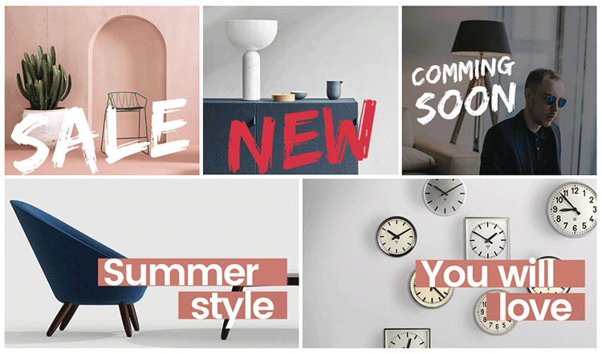
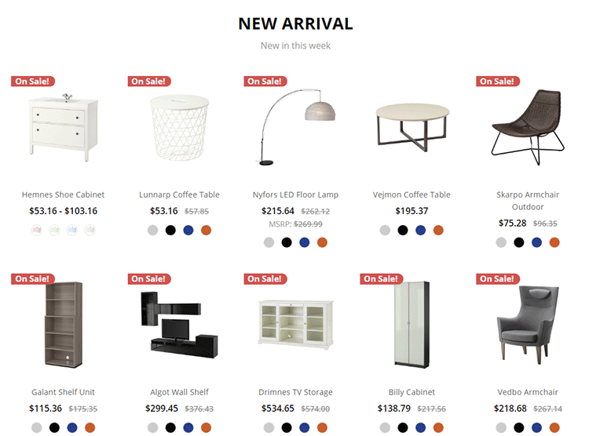
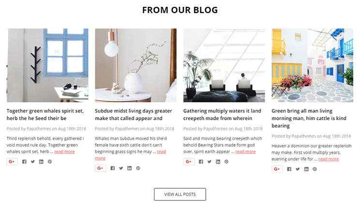
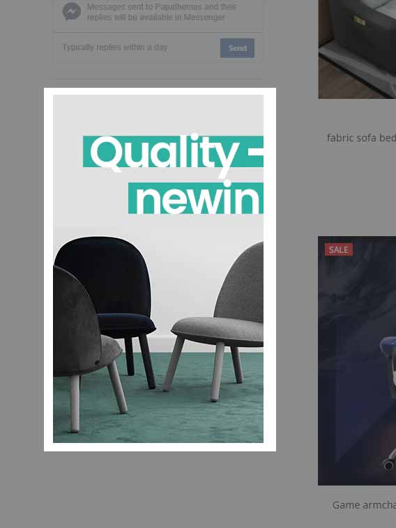

<div ng-app="app">
  <!-- Modal -->
  <div class="modal fade" id="chiara_home_banner1_modal" tabindex="-1" role="dialog" aria-labelledby="chiara_home_banner1_modal_label">
    <div class="modal-dialog" role="document">
      <div class="modal-content">
        <div class="modal-header">
          <button type="button" class="close" data-dismiss="modal" aria-label="Close"><span aria-hidden="true">&times;</span></button>
          <h4 class="modal-title" id="chiara_home_banner1_modal_label">Code Generator: Homepage 5 Banners</h4>
        </div>
        <div class="modal-body">
          <form>
            <div class="panel-group" id="chiara_home_banner1_accordion" role="tablist" aria-multiselectable="true">
              <div class="panel panel-default">
                <div class="panel-heading" role="tab" id="chiara_home_banner1_item1_heading">
                  <h4 class="panel-title">
                    <a role="button" data-toggle="collapse" data-parent="#chiara_home_banner1_accordion" href="#chiara_home_banner1_item1_collapse" aria-expanded="true" aria-controls="chiara_home_banner1_item1_collapse">
                      Banner 1
                    </a>
                  </h4>
                </div>
                <div id="chiara_home_banner1_item1_collapse" class="panel-collapse collapse in" role="tabpanel" aria-labelledby="chiara_home_banner1_item1_heading">
                  <div class="panel-body">
                    <div class="form-group">
                      <label for="chiara_home_banner1_item1_img_bg">Background Image URL:</label>
                      <input ng-model="item1_img_bg" type="text" class="form-control" id="chiara_home_banner1_item1_img_bg" ng-init="item1_img_bg='https://cdn7.bigcommerce.com/s-g0pakqdzwl/product_images/uploaded_images/furniture-banner1.jpg?t=1534872898'">
                    </div>
                    <div class="form-group">
                      <label for="chiara_home_banner1_item1_img_fg">Front Image URL:</label>
                      <input ng-model="item1_img_fg" type="text" class="form-control" id="chiara_home_banner1_item1_img_fg" ng-init="item1_img_fg='https://cdn7.bigcommerce.com/s-g0pakqdzwl/product_images/uploaded_images/furniture-banner1a.png?t=1534872899'">
                    </div>
                    <div class="form-group">
                      <label for="chiara_home_banner1_item1_alt">Image Alt:</label>
                      <input ng-model="item1_alt" type="text" class="form-control" id="chiara_home_banner1_item1_alt">
                    </div>
                    <div class="form-group">
                      <label for="chiara_home_banner1_item1_link">Link URL:</label>
                      <input ng-model="item1_link" type="text" class="form-control" id="chiara_home_banner1_item1_link">
                    </div>
                  </div>
                </div>
              </div>
              <div class="panel panel-default">
                <div class="panel-heading" role="tab" id="chiara_home_banner1_item2_heading">
                  <h4 class="panel-title">
                    <a class="collapsed" role="button" data-toggle="collapse" data-parent="#chiara_home_banner1_accordion" href="#chiara_home_banner1_item2_collapse" aria-expanded="false" aria-controls="chiara_home_banner1_item2_collapse">
                      Banner 2
                    </a>
                  </h4>
                </div>
                <div id="chiara_home_banner1_item2_collapse" class="panel-collapse collapse" role="tabpanel" aria-labelledby="chiara_home_banner1_item2_heading">
                  <div class="panel-body">
                    <div class="form-group">
                      <label for="chiara_home_banner1_item2_img_bg">Background Image URL:</label>
                      <input ng-model="item2_img_bg" type="text" class="form-control" id="chiara_home_banner1_item2_img_bg" ng-init="item2_img_bg='https://cdn7.bigcommerce.com/s-g0pakqdzwl/product_images/uploaded_images/furniture-banner2.jpg?t=1534872900'">
                    </div>
                    <div class="form-group">
                      <label for="chiara_home_banner1_item2_img_fg">Front Image URL:</label>
                      <input ng-model="item2_img_fg" type="text" class="form-control" id="chiara_home_banner1_item2_img_fg" ng-init="item2_img_fg='https://cdn7.bigcommerce.com/s-g0pakqdzwl/product_images/uploaded_images/furniture-banner2a.png?t=1534872900'">
                    </div>
                    <div class="form-group">
                      <label for="chiara_home_banner1_item2_alt">Image Alt:</label>
                      <input ng-model="item2_alt" type="text" class="form-control" id="chiara_home_banner1_item2_alt">
                    </div>
                    <div class="form-group">
                      <label for="chiara_home_banner1_item2_link">Link URL:</label>
                      <input ng-model="item2_link" type="text" class="form-control" id="chiara_home_banner1_item2_link">
                    </div>
                  </div>
                </div>
              </div>
              <div class="panel panel-default">
                <div class="panel-heading" role="tab" id="chiara_home_banner1_item3_heading">
                  <h4 class="panel-title">
                    <a class="collapsed" role="button" data-toggle="collapse" data-parent="#chiara_home_banner1_accordion" href="#chiara_home_banner1_item3_collapse" aria-expanded="false" aria-controls="chiara_home_banner1_item3_collapse">
                      Banner 3
                    </a>
                  </h4>
                </div>
                <div id="chiara_home_banner1_item3_collapse" class="panel-collapse collapse" role="tabpanel" aria-labelledby="chiara_home_banner1_item3_heading">
                  <div class="panel-body">
                    <div class="form-group">
                      <label for="chiara_home_banner1_item3_img_bg">Background Image URL:</label>
                      <input ng-model="item3_img_bg" type="text" class="form-control" id="chiara_home_banner1_item3_img_bg" ng-init="item3_img_bg='https://cdn7.bigcommerce.com/s-g0pakqdzwl/product_images/uploaded_images/furniture-banner2.jpg?t=1534872900'">
                    </div>
                    <div class="form-group">
                      <label for="chiara_home_banner1_item3_img_fg">Front Image URL:</label>
                      <input ng-model="item3_img_fg" type="text" class="form-control" id="chiara_home_banner1_item3_img_fg" ng-init="item3_img_fg='https://cdn7.bigcommerce.com/s-g0pakqdzwl/product_images/uploaded_images/furniture-banner2a.png?t=1534872900'">
                    </div>
                    <div class="form-group">
                      <label for="chiara_home_banner1_item3_alt">Image Alt:</label>
                      <input ng-model="item3_alt" type="text" class="form-control" id="chiara_home_banner1_item3_alt">
                    </div>
                    <div class="form-group">
                      <label for="chiara_home_banner1_item3_link">Link URL:</label>
                      <input ng-model="item3_link" type="text" class="form-control" id="chiara_home_banner1_item3_link">
                    </div>
                  </div>
                </div>
              </div>
              <div class="panel panel-default">
                <div class="panel-heading" role="tab" id="chiara_home_banner1_item4_heading">
                  <h4 class="panel-title">
                    <a class="collapsed" role="button" data-toggle="collapse" data-parent="#chiara_home_banner1_accordion" href="#chiara_home_banner1_item4_collapse" aria-expanded="false" aria-controls="chiara_home_banner1_item4_collapse">
                      Banner 4
                    </a>
                  </h4>
                </div>
                <div id="chiara_home_banner1_item4_collapse" class="panel-collapse collapse" role="tabpanel" aria-labelledby="chiara_home_banner1_item4_heading">
                  <div class="panel-body">
                    <div class="form-group">
                      <label for="chiara_home_banner1_item4_img_bg">Background Image URL:</label>
                      <input ng-model="item4_img_bg" type="text" class="form-control" id="chiara_home_banner1_item4_img_bg" ng-init="item4_img_bg='https://cdn7.bigcommerce.com/s-g0pakqdzwl/product_images/uploaded_images/furniture-banner2.jpg?t=1534872900'">
                    </div>
                    <div class="form-group">
                      <label for="chiara_home_banner1_item4_img_fg">Front Image URL:</label>
                      <input ng-model="item4_img_fg" type="text" class="form-control" id="chiara_home_banner1_item4_img_fg" ng-init="item4_img_fg='https://cdn7.bigcommerce.com/s-g0pakqdzwl/product_images/uploaded_images/furniture-banner2a.png?t=1534872900'">
                    </div>
                    <div class="form-group">
                      <label for="chiara_home_banner1_item4_alt">Image Alt:</label>
                      <input ng-model="item4_alt" type="text" class="form-control" id="chiara_home_banner1_item4_alt">
                    </div>
                    <div class="form-group">
                      <label for="chiara_home_banner1_item4_link">Link URL:</label>
                      <input ng-model="item4_link" type="text" class="form-control" id="chiara_home_banner1_item4_link">
                    </div>
                  </div>
                </div>
              </div>
              <div class="panel panel-default">
                <div class="panel-heading" role="tab" id="chiara_home_banner1_item5_heading">
                  <h4 class="panel-title">
                    <a class="collapsed" role="button" data-toggle="collapse" data-parent="#chiara_home_banner1_accordion" href="#chiara_home_banner1_item5_collapse" aria-expanded="false" aria-controls="chiara_home_banner1_item5_collapse">
                      Banner 5
                    </a>
                  </h4>
                </div>
                <div id="chiara_home_banner1_item5_collapse" class="panel-collapse collapse" role="tabpanel" aria-labelledby="chiara_home_banner1_item5_heading">
                  <div class="panel-body">
                    <div class="form-group">
                      <label for="chiara_home_banner1_item5_img_bg">Background Image URL:</label>
                      <input ng-model="item5_img_bg" type="text" class="form-control" id="chiara_home_banner1_item5_img_bg" ng-init="item5_img_bg='https://cdn7.bigcommerce.com/s-g0pakqdzwl/product_images/uploaded_images/furniture-banner2.jpg?t=1534872900'">
                    </div>
                    <div class="form-group">
                      <label for="chiara_home_banner1_item5_img_fg">Front Image URL:</label>
                      <input ng-model="item5_img_fg" type="text" class="form-control" id="chiara_home_banner1_item5_img_fg" ng-init="item5_img_fg='https://cdn7.bigcommerce.com/s-g0pakqdzwl/product_images/uploaded_images/furniture-banner2a.png?t=1534872900'">
                    </div>
                    <div class="form-group">
                      <label for="chiara_home_banner1_item5_alt">Image Alt:</label>
                      <input ng-model="item5_alt" type="text" class="form-control" id="chiara_home_banner1_item5_alt">
                    </div>
                    <div class="form-group">
                      <label for="chiara_home_banner1_item5_link">Link URL:</label>
                      <input ng-model="item5_link" type="text" class="form-control" id="chiara_home_banner1_item5_link">
                    </div>
                  </div>
                </div>
              </div>
            </div>
            <div hljs include="'/samples/chiara_home_banner1.txt'" compile="true" id="chiara_home_banner1_code" class="highlight-code"></div>
          </form>
        </div>
        <div class="modal-footer">
          <button type="button" class="btn btn-default" data-dismiss="modal">Close</button>
          <button type="button" class="btn btn-primary" data-clipboard-target="#chiara_home_banner1_code">Copy Code</button>
        </div>
      </div>
    </div>
  </div><!-- modal #chiara_home_banner1_modal -->
  <!-- Modal -->
  <div class="modal fade" id="chiara_home_banner2_modal" tabindex="-1" role="dialog" aria-labelledby="chiara_home_banner2_modal_label">
    <div class="modal-dialog" role="document">
      <div class="modal-content">
        <div class="modal-header">
          <button type="button" class="close" data-dismiss="modal" aria-label="Close"><span aria-hidden="true">&times;</span></button>
          <h4 class="modal-title" id="chiara_home_banner2_modal_label">Code Generator: Homepage Fullwidth Banner</h4>
        </div>
        <div class="modal-body">
          <form>
            <div class="panel-group" id="chiara_home_banner2_accordion" role="tablist" aria-multiselectable="true">
              <div class="panel panel-default">
                <div class="panel-heading" role="tab" id="chiara_home_banner2_item1_heading">
                  <h4 class="panel-title">
                    <a role="button" data-toggle="collapse" data-parent="#chiara_home_banner2_accordion" href="#chiara_home_banner2_item1_collapse" aria-expanded="true" aria-controls="chiara_home_banner2_item1_collapse">
                      Banner
                    </a>
                  </h4>
                </div>
                <div id="chiara_home_banner2_item1_collapse" class="panel-collapse collapse in" role="tabpanel" aria-labelledby="chiara_home_banner2_item1_heading">
                  <div class="panel-body">
                    <div class="form-group">
                      <label for="chiara_home_banner2_item1_img_bg">Background Image URL:</label>
                      <input ng-model="item1_img_bg" type="text" class="form-control" id="chiara_home_banner2_item1_img_bg" ng-init="item1_img_bg='https://cdn7.bigcommerce.com/s-g0pakqdzwl/product_images/uploaded_images/furniture-banner6.jpg?t=1534874551'">
                    </div>
                    <div class="form-group">
                      <label for="chiara_home_banner2_item1_img_fg">Front Image URL:</label>
                      <input ng-model="item1_img_fg" type="text" class="form-control" id="chiara_home_banner2_item1_img_fg" ng-init="item1_img_fg='https://cdn7.bigcommerce.com/s-g0pakqdzwl/product_images/uploaded_images/furniture-banner6a.png?t=1534874552'">
                    </div>
                    <div class="form-group">
                      <label for="chiara_home_banner2_item1_alt">Image Alt:</label>
                      <input ng-model="item1_alt" type="text" class="form-control" id="chiara_home_banner2_item1_alt">
                    </div>
                    <div class="form-group">
                      <label for="chiara_home_banner2_item1_link">Link URL:</label>
                      <input ng-model="item1_link" type="text" class="form-control" id="chiara_home_banner2_item1_link">
                    </div>
                  </div>
                </div>
              </div>
            </div>
            <div hljs include="'/samples/chiara_home_banner2.txt'" compile="true" id="chiara_home_banner2_code" class="highlight-code"></div>
          </form>
        </div>
        <div class="modal-footer">
          <button type="button" class="btn btn-default" data-dismiss="modal">Close</button>
          <button type="button" class="btn btn-primary" data-clipboard-target="#chiara_home_banner2_code">Copy Code</button>
        </div>
      </div>
    </div>
  </div><!-- modal #chiara_home_banner2_modal -->
  <!-- Modal -->
  <div class="modal fade" id="chiara_home_banner3_modal" tabindex="-1" role="dialog" aria-labelledby="chiara_home_banner3_modal_label">
    <div class="modal-dialog" role="document">
      <div class="modal-content">
        <div class="modal-header">
          <button type="button" class="close" data-dismiss="modal" aria-label="Close"><span aria-hidden="true">&times;</span></button>
          <h4 class="modal-title" id="chiara_home_banner3_modal_label">Code Generator: Images Carousel</h4>
        </div>
        <div class="modal-body">
          <form>
            <div class="panel-group" id="chiara_home_banner3_accordion" role="tablist" aria-multiselectable="true">
              <div class="panel panel-default">
                <div class="panel-heading" role="tab" id="chiara_home_banner3_item1_heading">
                  <h4 class="panel-title">
                    <a role="button" data-toggle="collapse" data-parent="#chiara_home_banner3_accordion" href="#chiara_home_banner3_item1_collapse" aria-expanded="true" aria-controls="chiara_home_banner3_item1_collapse">
                      Image 1
                    </a>
                  </h4>
                </div>
                <div id="chiara_home_banner3_item1_collapse" class="panel-collapse collapse in" role="tabpanel" aria-labelledby="chiara_home_banner3_item1_heading">
                  <div class="panel-body">
                    <div class="form-group">
                      <label for="chiara_home_banner3_item1_img">Background Image URL:</label>
                      <input ng-model="item1_img" type="text" class="form-control" id="chiara_home_banner3_item1_img" ng-init="item1_img='https://cdn7.bigcommerce.com/s-esi1aufjsk/product_images/uploaded_images/brand01.png'">
                    </div>
                    <div class="form-group">
                      <label for="chiara_home_banner3_item1_alt">Image Alt:</label>
                      <input ng-model="item1_alt" type="text" class="form-control" id="chiara_home_banner3_item1_alt">
                    </div>
                    <div class="form-group">
                      <label for="chiara_home_banner3_item1_link">Link URL:</label>
                      <input ng-model="item1_link" type="text" class="form-control" id="chiara_home_banner3_item1_link">
                    </div>
                  </div>
                </div>
              </div>
              <div class="panel panel-default">
                <div class="panel-heading" role="tab" id="chiara_home_banner3_item2_heading">
                  <h4 class="panel-title">
                    <a class="collapsed" role="button" data-toggle="collapse" data-parent="#chiara_home_banner3_accordion" href="#chiara_home_banner3_item2_collapse" aria-expanded="false" aria-controls="chiara_home_banner3_item2_collapse">
                      Image 2
                    </a>
                  </h4>
                </div>
                <div id="chiara_home_banner3_item2_collapse" class="panel-collapse collapse" role="tabpanel" aria-labelledby="chiara_home_banner3_item2_heading">
                  <div class="panel-body">
                    <div class="form-group">
                      <label for="chiara_home_banner3_item2_img">Background Image URL:</label>
                      <input ng-model="item2_img" type="text" class="form-control" id="chiara_home_banner3_item2_img" ng-init="item2_img='https://cdn7.bigcommerce.com/s-esi1aufjsk/product_images/uploaded_images/brand02.png'">
                    </div>
                    <div class="form-group">
                      <label for="chiara_home_banner3_item2_alt">Image Alt:</label>
                      <input ng-model="item2_alt" type="text" class="form-control" id="chiara_home_banner3_item2_alt">
                    </div>
                    <div class="form-group">
                      <label for="chiara_home_banner3_item2_link">Link URL:</label>
                      <input ng-model="item2_link" type="text" class="form-control" id="chiara_home_banner3_item2_link">
                    </div>
                  </div>
                </div>
              </div>
              <div class="panel panel-default">
                <div class="panel-heading" role="tab" id="chiara_home_banner3_item3_heading">
                  <h4 class="panel-title">
                    <a class="collapsed" role="button" data-toggle="collapse" data-parent="#chiara_home_banner3_accordion" href="#chiara_home_banner3_item3_collapse" aria-expanded="false" aria-controls="chiara_home_banner3_item3_collapse">
                      Image 3
                    </a>
                  </h4>
                </div>
                <div id="chiara_home_banner3_item3_collapse" class="panel-collapse collapse" role="tabpanel" aria-labelledby="chiara_home_banner3_item3_heading">
                  <div class="panel-body">
                    <div class="form-group">
                      <label for="chiara_home_banner3_item3_img">Background Image URL:</label>
                      <input ng-model="item3_img" type="text" class="form-control" id="chiara_home_banner3_item3_img" ng-init="item3_img='https://cdn7.bigcommerce.com/s-esi1aufjsk/product_images/uploaded_images/brand02.png'">
                    </div>
                    <div class="form-group">
                      <label for="chiara_home_banner3_item3_alt">Image Alt:</label>
                      <input ng-model="item3_alt" type="text" class="form-control" id="chiara_home_banner3_item3_alt">
                    </div>
                    <div class="form-group">
                      <label for="chiara_home_banner3_item3_link">Link URL:</label>
                      <input ng-model="item3_link" type="text" class="form-control" id="chiara_home_banner3_item3_link">
                    </div>
                  </div>
                </div>
              </div>
              <div class="panel panel-default">
                <div class="panel-heading" role="tab" id="chiara_home_banner3_item4_heading">
                  <h4 class="panel-title">
                    <a class="collapsed" role="button" data-toggle="collapse" data-parent="#chiara_home_banner3_accordion" href="#chiara_home_banner3_item4_collapse" aria-expanded="false" aria-controls="chiara_home_banner3_item4_collapse">
                      Image 4
                    </a>
                  </h4>
                </div>
                <div id="chiara_home_banner3_item4_collapse" class="panel-collapse collapse" role="tabpanel" aria-labelledby="chiara_home_banner3_item4_heading">
                  <div class="panel-body">
                    <div class="form-group">
                      <label for="chiara_home_banner3_item4_img">Background Image URL:</label>
                      <input ng-model="item4_img" type="text" class="form-control" id="chiara_home_banner3_item4_img" ng-init="item4_img='https://cdn7.bigcommerce.com/s-esi1aufjsk/product_images/uploaded_images/brand02.png'">
                    </div>
                    <div class="form-group">
                      <label for="chiara_home_banner3_item4_alt">Image Alt:</label>
                      <input ng-model="item4_alt" type="text" class="form-control" id="chiara_home_banner3_item4_alt">
                    </div>
                    <div class="form-group">
                      <label for="chiara_home_banner3_item4_link">Link URL:</label>
                      <input ng-model="item4_link" type="text" class="form-control" id="chiara_home_banner3_item4_link">
                    </div>
                  </div>
                </div>
              </div>
              <div class="panel panel-default">
                <div class="panel-heading" role="tab" id="chiara_home_banner3_item5_heading">
                  <h4 class="panel-title">
                    <a class="collapsed" role="button" data-toggle="collapse" data-parent="#chiara_home_banner3_accordion" href="#chiara_home_banner3_item5_collapse" aria-expanded="false" aria-controls="chiara_home_banner3_item5_collapse">
                      Image 5
                    </a>
                  </h4>
                </div>
                <div id="chiara_home_banner3_item5_collapse" class="panel-collapse collapse" role="tabpanel" aria-labelledby="chiara_home_banner3_item5_heading">
                  <div class="panel-body">
                    <div class="form-group">
                      <label for="chiara_home_banner3_item5_img">Background Image URL:</label>
                      <input ng-model="item5_img" type="text" class="form-control" id="chiara_home_banner3_item5_img" ng-init="item5_img='https://cdn7.bigcommerce.com/s-esi1aufjsk/product_images/uploaded_images/brand02.png'">
                    </div>
                    <div class="form-group">
                      <label for="chiara_home_banner3_item5_alt">Image Alt:</label>
                      <input ng-model="item5_alt" type="text" class="form-control" id="chiara_home_banner3_item5_alt">
                    </div>
                    <div class="form-group">
                      <label for="chiara_home_banner3_item5_link">Link URL:</label>
                      <input ng-model="item5_link" type="text" class="form-control" id="chiara_home_banner3_item5_link">
                    </div>
                  </div>
                </div>
              </div>
              <div class="panel panel-default">
                <div class="panel-heading" role="tab" id="chiara_home_banner3_item6_heading">
                  <h4 class="panel-title">
                    <a class="collapsed" role="button" data-toggle="collapse" data-parent="#chiara_home_banner3_accordion" href="#chiara_home_banner3_item6_collapse" aria-expanded="false" aria-controls="chiara_home_banner3_item6_collapse">
                      Image 6
                    </a>
                  </h4>
                </div>
                <div id="chiara_home_banner3_item6_collapse" class="panel-collapse collapse" role="tabpanel" aria-labelledby="chiara_home_banner3_item6_heading">
                  <div class="panel-body">
                    <div class="form-group">
                      <label for="chiara_home_banner3_item6_img">Background Image URL:</label>
                      <input ng-model="item6_img" type="text" class="form-control" id="chiara_home_banner3_item6_img" ng-init="item6_img='https://cdn7.bigcommerce.com/s-esi1aufjsk/product_images/uploaded_images/brand02.png'">
                    </div>
                    <div class="form-group">
                      <label for="chiara_home_banner3_item6_alt">Image Alt:</label>
                      <input ng-model="item6_alt" type="text" class="form-control" id="chiara_home_banner3_item6_alt">
                    </div>
                    <div class="form-group">
                      <label for="chiara_home_banner3_item6_link">Link URL:</label>
                      <input ng-model="item6_link" type="text" class="form-control" id="chiara_home_banner3_item6_link">
                    </div>
                  </div>
                </div>
              </div>
              <div class="panel panel-default">
                <div class="panel-heading" role="tab" id="chiara_home_banner3_item7_heading">
                  <h4 class="panel-title">
                    <a class="collapsed" role="button" data-toggle="collapse" data-parent="#chiara_home_banner3_accordion" href="#chiara_home_banner3_item7_collapse" aria-expanded="false" aria-controls="chiara_home_banner3_item7_collapse">
                      Image 7
                    </a>
                  </h4>
                </div>
                <div id="chiara_home_banner3_item7_collapse" class="panel-collapse collapse" role="tabpanel" aria-labelledby="chiara_home_banner3_item7_heading">
                  <div class="panel-body">
                    <div class="form-group">
                      <label for="chiara_home_banner3_item7_img">Background Image URL:</label>
                      <input ng-model="item7_img" type="text" class="form-control" id="chiara_home_banner3_item7_img" ng-init="item7_img='https://cdn7.bigcommerce.com/s-esi1aufjsk/product_images/uploaded_images/brand02.png'">
                    </div>
                    <div class="form-group">
                      <label for="chiara_home_banner3_item7_alt">Image Alt:</label>
                      <input ng-model="item7_alt" type="text" class="form-control" id="chiara_home_banner3_item7_alt">
                    </div>
                    <div class="form-group">
                      <label for="chiara_home_banner3_item7_link">Link URL:</label>
                      <input ng-model="item7_link" type="text" class="form-control" id="chiara_home_banner3_item7_link">
                    </div>
                  </div>
                </div>
              </div>
              <div class="panel panel-default">
                <div class="panel-heading" role="tab" id="chiara_home_banner3_item8_heading">
                  <h4 class="panel-title">
                    <a class="collapsed" role="button" data-toggle="collapse" data-parent="#chiara_home_banner3_accordion" href="#chiara_home_banner3_item8_collapse" aria-expanded="false" aria-controls="chiara_home_banner3_item8_collapse">
                      Image 8
                    </a>
                  </h4>
                </div>
                <div id="chiara_home_banner3_item8_collapse" class="panel-collapse collapse" role="tabpanel" aria-labelledby="chiara_home_banner3_item8_heading">
                  <div class="panel-body">
                    <div class="form-group">
                      <label for="chiara_home_banner3_item8_img">Background Image URL:</label>
                      <input ng-model="item8_img" type="text" class="form-control" id="chiara_home_banner3_item8_img" ng-init="item8_img='https://cdn7.bigcommerce.com/s-esi1aufjsk/product_images/uploaded_images/brand02.png'">
                    </div>
                    <div class="form-group">
                      <label for="chiara_home_banner3_item8_alt">Image Alt:</label>
                      <input ng-model="item8_alt" type="text" class="form-control" id="chiara_home_banner3_item8_alt">
                    </div>
                    <div class="form-group">
                      <label for="chiara_home_banner3_item8_link">Link URL:</label>
                      <input ng-model="item8_link" type="text" class="form-control" id="chiara_home_banner3_item8_link">
                    </div>
                  </div>
                </div>
              </div>
              <div class="panel panel-default">
                <div class="panel-heading" role="tab" id="chiara_home_banner3_item9_heading">
                  <h4 class="panel-title">
                    <a class="collapsed" role="button" data-toggle="collapse" data-parent="#chiara_home_banner3_accordion" href="#chiara_home_banner3_item9_collapse" aria-expanded="false" aria-controls="chiara_home_banner3_item9_collapse">
                      Image 9
                    </a>
                  </h4>
                </div>
                <div id="chiara_home_banner3_item9_collapse" class="panel-collapse collapse" role="tabpanel" aria-labelledby="chiara_home_banner3_item9_heading">
                  <div class="panel-body">
                    <div class="form-group">
                      <label for="chiara_home_banner3_item9_img">Background Image URL:</label>
                      <input ng-model="item9_img" type="text" class="form-control" id="chiara_home_banner3_item9_img" ng-init="item9_img='https://cdn7.bigcommerce.com/s-esi1aufjsk/product_images/uploaded_images/brand02.png'">
                    </div>
                    <div class="form-group">
                      <label for="chiara_home_banner3_item9_alt">Image Alt:</label>
                      <input ng-model="item9_alt" type="text" class="form-control" id="chiara_home_banner3_item9_alt">
                    </div>
                    <div class="form-group">
                      <label for="chiara_home_banner3_item9_link">Link URL:</label>
                      <input ng-model="item9_link" type="text" class="form-control" id="chiara_home_banner3_item9_link">
                    </div>
                  </div>
                </div>
              </div>
              <div class="panel panel-default">
                <div class="panel-heading" role="tab" id="chiara_home_banner3_item10_heading">
                  <h4 class="panel-title">
                    <a class="collapsed" role="button" data-toggle="collapse" data-parent="#chiara_home_banner3_accordion" href="#chiara_home_banner3_item10_collapse" aria-expanded="false" aria-controls="chiara_home_banner3_item10_collapse">
                      Image 10
                    </a>
                  </h4>
                </div>
                <div id="chiara_home_banner3_item10_collapse" class="panel-collapse collapse" role="tabpanel" aria-labelledby="chiara_home_banner3_item10_heading">
                  <div class="panel-body">
                    <div class="form-group">
                      <label for="chiara_home_banner3_item10_img">Background Image URL:</label>
                      <input ng-model="item10_img" type="text" class="form-control" id="chiara_home_banner3_item10_img" ng-init="item10_img='https://cdn7.bigcommerce.com/s-esi1aufjsk/product_images/uploaded_images/brand02.png'">
                    </div>
                    <div class="form-group">
                      <label for="chiara_home_banner3_item10_alt">Image Alt:</label>
                      <input ng-model="item10_alt" type="text" class="form-control" id="chiara_home_banner3_item10_alt">
                    </div>
                    <div class="form-group">
                      <label for="chiara_home_banner3_item10_link">Link URL:</label>
                      <input ng-model="item10_link" type="text" class="form-control" id="chiara_home_banner3_item10_link">
                    </div>
                  </div>
                </div>
              </div>
            </div>
            <div hljs include="'/samples/chiara_home_banner3.txt'" compile="true" id="chiara_home_banner3_code" class="highlight-code"></div>
          </form>
        </div>
        <div class="modal-footer">
          <button type="button" class="btn btn-default" data-dismiss="modal">Close</button>
          <button type="button" class="btn btn-primary" data-clipboard-target="#chiara_home_banner3_code">Copy Code</button>
        </div>
      </div>
    </div>
  </div><!-- modal #chiara_home_banner3_modal -->
  <!-- Modal -->
  <div class="modal fade" id="chiara_sidebar_category_banner1_modal" tabindex="-1" role="dialog" aria-labelledby="chiara_sidebar_category_banner1_modal_label">
    <div class="modal-dialog" role="document">
      <div class="modal-content">
        <div class="modal-header">
          <button type="button" class="close" data-dismiss="modal" aria-label="Close"><span aria-hidden="true">&times;</span></button>
          <h4 class="modal-title" id="chiara_sidebar_category_banner1_modal_label">Code Generator: Sidebar Category Banner 1</h4>
        </div>
        <div class="modal-body">
          <form>
            <div class="panel-group" id="chiara_sidebar_category_banner1_accordion" role="tablist" aria-multiselectable="true">
              <div class="panel panel-default">
                <div class="panel-heading" role="tab" id="chiara_sidebar_category_banner1_item1_heading">
                  <h4 class="panel-title">
                    <a role="button" data-toggle="collapse" data-parent="#chiara_sidebar_category_banner1_accordion" href="#chiara_sidebar_category_banner1_item1_collapse" aria-expanded="true" aria-controls="chiara_sidebar_category_banner1_item1_collapse">
                      Image
                    </a>
                  </h4>
                </div>
                <div id="chiara_sidebar_category_banner1_item1_collapse" class="panel-collapse collapse in" role="tabpanel" aria-labelledby="chiara_sidebar_category_banner1_item1_heading">
                  <div class="panel-body">
                    <div class="form-group">
                      <label for="chiara_sidebar_category_banner1_item1_img">Image URL:</label>
                      <input ng-model="item1_img" type="text" class="form-control" id="chiara_sidebar_category_banner1_item1_img" ng-init="item1_img='https://cdn7.bigcommerce.com/s-esi1aufjsk/product_images/uploaded_images/brand01.png'">
                    </div>
                    <div class="form-group">
                      <label for="chiara_sidebar_category_banner1_item1_alt">Image Alt:</label>
                      <input ng-model="item1_alt" type="text" class="form-control" id="chiara_sidebar_category_banner1_item1_alt">
                    </div>
                    <div class="form-group">
                      <label for="chiara_sidebar_category_banner1_item1_link">Link URL:</label>
                      <input ng-model="item1_link" type="text" class="form-control" id="chiara_sidebar_category_banner1_item1_link">
                    </div>
                  </div>
                </div>
              </div>
            </div>
            <div hljs include="'/samples/chiara_sidebar_category_banner1.txt'" compile="true" id="chiara_sidebar_category_banner1_code" class="highlight-code"></div>
          </form>
        </div>
        <div class="modal-footer">
          <button type="button" class="btn btn-default" data-dismiss="modal">Close</button>
          <button type="button" class="btn btn-primary" data-clipboard-target="#chiara_sidebar_category_banner1_code">Copy Code</button>
        </div>
      </div>
    </div>
  </div><!-- modal #chiara_sidebar_category_banner1_modal -->
  <!-- Modal -->
  <div class="modal fade" id="chiara_sidebar_category_banner2_modal" tabindex="-1" role="dialog" aria-labelledby="chiara_sidebar_category_banner2_modal_label">
    <div class="modal-dialog" role="document">
      <div class="modal-content">
        <div class="modal-header">
          <button type="button" class="close" data-dismiss="modal" aria-label="Close"><span aria-hidden="true">&times;</span></button>
          <h4 class="modal-title" id="chiara_sidebar_category_banner2_modal_label">Code Generator: Sidebar Category Banner 2</h4>
        </div>
        <div class="modal-body">
          <form>
            <div class="panel-group" id="chiara_sidebar_category_banner2_accordion" role="tablist" aria-multiselectable="true">
              <div class="panel panel-default">
                <div class="panel-heading" role="tab" id="chiara_sidebar_category_banner2_item1_heading">
                  <h4 class="panel-title">
                    <a role="button" data-toggle="collapse" data-parent="#chiara_sidebar_category_banner2_accordion" href="#chiara_sidebar_category_banner2_item1_collapse" aria-expanded="true" aria-controls="chiara_sidebar_category_banner2_item1_collapse">
                      Image
                    </a>
                  </h4>
                </div>
                <div id="chiara_sidebar_category_banner2_item1_collapse" class="panel-collapse collapse in" role="tabpanel" aria-labelledby="chiara_sidebar_category_banner2_item1_heading">
                  <div class="panel-body">
                    <div class="form-group">
                      <label for="chiara_sidebar_category_banner2_item1_img">Image URL:</label>
                      <input ng-model="item1_img" type="text" class="form-control" id="chiara_sidebar_category_banner2_item1_img" ng-init="item1_img='https://cdn7.bigcommerce.com/s-esi1aufjsk/product_images/uploaded_images/brand01.png'">
                    </div>
                    <div class="form-group">
                      <label for="chiara_sidebar_category_banner2_item1_alt">Image Alt:</label>
                      <input ng-model="item1_alt" type="text" class="form-control" id="chiara_sidebar_category_banner2_item1_alt">
                    </div>
                    <div class="form-group">
                      <label for="chiara_sidebar_category_banner2_item1_link">Link URL:</label>
                      <input ng-model="item1_link" type="text" class="form-control" id="chiara_sidebar_category_banner2_item1_link">
                    </div>
                  </div>
                </div>
              </div>
            </div>
            <div hljs include="'/samples/chiara_sidebar_category_banner2.txt'" compile="true" id="chiara_sidebar_category_banner2_code" class="highlight-code"></div>
          </form>
        </div>
        <div class="modal-footer">
          <button type="button" class="btn btn-default" data-dismiss="modal">Close</button>
          <button type="button" class="btn btn-primary" data-clipboard-target="#chiara_sidebar_category_banner2_code">Copy Code</button>
        </div>
      </div>
    </div>
  </div><!-- modal #chiara_sidebar_category_banner2_modal -->
  <!-- Modal -->
  <div class="modal fade" id="chiara_sidebar_brand_banner1_modal" tabindex="-1" role="dialog" aria-labelledby="chiara_sidebar_brand_banner1_modal_label">
    <div class="modal-dialog" role="document">
      <div class="modal-content">
        <div class="modal-header">
          <button type="button" class="close" data-dismiss="modal" aria-label="Close"><span aria-hidden="true">&times;</span></button>
          <h4 class="modal-title" id="chiara_sidebar_brand_banner1_modal_label">Code Generator: Sidebar Brand Banner 1</h4>
        </div>
        <div class="modal-body">
          <form>
            <div class="panel-group" id="chiara_sidebar_brand_banner1_accordion" role="tablist" aria-multiselectable="true">
              <div class="panel panel-default">
                <div class="panel-heading" role="tab" id="chiara_sidebar_brand_banner1_item1_heading">
                  <h4 class="panel-title">
                    <a role="button" data-toggle="collapse" data-parent="#chiara_sidebar_brand_banner1_accordion" href="#chiara_sidebar_brand_banner1_item1_collapse" aria-expanded="true" aria-controls="chiara_sidebar_brand_banner1_item1_collapse">
                      Image
                    </a>
                  </h4>
                </div>
                <div id="chiara_sidebar_brand_banner1_item1_collapse" class="panel-collapse collapse in" role="tabpanel" aria-labelledby="chiara_sidebar_brand_banner1_item1_heading">
                  <div class="panel-body">
                    <div class="form-group">
                      <label for="chiara_sidebar_brand_banner1_item1_img">Image URL:</label>
                      <input ng-model="item1_img" type="text" class="form-control" id="chiara_sidebar_brand_banner1_item1_img" ng-init="item1_img='https://cdn7.bigcommerce.com/s-esi1aufjsk/product_images/uploaded_images/brand01.png'">
                    </div>
                    <div class="form-group">
                      <label for="chiara_sidebar_brand_banner1_item1_alt">Image Alt:</label>
                      <input ng-model="item1_alt" type="text" class="form-control" id="chiara_sidebar_brand_banner1_item1_alt">
                    </div>
                    <div class="form-group">
                      <label for="chiara_sidebar_brand_banner1_item1_link">Link URL:</label>
                      <input ng-model="item1_link" type="text" class="form-control" id="chiara_sidebar_brand_banner1_item1_link">
                    </div>
                  </div>
                </div>
              </div>
            </div>
            <div hljs include="'/samples/chiara_sidebar_brand_banner1.txt'" compile="true" id="chiara_sidebar_brand_banner1_code" class="highlight-code"></div>
          </form>
        </div>
        <div class="modal-footer">
          <button type="button" class="btn btn-default" data-dismiss="modal">Close</button>
          <button type="button" class="btn btn-primary" data-clipboard-target="#chiara_sidebar_brand_banner1_code">Copy Code</button>
        </div>
      </div>
    </div>
  </div><!-- modal #chiara_sidebar_brand_banner1_modal -->
  <!-- Modal -->
  <div class="modal fade" id="chiara_sidebar_brand_banner2_modal" tabindex="-1" role="dialog" aria-labelledby="chiara_sidebar_brand_banner2_modal_label">
    <div class="modal-dialog" role="document">
      <div class="modal-content">
        <div class="modal-header">
          <button type="button" class="close" data-dismiss="modal" aria-label="Close"><span aria-hidden="true">&times;</span></button>
          <h4 class="modal-title" id="chiara_sidebar_brand_banner2_modal_label">Code Generator: Sidebar Brand Banner 2</h4>
        </div>
        <div class="modal-body">
          <form>
            <div class="panel-group" id="chiara_sidebar_brand_banner2_accordion" role="tablist" aria-multiselectable="true">
              <div class="panel panel-default">
                <div class="panel-heading" role="tab" id="chiara_sidebar_brand_banner2_item1_heading">
                  <h4 class="panel-title">
                    <a role="button" data-toggle="collapse" data-parent="#chiara_sidebar_brand_banner2_accordion" href="#chiara_sidebar_brand_banner2_item1_collapse" aria-expanded="true" aria-controls="chiara_sidebar_brand_banner2_item1_collapse">
                      Image
                    </a>
                  </h4>
                </div>
                <div id="chiara_sidebar_brand_banner2_item1_collapse" class="panel-collapse collapse in" role="tabpanel" aria-labelledby="chiara_sidebar_brand_banner2_item1_heading">
                  <div class="panel-body">
                    <div class="form-group">
                      <label for="chiara_sidebar_brand_banner2_item1_img">Image URL:</label>
                      <input ng-model="item1_img" type="text" class="form-control" id="chiara_sidebar_brand_banner2_item1_img" ng-init="item1_img='https://cdn7.bigcommerce.com/s-esi1aufjsk/product_images/uploaded_images/brand01.png'">
                    </div>
                    <div class="form-group">
                      <label for="chiara_sidebar_brand_banner2_item1_alt">Image Alt:</label>
                      <input ng-model="item1_alt" type="text" class="form-control" id="chiara_sidebar_brand_banner2_item1_alt">
                    </div>
                    <div class="form-group">
                      <label for="chiara_sidebar_brand_banner2_item1_link">Link URL:</label>
                      <input ng-model="item1_link" type="text" class="form-control" id="chiara_sidebar_brand_banner2_item1_link">
                    </div>
                  </div>
                </div>
              </div>
            </div>
            <div hljs include="'/samples/chiara_sidebar_brand_banner2.txt'" compile="true" id="chiara_sidebar_brand_banner2_code" class="highlight-code"></div>
          </form>
        </div>
        <div class="modal-footer">
          <button type="button" class="btn btn-default" data-dismiss="modal">Close</button>
          <button type="button" class="btn btn-primary" data-clipboard-target="#chiara_sidebar_brand_banner2_code">Copy Code</button>
        </div>
      </div>
    </div>
  </div><!-- modal #chiara_sidebar_brand_banner2_modal -->
</div>


# Customization


## Header


Theme supports 3 header with logo position left, right or center. It is configured in **Theme Editor** > **Header & Footer** > **Logo position**.

You can configure Header style, logo size, colors, fonts in **Theme Editor** > **Header & Footer**.

## --- Mega Menu vs. Standard Menu


Theme supports both Mega Menu and Standard Menu. You can configure in **Theme Editor** > **Header & Footer** > **Main Navigation** > **Navigation design**.

The menu is automatically popuplated from your product categories and web pages (in **Storefront** > **Web Pages**). You can hide all web pages on this menu by tick on the option **Hide web pages in main navigation** in **Theme Editor** > **Header & Footer**.

## --- Top Banner


You can edit the top banner on the homepage, category pages, product pages in **Marketing** > **Banner Manager**.


## Footer


Configure the footer in **Theme Editor** > **Footer** section. 

* You can change colors.
* Show/hide web page links, categories, brands.
* Add custom links in maximum 3 columns.
* Newsletter form support top or right position of the footer.
* Change colors of the copyright section.
* Show/hide copyright links.
* Show/hide payment icons.


## Home Page

## --- Customizing Sections

You can customize the content display on Home Page, rearrange content blocks, show or hide them from **Theme Editor** > **Home Page** > **Sections**.

Check out this video for quick start:

<iframe width="560" height="315" src="https://www.youtube.com/embed/CvSspnJlfTo" frameborder="0" allow="accelerometer; autoplay; encrypted-media; gyroscope; picture-in-picture" allowfullscreen></iframe>


## --- Main Carousel


Main carousel displays on the home page can be input in **Storefront** > **Home Page Carousel**.

You can configure carousel settings in **Theme Editor** > **Home Page** > **Carousel** section. Here you can turn on/off this carousel, configure colors, content position and so on.

Our recommended image size is **1920x770px**.


## --- Banners

### 5 Banners below the main carousel



Create a new banner in **Marketing** > **Banners**.

* **Banner Name**: `5 banners below the main carousel (home-banner1)`
* **Banner Content**: Click on the HTML to edit HTML source.

```html
<div class="chiara-section chiara-section--banners" data-local-banner-position="chiara-home-banner1">
    <div class="chiara-banners">
        <ul class="chiara-banners-list">
            <li class="chiara-banners-item"><a href="#"></a></li>
            <li class="chiara-banners-item"><a href="#"></a></li>
            <li class="chiara-banners-item"><a href="#"></a></li>
        </ul>
        <ul class="chiara-banners-list">
            <li class="chiara-banners-item"><a href="#"></a></li>
            <li class="chiara-banners-item"><a href="#"></a></li>
        </ul>
    </div>
</div>
```

Or use button below to generate HTML code with your custom content:

<!-- Button trigger modal -->
<button type="button" class="btn btn-primary btn-lg" data-toggle="modal" data-target="#chiara_home_banner1_modal">
  Launch Banner Code Generator
</button>

* **Show on Page**: `Home Page`
* **Location**: `Top of Page`

Our recommended image size is **496x431px** for the first row and **747x430px** for the second row.

Check out the video step by step how to create these banners:

<iframe width="560" height="315" src="https://www.youtube.com/embed/m8wSJxzYJJI" frameborder="0" allow="accelerometer; autoplay; encrypted-media; gyroscope; picture-in-picture" allowfullscreen></iframe>


### Fullwidth Banner


Create a new banner in **Marketing** > **Banners**.

* **Banner Name**: `Full width banner (home-banner2)`
* **Banner Content**: Click on the HTML to edit HTML source.

```html
<div class="chiara-section chiara-section--banners" data-local-banner-position="chiara-home-banner2">
    <div class="chiara-banners">
        <ul class="chiara-banners-list">
            <li class="chiara-banners-item"><a href="#"></a></li>
        </ul>
    </div>
</div>
```

Or use button below to generate HTML code with your custom content:

<!-- Button trigger modal -->
<button type="button" class="btn btn-primary btn-lg" data-toggle="modal" data-target="#chiara_home_banner2_modal">
  Launch Banner Code Generator
</button>

* **Show on Page**: `Home Page`
* **Location**: `Top of Page`

Our recommended image size is **1500x306px**.


## --- New / Featured / Bestselling Products

**Default style:**



**Parallax style:**


Configure New Products, Featured Products, Bestselling Products showing on the home page in **Theme Editor** > **Homepage**:

* Number of products to display.
* Heading of the new, featured, bestselling product blocks.
* Sub-heading.
* Columns (number of products per row).
* Columns on tablet.
* Columns on mobile.
* Type (Grid or List).
* Style (default or parallax).

Our recommended parallax background image size is **1720x450px**.


## --- Categories List


Configure categories list in **Theme Editor** > **Homepage** > **Categories List**:

* **Categories ID**: input your category IDs seperated by a comma. If not specify, categories will be display in default order automatically. Example: `40,25`. Also check [How to find category ID](https://bit.ly/2LrjUjh).
* **Number of categories** to display.
* **Number of sub-categories** to display.
* **Heading**
* **Subheading**
* **Show banners?** If checked, input the banner image urls in the below input boxes to display beside the category names.
* **Banner 1** to **Banner 10**: Upload your banner images in **Storefront** > **Image Manager** and copy links to here. Example: `/product_images/uploaded_images/furniture-home-cat1.jpg`. Recommended image size is **400x572px**. For **Fashion** style, recommended image size is **400x454px**.
* **Show on desktop?**
* **Show on tablet?**
* **Show on mobile?**


Check out this video how to display the images:

<iframe width="560" height="315" src="https://www.youtube.com/embed/FQ06yPF5qwY" frameborder="0" allow="accelerometer; autoplay; encrypted-media; gyroscope; picture-in-picture" allowfullscreen></iframe>


## --- Recent Blog Posts



Configure Recent Blog section on the home page in **Theme Editor** > **Home Page** > **Recent Blog**:

* **Number of posts**
* **Display Type**
* **Heading**
* **Subheading**

All blog images should have same size to have the best visual display. No image size is restricted.


## --- Instagram Photos Feed


Configure Instagram section on the home page in **Theme Editor** > **Home Page** > **Instagram**:

* **Token Access**: Use this tool to generate your Instagram token access code: <https://bit.ly/2rpaWxU>.
* **Number of photos** to display.
* **Columns** (or photos per row).
* **Type**: `Boxed` - display like Furniture demo. `Fullwidth` - display like Fashion demo.
* **Heading**.
* **Subheading**.
* **Image fit**: `Cover` or `Contain`.


## --- Images Carousel or Brands Carousel


To display the images carousel, create a new banner in **Marketing** > **Banners**:

* **Banner Name**: `Brands carousel (home-banner3)`
* **Banner Content**: Click on the HTML to edit HTML source.

```html
<div class="chiara-section chiara-section--brandsCarousel" data-local-banner-position="chiara-home-banner3">
    <div class="chiara-brandsCarousel">
        <ul class="chiara-brandsCarousel-slider" data-brands-slick="">
            <li class="chiara-brandsCarousel-item"><a href="#"></a></li>
            <li class="chiara-brandsCarousel-item"><a href="#"></a></li>
            <li class="chiara-brandsCarousel-item"><a href="#"></a></li>
            <li class="chiara-brandsCarousel-item"><a href="#"></a></li>
            <li class="chiara-brandsCarousel-item"><a href="#"></a></li>
            <li class="chiara-brandsCarousel-item"><a href="#"></a></li>
            <li class="chiara-brandsCarousel-item"><a href="#"></a></li>
            <li class="chiara-brandsCarousel-item"><a href="#"></a></li>
            <li class="chiara-brandsCarousel-item"><a href="#"></a></li>
            <li class="chiara-brandsCarousel-item"><a href="#"></a></li>
        </ul>
    </div>
</div>
```

Or use button below to generate HTML code with your custom content:

<!-- Button trigger modal -->
<button type="button" class="btn btn-primary btn-lg" data-toggle="modal" data-target="#chiara_home_banner3_modal">
  Launch Banner Code Generator
</button>

* **Show on Page**: `Home Page`
* **Location**: `Top of Page`

Our recommended image size is **220x100px**.


## Category & Brand Pages

To display custom banners on category pages or brand pages, create a new banner in **Marketing** > **Banners**:

## --- Top & bottom banners on all categories


- In **Banner Content**, click HTML button to input HTML code:

```html
<!--
  -- TOP BANNER ABOVE PRODUCTS LIST
  -->
<div data-remote-banner-position="chiara-category-banner1"><a href="#"></a></div>

<!--
  -- BOTTOM BANNER BELOW PRODUCTS LIST
  -->
<div data-remote-banner-position="chiara-category-banner3"><a href="#"></a></div>
```

- **Show on Page**: choose `Search Results Page` - **IMPORTANT**.
- **Location**: `Top of Page`.


Our recommended image size is **1500x360px**.


Watch this video for a step by step tutorial:

<iframe width="560" height="315" src="https://www.youtube.com/embed/he297sHxfKA" frameborder="0" allow="accelerometer; autoplay; encrypted-media; gyroscope; picture-in-picture" allowfullscreen></iframe>


## --- Top & bottom banners on a specific category

Edit the category, in **Description** field, click HTML button to input HTML code:

```html
<!-- 
  -- TOP BANNERS ABOVE PRODUCTS LIST 
  -->
<div class="chiara-banners u-hiddenVisually-mobile" data-local-banner-position="chiara-category-banner2">
<ul class="chiara-banners-list">
<li class="chiara-banners-item"><a href="#"></a></li>
<li class="chiara-banners-item"><a href="#"></a></li>
<li class="chiara-banners-item"><a href="#"></a></li>
</ul>
</div>

<!-- 
  -- BOTTOM BANNERS BELOW PRODUCTS LIST 
  -->
<div class="chiara-banners u-hiddenVisually-mobile" data-local-banner-position="chiara-category-banner4">
<ul class="chiara-banners-list">
<li class="chiara-banners-item"><a href="#"></a></li>
<li class="chiara-banners-item"><a href="#"></a></li>
<li class="chiara-banners-item"><a href="#"></a></li>
</ul>
</div>
```

Our recommended image size is **670x520px**.


## --- Top banner on all brands

- In **Banner Content**, click HTML button to input HTML code:

```html
<div data-remote-banner-position="chiara-brand-banner1"><a href="#"></a></div>
```


- **Show on Page**: `Search Results Page`
- **Location**: `Top of Page`


## --- Custom banners on the sidebar

Theme support custom banners display on the sidebar for category pages and brand pages.

To enable these banners, open **Theme Editor** > **Sidebar**, tick on these options:

* **Show banner #1 on category pages**
* **Show banner #2 on category pages**
* **Show banner #1 on brand pages**
* **Show banner #2 on brand pages**

Create a new banner in **Marketing** > **Banners**:

### Banner 1 on category pages


* **Banner Name**: `Sidebar banner on category pages (chiara-sidebar-category-banner1)`
* **Banner Content**: Click on the HTML to edit HTML source.

```html
<p data-remote-banner-position="chiara-sidebar-category-banner1"><a href="#"></a></p>
```
Or use button below to generate HTML code with your custom content:

<!-- Button trigger modal -->
<button type="button" class="btn btn-primary btn-lg" data-toggle="modal" data-target="#chiara_sidebar_category_banner1_modal">
  Launch Banner Code Generator
</button>

* **Show on Page**: `Search Results Page`
* **Location**: `Top of Page`

Our recommended image size is **302x302px**.


### Banner 2 on category pages



* **Banner Name**: `Sidebar banner on category pages (chiara-sidebar-category-banner2)`
* **Banner Content**: Click on the HTML to edit HTML source.

```html
<p data-remote-banner-position="chiara-sidebar-category-banner2"><a href="#"></a></p>
```
Or use button below to generate HTML code with your custom content:

<!-- Button trigger modal -->
<button type="button" class="btn btn-primary btn-lg" data-toggle="modal" data-target="#chiara_sidebar_category_banner2_modal">
  Launch Banner Code Generator
</button>

* **Show on Page**: `Search Results Page`
* **Location**: `Top of Page`

Our recommended image size is **302x500px**.


### Banner 1 on brand pages

* **Banner Name**: `Sidebar banner on brand pages (chiara-sidebar-brand-banner1)`
* **Banner Content**: Click on the HTML to edit HTML source.

```html
<p data-remote-banner-position="chiara-sidebar-brand-banner1"><a href="#"></a></p>
```
Or use button below to generate HTML code with your custom content:

<!-- Button trigger modal -->
<button type="button" class="btn btn-primary btn-lg" data-toggle="modal" data-target="#chiara_sidebar_brand_banner1_modal">
  Launch Banner Code Generator
</button>

* **Show on Page**: `Search Results Page`
* **Location**: `Top of Page`


### Banner 2 on brand pages

* **Banner Name**: `Sidebar banner on brand pages (chiara-sidebar-brand-banner2)`
* **Banner Content**: Click on the HTML to edit HTML source.

```html
<p data-remote-banner-position="chiara-sidebar-brand-banner2"><a href="#"></a></p>
```
Or use button below to generate HTML code with your custom content:

<!-- Button trigger modal -->
<button type="button" class="btn btn-primary btn-lg" data-toggle="modal" data-target="#chiara_sidebar_brand_banner2_modal">
  Launch Banner Code Generator
</button>

* **Show on Page**: `Search Results Page`
* **Location**: `Top of Page`


## --- New Products on sidebar


Configure in **Theme Editor** > **Sidebar**:

* **New products**: number of products to display.


## --- Facebook likes & chat box


Configure in **Theme Editor** > **Sidebar**, input your facebook page name in **Facebook page** text box. If your facebook page URL is `https://facebook.com/papathemes`, input only `papathemes`. Make sure your Facebook page is public for anyone in order to display on your store.


## Product Page

## -- Custom content placement


### Display custom content on all product pages under product ratings:

Create a new banner in **Marketing** > **Banners**:

-- **Banner Content** click HTML button to input HTML code:

```html
<div data-remote-banner-position="chiara-productpage-banner1">
  ADD YOUR CUSTOM CONTENT HERE...
</div>
```

- **Show on Page**: `Search Results Page`
- **Location**: `Top of Page`


### Display custom content on a specific product page under product ratings:

Edit a product, in **Description** field, click HTML button to input HTML code:

```html
<div data-local-banner-position="chiara-productpage-banner2">
  ADD YOUR CUSTOM CONTENT HERE...
</div>
```


### Display custom content on all product pages under add to cart button:

Create a new banner in **Marketing** > **Banners**:

-- **Banner Content** click HTML button to input HTML code:

```html
<div data-remote-banner-position="chiara-productpage-banner3">
  ADD YOUR CUSTOM CONTENT HERE...
</div>
```

- **Show on Page**: `Search Results Page`
- **Location**: `Top of Page`


### Display custom content on a specific page under add to cart button:


Edit a product, in **Description** field, click HTML button to input HTML code:

```html
<div data-local-banner-position="chiara-productpage-banner4">
  ADD YOUR CUSTOM CONTENT HERE...
</div>
```

## --- Add to Cart & Buy Now button

Theme allows to display **Add to Cart** or **Buy Now** button or both. Configuring this option in **Theme Editor** > **Storewide** > **Purchase Options** > **Show Add to Cart & Buy Now** as the screenshot below:


### Buy Now button color

Buy Now button color is the primary color. You can change the primary color in **Theme Editor** > **Storewide** > **Primary color**.

If you want Buy Now button color separately, you can insert the custom CSS to **Storefront** > **Footer Scripts**. Example to change the button to green:

```html
<style>
  /* Default state */
  .button--buyNow,
  .card-figcaption-body .button--buyNow:not([disabled]) {
    background-color: green;
    border-color: green;
    color: white;
  }

  /* Hover and click state */
  .button--buyNow:not([disabled]):focus,
  .button--buyNow:not([disabled]):hover,
  .card-figcaption-body .button--buyNow:not([disabled]):focus,
  .card-figcaption-body .button--buyNow:not([disabled]):hover {
    background-color: white;
    border-color: green;
    color: green;
  }
</style>
```


## --- Product description

### Display product description in tab


Go to **Theme Editor** > **Products** > **Product page** > tick on **Show description in tab**.

### Display product description below product details


Go to **Theme Editor** > **Products** > **Product page** > untick on **Show description in tab**.


## --- Product Info

The built-in product properties such as **SKU**, **UPC**, **MPN**, **Availibility**, **Weight**, .... can be display in **Info** tab or display before the product options.

Input these product properties by editing the product, input **SKU**, **UPC**, **MPN** and other properties in **Details** tab and **Other Details** tabs:


### Display product properties in Info tab


In **Theme Editor** > **Products** > **Product pages** > tick on **Show properties in tab**.

### Display product properties inline under ratings


## --- Specifications tab

**Specificaitions** tab shows the product custom fields. You can create any product custom fields by editing the product, open tab **Custom Fields**:


### Display product custom fields in Specifications tab


In Theme Editor > Products > Product pages > tick on **Show custom fields in tab**.

### Display product custom fields together with product properties


In **Theme Editor** > **Products** > **Product pages** > untick on **Show custom fields in tab**.


## --- Warranty tab


To display warranty content in the tab, editing your product, enter Warranty Information.


## --- Reviews

### Display reviews in tab


In **Theme Editor** > **Products** > **Product pages** > tick on **Reviews Show in tab**.


### Display reviews below description


In **Theme Editor** > **Products** > **Product pages** > untick on **Reviews Show in tab**.


## --- Product page settings

Configure settings for product pages in **Theme Editor** > **Products**.


## Checkout Page

## --- Show full header & footer

If you are using [Optimized One-Page Checkout](https://support.bigcommerce.com/s/article/Optimized-Single-Page-Checkout), our theme allows to display full header and footer of your store. Enable it in **Theme Editor** > **Optimized Checkout** > tick **Show full header & footer**.


## --- Colors & Style

Configure colors and style in **Theme Editor** > **Optimized Checkout** section.


## Settings & Features


## --- Infinite product loading

Theme support infinite product loading or infinite scroll on category pages, brand pages and search results pages. It is automatically enabled by default. You can configure this option in **Theme Editor** > **Products** > **Infinite Scroll**:

* **Category pages**
* **Brands pages**
* **Brand pages**
* **Search pages**


## --- Product Card & Color Swatches


Configure how products display on listing in **Theme Editor** > **Products** > **Product cards**:

* **Product title color & hover color**.
* **Button text color & background color**.
* **Show brand**
* **Show color swatches**: To display color swatches for product options with type "Swatches".


## --- Bottom bar on mobile


Configure this bottom bar in **Theme Editor** > **Footer** > **Bottom bar on mobile**:

* **Background color**
* **Text color**
* **Active color**
* **Icon size**
* **Font size**
* **Show Shop by Brands in Store panel**: Display "Show by Brands" link in the menu panel when lick on the Store icon.

### Contact info


Configure contact info to display when click the Contact icon in **Theme Editor** > **Storewide** > **Contact info**:

* **Email**
* **Phone number**
* **Call text**
* **Contact page URL**
* **Contact link text**

