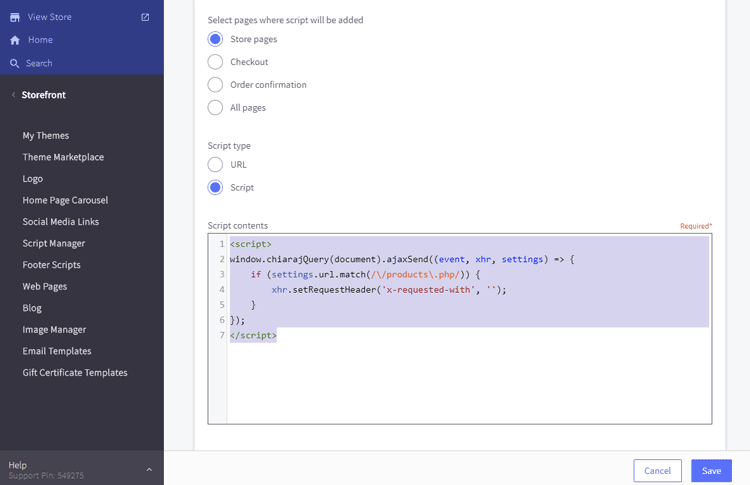
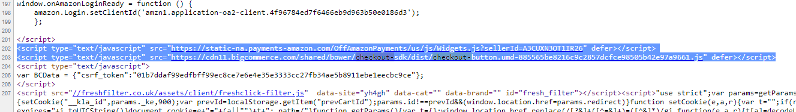
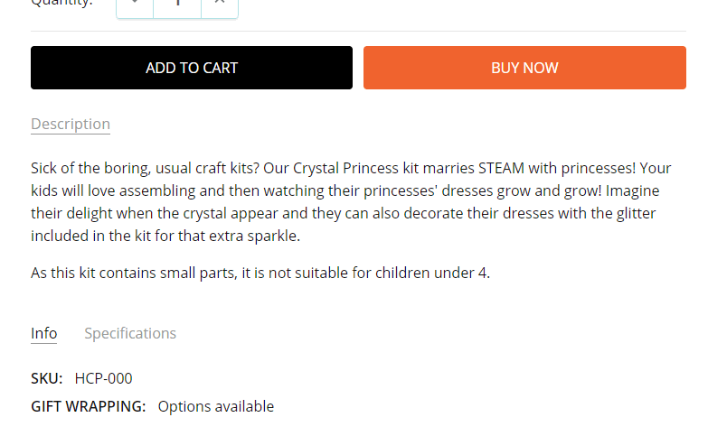

# FAQs

## IMPORTANT NOTE:

**ALL CUSTOM CODE SNIPPETS BELOW WE DO NOT HAVE ANY GUARANTEE WILL WORK AS YOU INTENDED. IN ADDITION, IT MAY AFFECT THE STABILITY OF THE ORIGINAL THEME. RECOMMENDED TO USE ONLY WHEN YOU UNDERSTAND. WE DO NOT HAVE ANY COMMITMENT NOR RESPONSIBILITY. IF IT CAUSES UNEXPECTED PROBLEMS, PLEASE REMOVE IT TO GET THE THEME WORKING PROPERLY AGAIN.**

## Change text of BUY button on the product page on mobile

Go to **Storefront** > **Script Manager**, click **Create a Script**, choose:

- **Location on page** = `Footer`
- **Select pages where script will be added** = `Store Pages`
- **Script type** = `Script`

Enter the script below to **Scripts contents**:

```html
<script>
(function() {
var style = document.createElement('style');
style.innerHTML = ".productView-options-toggle { width: 110px; border-radius: 3px; }"
+ ".productView-options-toggle .on { font-size: 0; }"
+ ".productView-options-toggle .on:before { font-size: 12px; content: 'Customize'; }";
document.head.appendChild(style);
})();
</script>
```

Where `Customize` is an example text to change.


## Display the product options on the product page on mobile

Go to **Storefront** > **Script Manager**, click **Create a Script**, choose:

- **Location on page** = `Footer`
- **Select pages where script will be added** = `Store Pages`
- **Script type** = `Script`

Enter the script below to **Scripts contents**:

```html
<script>
(function() {
var style = document.createElement('style');
style.innerHTML = ''
+ '@media (max-width: 800px) {'
+ '.productView-options-toggle { display: none }'
+ '.productView-options-content { position: static; right: 0; opacity: 1; box-shadow: none; border-top: 1px solid #ddd}'
+ '.productView-options-panel-body { position: static; padding-bottom: 0px; }'
+ '.productView-options-panel-heading ~ .mobile-panel-close { display: none; }'
+ '.productView-options-content .form-action { position: static; right: auto; }'
+ '.productView-options-panel-heading { display: none }'
+ '.productView-options { order: 6; }'
+ '}';
document.head.appendChild(style);
})();
</script>
```

## Hide the "Home" link on the main menu

Go to **Storefront** > **Script Manager**, click **Create a Script**, choose:

- **Location on page** = `Footer`
- **Select pages where script will be added** = `All Pages`
- **Script type** = `Script`

Enter the script below to **Scripts contents**:

```html
<script>
(function() {
var style = document.createElement('style');
style.innerHTML = '#navPages-main > .navPages-item:first-child { display: none }';
document.head.appendChild(style);
})();
</script>
```


## Fix Products Bought Together stop working after BigCommerce API changed

If you suddenly get a problem that the products also bought together stop working on your product pages. 
That is because BigCommerce has changed the content type of product ajax request.

To workaround this issue while waiting for the fix from BigCommerce or the theme update, please follow
this instruction.

Login to your store admin panel, go to **Storefront** > **Script Manager** > click on the button **Create a Script**.

Input:

- **Name of Script**: `Fix Also Bought Products stop working after BC API changed` or whatever.
- **Location of page**: `Footer`
- **Select pages where script will be added**: `Store pages`.
- **Script type**: `Script`.
- **Script contents**:

```html
<script>
window.chiarajQuery(document).ajaxSend((event, xhr, settings) => {
	if (settings.url.match(/\/products\.php/)) {
		xhr.setRequestHeader('x-requested-with', '');
	}
});
</script>
```

Then click **Save** button.

Your script should look like this screenshot:




## Add custom text on the orders page


Go to **Storefront** > **Script Manager**, click **Create a Script**, choose:

- **Location on page** = `Footer`
- **Select pages where script will be added** = `Checkout Pages`
- **Script type** = `Script`

Enter the script below to **Scripts contents**:

```html
<script>
(function () {
    var t = setInterval(function () {
        var $ = window.jQuerySupermarket || window.chiarajQuery || window.jQuery;
        if (typeof $ === 'undefined') {
            return;
        }
        clearInterval(t);

        if ($('body').is('.page-type-account_orderstatus, .papaSupermarket-pageType--account-orderstatus')) {
            $('.account').before('<p style="font-size:large;text-align:center">Click on your Order # to view details and tracking number</p>');
        }
    }, 200);
})();
</script>
```

Choose location = **Footer**.


## Collapse product description tab by default on product pages

Go to **Storefront** > **Script Manager**, click **Create a Script**, choose:

- **Location on page** = `Footer`
- **Select pages where script will be added** = `Store pages`
- **Script type** = `Script`

Enter the script below to **Scripts contents**: 

```html
<script>
(function($) {
    $('.productView-tab--description.is-active, .productView-desc.is-active').removeClass('is-active');
})(window.chiarajQuery || window.$);
</script>
```


## Make responsive top banner


Go to **Storefront** > **Script Manager**, click **Create a Script**, choose:

- **Location on page** = `Footer`
- **Select pages where script will be added** = `All Pages`
- **Script type** = `Script`

Enter the script below to **Scripts contents**:

```html
<script>
(function() {
var style = document.createElement('style');
style.innerHTML = ''
+ '.list-unstyled { display: block; list-style: none; margin: 0; padding: 0; }'
+ '.font-size-larger { font-size: larger }'
+ '@media (min-width: 801px) {'
    + '.flex-desktop { display: flex }'
    + '.flex-desktop > * { flex: 1 }'
    + '.display-inline-desktop { display: inline }'
    + '.ml-2-desktop { margin-left: 2rem }'
+ '}'
+ '@media (max-width: 550px) {'
    + '.hide-mobile { display: none }'
+ '}'
+ '@media (min-width: 551px) and (max-width: 800px) {'
    + '.hide-tablet { display: none }'
+ '}';
document.head.appendChild(style);
})();
</script>
```


### Banner 1

Create a new banner, open HTML source editor and add the code below:

```html
<ul class="list-unstyled flex-desktop">
    <li class="hide-mobile hide-tablet">EAST COAST STORES NOW OPEN</li>
    <li>FREE SHIPPING WITH ORDERS OVER $100</li>
    <li class="hide-mobile hide-tablet">FREE RETURNS ON ALL ORDERS</li>
</ul>
```

The banner will shows 3 column on desktop. On mobile and tablet, only "FREE SHIPPING WITH ORDERS OVER $100" is displayed.

CSS class explanation:

- `list-unstyled`: use to reset the UL element.
- `flex-desktop`: allow UL show as flex layout (columns) on desktop.
- `hide-mobile`: hide the element on mobile.
- `hide-mobile`: hide the element on tablet.


### Banner 2

Create a new banner, open HTML source editor and add the code below:

```html
<div>
    <p class="display-inline-desktop">One Day Only! Online Only</p>
    <p class="display-inline-desktop font-size-larger ml-2-desktop"><strong>HAPPY FRIDAY THE 13TH! · TAKE 13% OFF YOUR ENTIRE ORDER</strong></p>
</div>
```
The banner will shows 2 rows on mobile and tablet, but 1 row on desktop. Text "HAPPY FRIDAY THE 13TH! · TAKE 13% OFF YOUR ENTIRE ORDER" will have larger font size.

CSS class explanation:

- `display-inline-desktop`: display inline (same row) on desktop.
- `font-size-larger`: allow font size larger.
- `ml-2-desktop`: have a margin left 2rem on desktop.


## Show all the main navigation's items without (...) icon

Go to **Storefront** > **Script Manager**, click **Create a Script**, choose:

- **Location on page** = `Footer`
- **Select pages where script will be added** = `All pages`
- **Script type** = `Script`

Enter the script below to **Scripts contents**: 

```html
<script>
if (!window.chiaraSettings) window.chiaraSettings = {};
window.chiaraSettings.disableAutoSizeNavPages = true;
</script>
```


## Move product properties to show before Add to Cart button on PDP


Go to **Storefront** > **Script Manager**, click **Create a Script**, choose:

- **Location on page** = `Footer`
- **Select pages where script will be added** = `Store pages`
- **Script type** = `Script`

Enter the script below to **Scripts contents**: 

```html
<script>
(function($) {
    var $el = $('.productView-info--desktopOnly').css('margin-top', '1rem');
    $('.productView-options-content .form-action-group').before($el);
})(window.chiarajQuery || window.$);
</script>
```


## Show your site logo on all pages on mobile

According to our design intent, the site logo will be hidden on some pages and the main title of that page will appear in the header on mobile. If you want your logo to appear on every page, you can use the following custom code snippet.

Go to **Storefront** > **Script Manager**, click **Create a Script**, choose:

- **Location on page** = `Footer`
- **Select pages where script will be added** = `All Pages`
- **Script type** = `Script`

Enter the script below to **Scripts contents**:

```html
<script>
(function() {
var style = document.createElement('style');
style.innerHTML = ''
+ '@media (max-width: 800px) {'
  + '.page-type-account_addressbook .page-heading-logo, .page-type-account_addressbook h1.page-heading, .page-type-account_inbox .page-heading-logo, .page-type-account_inbox h1.page-heading, .page-type-account_order .page-heading-logo, .page-type-account_order h1.page-heading, .page-type-account_orderstatus .page-heading-logo, .page-type-account_orderstatus h1.page-heading, .page-type-account_recentitems .page-heading-logo, .page-type-account_recentitems h1.page-heading, .page-type-account_returns .page-heading-logo, .page-type-account_returns h1.page-heading, .page-type-accountcreated .page-heading-logo, .page-type-accountcreated h1.page-heading, .page-type-blog .page-heading-logo, .page-type-blog h1.page-heading, .page-type-brand .page-heading-logo, .page-type-brand h1.page-heading, .page-type-brands .page-heading-logo, .page-type-brands h1.page-heading, .page-type-cart .page-heading-logo, .page-type-cart h1.page-heading, .page-type-category .page-heading-logo, .page-type-category h1.page-heading, .page-type-createaccount .page-heading-logo, .page-type-createaccount h1.page-heading, .page-type-editaccount .page-heading-logo, .page-type-editaccount h1.page-heading, .page-type-forgotpassword .page-heading-logo, .page-type-forgotpassword h1.page-heading, .page-type-giftcertificates .page-heading-logo, .page-type-giftcertificates h1.page-heading, .page-type-giftcertificates_balance .page-heading-logo, .page-type-giftcertificates_balance h1.page-heading, .page-type-giftcertificates_redeem .page-heading-logo, .page-type-giftcertificates_redeem h1.page-heading, .page-type-login .page-heading-logo, .page-type-login h1.page-heading, .page-type-newpassword .page-heading-logo, .page-type-newpassword h1.page-heading, .page-type-page_contact_form .page-heading-logo, .page-type-page_contact_form h1.page-heading, .page-type-wishlists .page-heading-logo, .page-type-wishlists h1.page-heading { display: block; position: static; width: auto; height: auto; overflow: visible }'
  + '.page-type-account_addressbook .header-logo, .page-type-account_inbox .header-logo, .page-type-account_order .header-logo, .page-type-account_orderstatus .header-logo, .page-type-account_recentitems .header-logo, .page-type-account_returns .header-logo, .page-type-accountcreated .header-logo, .page-type-blog .header-logo, .page-type-brand .header-logo, .page-type-brands .header-logo, .page-type-cart .header-logo, .page-type-category .header-logo, .page-type-createaccount .header-logo, .page-type-editaccount .header-logo, .page-type-forgotpassword .header-logo, .page-type-giftcertificates .header-logo, .page-type-giftcertificates_balance .header-logo, .page-type-giftcertificates_redeem .header-logo, .page-type-login .header-logo, .page-type-newpassword .header-logo, .page-type-page_contact_form .header-logo, .page-type-wishlists .header-logo { display: block }'
+ '}';
document.head.appendChild(style);
})();
</script>
```

## Add item units behind prices (i.e $19.95 lb)

Go to **Storefront** > **Script Manager**, click **Create a Script**, choose:

- **Location on page** = `Footer`
- **Select pages where script will be added** = `All Pages`
- **Script type** = `Script`

Enter the script below to **Scripts contents**:

```html
<script>
(function() {
var style = document.createElement('style');
style.innerHTML = '.price:after { content: ' lb'; }';
document.head.appendChild(style);
})();
</script>
```


## Move Compare button to under Add to Cart button on product card items

Go to **Storefront** > **Script Manager**, click **Create a Script**, choose:

- **Location on page** = `Footer`
- **Select pages where script will be added** = `All pages`
- **Script type** = `Script`

Enter the script below to **Scripts contents**: 

```html
<script>
(function($) {
    function throttle(callback, wait, immediate = false) {
      let timeout = null 
      let initialCall = true

      return function() {
        const callNow = immediate && initialCall
        const next = () => {
          callback.apply(this, arguments)
          timeout = null
        }

        if (callNow) { 
          initialCall = false
          next()
        }

        if (!timeout) {
          timeout = setTimeout(next, wait)
        }
      }
    }

    function main() {
        $('.card').not('[data-compare-button-moved]').each(function(i, el) {
            var $card = $(el);
            var $btn = $card.find('.card-figcaption-body-alt .card-figcaption-button.compare');

            $btn.appendTo($card.find('.card-figcaption-body'))
                .addClass('button--small')
                .attr('data-compare-button-moved', true);

            $btn.find('span').removeClass('is-srOnly');
            $btn.find('.icon').remove();

        });
    }

    $(window).on('scroll resize load', throttle(main, 300, true));
})(window.chiarajQuery || window.jQuery);
</script>
```


## Rename related products tab

Go to **Storefront** > **Script Manager**, click **Create a Script**, choose:

- **Location on page** = `Footer`
- **Select pages where script will be added** = `Store pages`
- **Script type** = `Script`


Enter the script below to **Scripts contents**: 

```html
<script>
(function($) {
    $('.productView-productsList--related .productView-productsList-heading').text('RELATED PRODUCTS TITLE');
})(window.chiarajQuery || window.jQuery);
</script>
```

Replace `RELATED PRODUCTS TITLE` with your real title.


## Rename the tabs on product pages

Go to **Storefront** > **Script Manager**, click **Create a Script**, choose:

- **Location on page** = `Footer`
- **Select pages where script will be added** = `Store pages`
- **Script type** = `Script`

Enter the script below to **Scripts contents**: 

```html
<script>
(function($) {
    function update() {
        $('.productView-tab--desc .productView-tab-title, .productView-desc-heading').html('YOUR DESCRIPTION TITLE');
        $('.productView-tab--warranty .productView-tab-title, .productView-warranty-heading, .productView-warranty-panel-heading').html('YOUR WARRANTEY TITLE');
        $('.productView-tab--properties .productView-tab-title, .productView-properties-heading, .productView-properties-panel-heading').html('YOUR INFO TITLE');
        $('.productView-tab--addition .productView-tab-title, .productView-addition-heading, .productView-addition-panel-heading').html('YOUR FEATURES TITLE');
    }

    $(document).ajaxComplete(function(event, xhr, options) {
       if (options.headers['stencil-options'].match(/quick-view/)) {
            setTimeout(update, 500);
       }
    });
    update();
})(window.chiarajQuery || window.jQuery);
</script>
```

Replace `YOUR DESCRIPTION TITLE`, `YOUR INFO TITLE`, `YOUR FEATURES TITLE` as you wish.


## Tweak the checkout with PayPal buttons and other additional buttons on the cart page

Go to **Storefront** > **Script Manager**, click **Create a Script**, choose:

- **Location on page** = `Footer`
- **Select pages where script will be added** = `All Pages`
- **Script type** = `Script`

Enter the script below to **Scripts contents**: 

```html
<script>
(function() {
    var css = document.createElement('style');
    css.innerHTML = ''
        + '.checkoutRemote { flex-direction: column; }'
        + '.checkoutRemote > div { margin-bottom: 1rem }'
        + '.visa-checkout-wrapper { display: inline-flex; flex-direction: column }'
        + '#checkout-app .cart-additionalCheckoutButtons .PayPalExpressCheckout:before { text-align: left }'
        + '.cart-additionalCheckoutButtons .FloatRight { display: flex; flex-direction: column; align-items: center; justify-content: center; }'
        + '.cart-additionalCheckoutButtons .FloatRight > p { display: none !important }'
        + '@media (max-width: 550px) {'
        + '.cart-additionalCheckoutButtons { margin-top: .75rem }'
        + '.cart-additionalCheckoutButtons .CheckoutButton { margin-bottom: .75rem }'
        + '.cart-additionalCheckoutButtons .FloatRight > div { float: none; text-align: center; display: block; width: 100% }'
        + '.cart-additionalCheckoutButtons .FloatRight .or-use-label { display: none }'
        + '.cart-additionalCheckoutButtons .PayPalExpressCheckout:before { display: block; content: "Or continue with Express Checkout"; text-align: center; width: 100%; margin: .5rem 0 }'
        + '.paypal-smart-buttons { margin-top: 0 !important; margin-bottom: 0 !important; }'
        + '.paypal-smart-buttons .zoid-outlet { width: 100% !important }'
        + '/*.amazonpay-button-inner-image { width: 100%; max-height: none !important }*/'
        + '}'
        + '@media (min-width: 551px) and (max-width: 800px) {'
        + '.cart-totals { float: none; margin: 0 auto; }'
        + '.cart-actions { text-align: center }'
        + '.cart-actions .button { float: none; min-width: 296px }'
        + '.cart-additionalCheckoutButtons { margin-top: .75rem }'
        + '.cart-additionalCheckoutButtons .CheckoutButton { text-align: center }'
        + '.cart-additionalCheckoutButtons .FloatRight > div { float: none; margin: 0; display: block }'
        + '.cart-additionalCheckoutButtons .FloatRight .or-use-label { display: none }'
        + '.cart-additionalCheckoutButtons .PayPalExpressCheckout:before { display: block; content: "Or continue with Express Checkout"; text-align: center; width: 296px; margin: .5rem auto }'
        + '.paypal-smart-buttons .zoid-outlet { width: 296px !important }'
        + '/*.amazonpay-button-inner-image { width: 200px; max-height: none !important }*/'
        + '}'
        + '@media (min-width: 801px) {'
        + '.cart-actions .button { min-width: 296px }'
        + '.paypal-smart-buttons { margin: 0 !important }'
        + '.paypal-smart-buttons .zoid-outlet { width: 296px !important }'
        + '.cart-additionalCheckoutButtons { margin-top: .75rem }'
        + '.cart-additionalCheckoutButtons .FloatRight { display: block }'
        + '.cart-additionalCheckoutButtons .FloatRight .or-use-label { display: none }'
        + '.cart-additionalCheckoutButtons .PayPalExpressCheckout:before { display: block; content: "Or continue with Express Checkout"; text-align: center; width: 296px; margin: .5rem auto }'
        + '/*.amazonpay-button-inner-image { width: 200px; max-height: none !important }*/'
        + '}';
    document.head.appendChild(css);

    var observer = new MutationObserver(function() {
        var img = document.querySelector('.amazonpay-button-inner-image');
        if (img) {
            img.src = img.src.replace(/small/, 'large');
        }
    });
    observer.observe(document.querySelector('.CheckoutButtonAmazon'), { childList: true });
})();
</script>
```


## Display additional checkout buttons on the checkout page


Go to **Storefront** > **Script Manager**, click **Create a Script**, choose:

- **Location on page** = `Footer`
- **Select pages where script will be added** = `All Pages`
- **Script type** = `Script`

Enter the script below to **Scripts contents**: 

```html
<script type="text/javascript" src="https://static-na.payments-amazon.com/OffAmazonPayments/us/js/Widgets.js?sellerId=A3CUXN3OT1IR26" defer></script>
<script type="text/javascript" src="https://cdn11.bigcommerce.com/shared/bower/checkout-sdk/dist/checkout-button.umd-885565be8216c9c2857dcfce98505b42e97a9661.js" defer></script>
<script src="https://code.jquery.com/jquery-3.4.1.min.js" integrity="sha256-CSXorXvZcTkaix6Yvo6HppcZGetbYMGWSFlBw8HfCJo=" crossorigin="anonymous"></script>
<script src="https://cdnjs.cloudflare.com/ajax/libs/jquery-throttle-debounce/1.1/jquery.ba-throttle-debounce.min.js" integrity="sha256-+nuEu243+6BveXk5N+Vbr268G+4FHjUOEcfKaBqfPbc=" crossorigin="anonymous"></script>
<script>
(function($) {
    var css = document.createElement('style');
    css.innerHTML = ''
    	+ '#checkout-app .customerEmail-container { margin-bottom: 0 }'
    	+ '#checkout-app .customerEmail-container + p { display: none }';
    document.head.appendChild(css);
    
    function checkoutButtons() {
        var $checkoutRemote = $('.checkoutRemote');
        if ($checkoutRemote.length == 0 || $checkoutRemote.data('updated')) {
            return;
        }
        $.get('/cart.php', function(resp) {
            $resp = $(resp);
            $checkoutRemote.html('').append($resp.find('.cart-additionalCheckoutButtons'));
            $checkoutRemote.data('updated', true);
            var img = document.querySelector('.amazonpay-button-inner-image');
            if (img) {
                img.src = img.src.replace(/small/, 'large');
            }
        });
    }
    function customerSection() {
        var $section = $('#checkout-customer-guest');
        if ($section.length === 0 || $section.data('updated')) {
            return;
        }
        $section.data('updated', true);
        $section.find('.form-body > p:nth-child(3)').prependTo($section.find('.form-body'));
    }
    var observer = new MutationObserver($.debounce(200, function() {
        checkoutButtons();
        customerSection();
    }));
    observer.observe(document.querySelector('#checkout-app'), { childList: true, subtree: true })
})(window.jQuery);
</script>
```

Replace 2 lines in the script by your own code:

```html
<script type="text/javascript" src="https://static-na.payments-amazon.com/OffAmazonPayments/us/js/Widgets.js?sellerId=A3CUXN3OT1IR26" defer></script>
<script type="text/javascript" src="https://cdn11.bigcommerce.com/shared/bower/checkout-sdk/dist/checkout-button.umd-885565be8216c9c2857dcfce98505b42e97a9661.js" defer></script>
```

You can find it by going to your cart page after added some products to cart, right click > **View page source** (or **Ctrl + U**), search `checkout-button.umd` and copy 2 lines around like this example:




## Always show Add to Cart button on desktop screens

Go to **Storefront** > **Script Manager**, click **Create a Script**, choose:

- **Location on page** = `Footer`
- **Select pages where script will be added** = `Store Pages`
- **Script type** = `Script`

Enter the script below to **Scripts contents**:

```html
<script>
(function() {
var style = document.createElement('style');
style.innerHTML = ''
+ '@media (min-width: 801px) {'
+ '.card-img-container { position: relative }'
+ '.card-figcaption { position: static; display: block; opacity: 1; margin-top: .42857rem; overflow: visible }'
+ '.card-figcaption-body { position: static; transform: none; display: block }'
+ '.card-figcaption-body-alt { z-index: 2; display: none }'
+ '.card-figure:hover .card-figcaption-body-alt { display: block }'
+ '}';
document.head.appendChild(style);
})();
</script>
```

## Fix product variant image not change when click on product swatches on product card items if "Show Image Slider" is enabled

Go to **Storefront** > **Script Manager**, click **Create a Script**, choose:

- **Location on page** = `Footer`
- **Select pages where script will be added** = `All pages`
- **Script type** = `Script`

Enter the script below to **Scripts contents**: 


```html
<script>
(function($) {
    $('body').on('click', '.productCard-colorSwatch', function() {
        var $img = $(event.target).closest('.card').find('.card-image.first');
        if ($img.length > 0) {
            $img.siblings('.is-active').removeClass('is-active');
            $img.addClass('is-active');
        }
    });
})(window.chiarajQuery);
</script>
```


## Change "Already have an account? Sign in now" in Checkout page

Go to **Storefront** > **Script Manager**, click **Create a Script**, choose:

- **Location on page** = `Footer`
- **Select pages where script will be added** = `Checkout`
- **Script type** = `Script`

Enter the script below to **Scripts contents**:

```html
<script>
(function($) {
    var CREATE_ACCOUNT_HTML = '<a href="/login.php">Login</a> to your account or <a href="/login.php?action=create_account">Create an account</a> for faster checkout in the future';

    function debounce(func, wait, immediate) {
        var timeout;
        return function() {
            var context = this, args = arguments;
            var later = function() {
                timeout = null;
                if (!immediate) func.apply(context, args);
            };
            var callNow = immediate && !timeout;
            clearTimeout(timeout);
            timeout = setTimeout(later, wait);
            if (callNow) func.apply(context, args);
        };
    };

    function main() {
        var $orgSignin = $('.customerEmail-container + p');
        var $newSignin = $orgSignin.next('.customerEmail-signin');

        if ($orgSignin.length > 0 && $newSignin.length === 0) {
            $newSignin = $('<p class="customerEmail-signin">' + CREATE_ACCOUNT_HTML + '</p>');
            $orgSignin.hide().after($newSignin);
        }
    }

    var debounceMain = debounce(main, 200);

    (new MutationObserver(debounceMain)).observe(document.getElementById('checkout-app'), { childList: true, subtree: true });
})(window.chiarajQuery);
</script>
```

## Show all image thumbnails and display videos at third position on PDP

Go to **Storefront** > **Script Manager**, click **Create a Script**, choose:

- **Location on page** = `Footer`
- **Select pages where script will be added** = `Store Pages`
- **Script type** = `Script`

Enter the script below to **Scripts contents**:

```html
<script>
(function() {
var style = document.createElement('style');
style.innerHTML = ''
+ '.productView-imageCarousel-nav { height: auto !important; max-height: none !important }'
+ '.productView-imageCarousel-nav .slick-track { width: auto !important; transform: none !important; display: flex; flex-wrap: wrap }'
+ '.productView-imageCarousel-nav-item { margin: 0.1875rem !important; max-width: 100px !important; order: 5 }'
+ '.productView-imageCarousel-nav .productView-imageCarousel-nav-item:nth-child(1) { order: 1 }'
+ '.productView-imageCarousel-nav .productView-imageCarousel-nav-item:nth-child(2) { order: 2 }'
+ '.productView-imageCarousel-nav .productView-imageCarousel-nav-item--video { order: 3 }';
document.head.appendChild(style);
})();
</script>
```


## How to make the custom footer links open in the new window

Go to **Storefront** > **Script Manager**, click **Create a Script**, choose:

- **Location on page** = `Footer`
- **Select pages where script will be added** = `All Pages`
- **Script type** = `Script`

Enter the script below to **Scripts contents**:

```html
<script>
(function() {
   var links = document.querySelectorAll('#footer-info-list-custom1 a, #footer-info-list-custom2 a, #footer-info-list-custom3 a');
   for (var i in links) {
       links[i].target = '_blank';
   }
})();
</script>
```


## Fix Main Navigation dropdown error on Safari

This bug seems to appear on version 1.5.6 and lower.

Go to **Storefront** > **Script Manager**, click **Create a Script**, choose:

- **Location on page** = `Footer`
- **Select pages where script will be added** = `All Pages`
- **Script type** = `Script`

Enter the script below to **Scripts contents**:

```html
<script>
    (function() {
        var isSafari = /^((?!chrome|android).)*safari/i.test(navigator.userAgent);
        if (!isSafari) return;
		
        function main($) {
            var $nav = $('.navPages-container, .navPages-container .navPages');
            $(window).on('resize load', function() {
                $nav.css('overflow', '');
                if ($(window).width() >= 801) {
                    setTimeout(function() {
                        $nav.css('overflow', 'visible');
                    }, 500);
                }
            });
        }
        
        var ti = setInterval(function() {
            if (typeof window.chiarajQuery !== 'undefined') {
            	clearInterval(ti);
                main(window.chiarajQuery);
            }
        }, 200);
    })();
</script>
```


## Remove `imbypass=on` on PDP

Go to **Storefront** > **Script Manager**, click **Create a Script**, choose:

- **Location on page** = `Footer`
- **Select pages where script will be added** = `Store Pages`
- **Script type** = `Script`

Enter the script below to **Scripts contents**:

```html
<script>
(function($) {
    $('a[data-zoom-image]').each(function(i, el) {
        var $el = $(el);
        var href = $el.attr('href'),
            zoom = $el.attr('data-zoom-image');
        $el.attr('href', href.replace(/[?&]imbypass=on/g, ''))
            .attr('data-zoom-image', zoom.replace(/[?&]imbypass=on/g, ''));
    });
})(window.chiarajQuery || window.jQuery);
</script>
```


## Display Add to Cart button inline on PDP on mobile

Go to **Storefront** > **Script Manager**, click **Create a Script**, choose:

- **Location on page** = `Footer`
- **Select pages where script will be added** = `Store Pages`
- **Script type** = `Script`

Enter the script below to **Scripts contents**: 

```html
<script>
(function() {
    var css = document.createElement('style');
    css.innerHTML = '@media (max-width: 800px) {'
        + '.productView-options .form-action-group { position: static; border-top: 0; padding-left: 0; padding-right: 0; margin: 0 -5px }'
        + '.productView-options { display: block !important; height: auto }'
        + '.productView-options-panel-heading { display: none }'
        + '}';
    document.head.appendChild(css);
})();
</script>
```


## Hide Info section on PDP when it is empty

Go to **Storefront** > **Script Manager**, click **Create a Script**, choose:

- **Location on page** = `Footer`
- **Select pages where script will be added** = `Store Pages`
- **Script type** = `Script`

Enter the script below to **Scripts contents**: 

```html
<script>
(function() {
    if (document.querySelector('.productView-info').innerText.trim() === '') {
        document.querySelector('.productView-properties').style += ';display:none;';
        document.querySelector('.productView-tab--properties').style += ';display:none;';
    }
})();
</script>
```

## Display full warranty content on PDP on mobile

Go to **Storefront** > **Script Manager**, click **Create a Script**, choose:

- **Location on page** = `Footer`
- **Select pages where script will be added** = `Store Pages`
- **Script type** = `Script`

Enter the script below to **Scripts contents**: 

```html
<script>
(function() {
    var css = document.createElement('style');
    css.innerHTML = ''
        + '.productView-warranty-heading-toggle > .icon { display: none }'
        + '.productView-warranty-summary { display: none }'
        + '.productView-warranty-content { position: static; opacity: 1; background-color: transparent; box-shadow: none }'
        + '.productView-warranty-panel-body { position: static; }'
        + '.productView-warranty-panel-heading { display: none }';
    document.head.appendChild(css);
})();
</script>
```

## Display full product info and custom fields on mobile


Go to **Storefront** > **Script Manager**, click **Create a Script**, choose:

- **Location on page** = `Footer`
- **Select pages where script will be added** = `Store Pages`
- **Script type** = `Script`

Enter the script below to **Scripts contents**: 

```html
<script>
(function() {
    var css = document.createElement('style');
    css.innerHTML = ''
        + '.productView-properties-subheading { display: none }'
        + '.productView-properties-heading-toggle > .icon { display: none }'
        + '.productView-properties-summary { display: none }'
        + '.productView-properties-content { position: static; opacity: 1; background-color: transparent; box-shadow: none }'
        + '.productView-properties-panel-body { position: static; }'
        + '.productView-properties-panel-heading { display: none }';
    document.head.appendChild(css);
})();
</script>
```

## Display selected swatch option name on PDP

Go to **Storefront** > **Script Manager**, click **Create a Script**, choose:

- **Location on page** = `Footer`
- **Select pages where script will be added** = `Store Pages`
- **Script type** = `Script`

Enter the script below to **Scripts contents**: 

```html
<script>
(function() {
    var css = document.createElement('style');
    css.innerHTML = ''
        + '[data-product-attribute="swatch"] { position: relative; }'
        + '[data-product-attribute="swatch"] .form-option:not(.unavailable) { position: static; }'
        + '[data-product-attribute="swatch"] .form-option-expanded { left: auto; top: auto; margin-top: 25px; margin-left: 30px; }'
        + '[data-product-attribute="swatch"] .form-radio:checked+.form-option:not(.unavailable) .form-option-variant:after { content: attr(title); position: absolute; top: 0; left: 120px; }';
    document.head.appendChild(css);
})();  
</script>
```

You can adjust `left: 120px` if the option label is longer.

## Fix cart popup display overlapped by the main menu on Firefox


Go to **Storefront** > **Script Manager**, click **Create a Script**, choose:

- **Location on page** = `Footer`
- **Select pages where script will be added** = `All Pages`
- **Script type** = `Script`

Enter the script below to **Scripts contents**: 

```html
<script>
(function() {
    var css = document.createElement('style');
    css.innerHTML = ''
        + '@media (min-width: 801px) {'
        + '.navUser { z-index: 60 }'
        + '}';
    document.head.appendChild(css);
})();
</script>
```


## Hide phone number (Call Us) on mobile


Go to **Storefront** > **Script Manager**, click **Create a Script**, choose:

- **Location on page** = `Footer`
- **Select pages where script will be added** = `All Pages`
- **Script type** = `Script`

Enter the script below to **Scripts contents**: 

```html
<script>
(function() {
    var css = document.createElement('style');
    css.innerHTML = ''
        + '@media (max-width: 800px) {'
        + '.bottomBar-contactPanel .button[href^=tel] { display: none }'
        + '}';
    document.head.appendChild(css);
})();
</script>
```


## And a custom link on the main navigation

Go to **Storefront** > **Script Manager**, click **Create a Script**, choose:

- **Location on page** = `Footer`
- **Select pages where script will be added** = `All Pages`
- **Script type** = `Script`

Enter the script below to **Scripts contents**: 

```html
<script>
(function(link, title) {
    var lastEl = Array.from(document.querySelectorAll('.navPages .navPages-list--main > .navPages-item--category')).pop();
    var li = document.createElement('li');
    li.setAttribute('class', 'navPages-item navPages-item-page');
    li.innerHTML = '<a class="navPages-action is-root" href="' + link + '">' + title + '</a>';
    lastEl.parentNode.insertBefore(li, lastEl.nextSibling);
})(
    'YOUR CUSTOM LINK HERE',
    'YOUR LINK TITLE HERE'
);
</script>
```

- Replace `YOUR CUSTOM LINK HERE` by your link URL.
- Replace `YOUR LINK TITLE HERE` by your link title.


## Hide all MSRP price store wide

Go to **Storefront** > **Script Manager**, click **Create a Script**, choose:

- **Location on page** = `Footer`
- **Select pages where script will be added** = `All Pages`
- **Script type** = `Script`

Enter the script below to **Scripts contents**: 

```html
<script>
(function() {
    var css = document.createElement('style');
    css.innerHTML = '.price-section.rrp-price--withoutTax, .price-section.rrp-price--withTax { display: none !important }';
    document.head.appendChild(css);
})();
</script>
```

## Display AfterPay payment icon

Go to **Storefront** > **Script Manager**, click **Create a Script**, choose:

- **Location on page** = `Footer`
- **Select pages where script will be added** = `All Pages`
- **Script type** = `Script`

Enter the script below to **Scripts contents**: 

```html
<script>
(function() {
    var img = document.createElement('img');
    img.src = 'https://cdn11.bigcommerce.com/s-c14n6tful3/content/icons/afterpay-black.svg?t=1';
    img.alt = 'AfterPay';
    img.classList.add('footer-payment-icon');
    img.style = 'width: 90px';
    var el = document.querySelector('.footer-payment-icons');
    el.appendChild(img);
})();
</script>
```

## Display ZIP payment icon

Go to **Storefront** > **Script Manager**, click **Create a Script**, choose:

- **Location on page** = `Footer`
- **Select pages where script will be added** = `All Pages`
- **Script type** = `Script`

Enter the script below to **Scripts contents**: 

```html
<script>
(function() {
    var img = document.createElement('img');
    img.src = 'https://cdn11.bigcommerce.com/s-c14n6tful3/content/icons/zippay.svg?t=1';
    img.alt = 'ZIP Pay';
    img.classList.add('footer-payment-icon');
    img.style = 'width: 90px';
    var el = document.querySelector('.footer-payment-icons');
    el.appendChild(img);
})();
</script>
```

## Display LayBuy payment icon

Go to **Storefront** > **Script Manager**, click **Create a Script**, choose:

- **Location on page** = `Footer`
- **Select pages where script will be added** = `All Pages`
- **Script type** = `Script`

Enter the script below to **Scripts contents**: 

```html
<script>
(function() {
    var img = document.createElement('img');
    img.src = 'https://cdn11.bigcommerce.com/s-c14n6tful3/content/icons/laybuy.svg?t=1';
    img.alt = 'LayBuy';
    img.classList.add('footer-payment-icon');
    img.style = 'width: 90px';
    var el = document.querySelector('.footer-payment-icons');
    el.appendChild(img);
})();
</script>
```


## Show the related products when Frequently Bought Together is enabled

If you want to show the related products for a specific products while Products Frequently Bought Together feature is enabled, follow the instruction below. Frequently Bought Together is also hidden for these products.

1. Create a custom field with name `ShowRelatedProducts` with value = `1` in a specific product.

2. Create a custom script in **Storefront** > **Script Manager**, click **Create a Script**, choose:

- **Location on page** = `Footer`
- **Select pages where script will be added** = `All Pages`
- **Script type** = `Script`

Enter the script below to **Scripts contents**: 

```html
<script>
    (function($) {
        function debounce(func, wait, immediate) {
            var timeout;
            return function() {
                var context = this, args = arguments;
                var later = function() {
                    timeout = null;
                    if (!immediate) func.apply(context, args);
                };
                var callNow = immediate && !timeout;
                clearTimeout(timeout);
                timeout = setTimeout(later, wait);
                if (callNow) func.apply(context, args);
            };
        };

        function init($scope) {
            if ($scope.find('.productView-info-name--cfShowrelatedproducts').length === 0) {
                return;
            }

            $scope.find('.productView-alsoBought').hide();
            
            var  productId = $scope.find('input[name=product_id]').val();
            if (!productId) {
                return;
            }

            stencilUtils.api.product.getById(productId, {
                template: 'products/tabs',
                config: {
                    product: {
                        related_products: true
                    }
                }
            }, function(err, resp) {
                if (err) {
                    return;
                }
                
                var $wrapper = $('<section class="productView-productsList productView-productsList--related"><h3 class="productView-productsList-heading">Related Products</h3><div class="productView-productsList-content" data-content></div></section>');
                var $content = $wrapper.find('[data-content]');

                $('<div>').append(resp).find('.productCarousel').first().appendTo($content);

                if ($content.children().length > 0) {
                    $scope.append($wrapper);

                    var $slick = $content.find('[data-slick]');
                    var opts = $slick.data('slick');

                    opts.responsive[0].settings.slidesToShow = 5;

                    $slick.slick(opts);
                }
            });
        }

        function css() {
            $('head').append(''
                + '<style>'
                + '.productView-info-name--cfShowrelatedproducts, .productView-info-value--cfShowrelatedproducts { display: none }'
                + '</style>');
        }

        $(document).ready(function() {
            css();

            $('.productView-container').each(function(i, el) {
                init($(el));
            });

            var ob = new MutationObserver(debounce(function() {
                $('.modal-body.quickView .productView').each(function(i, el) {
                    var $el = $(el);
                    if (!$el.data('initRelatedProducts')) {
                        $el.data('initRelatedProducts', true);
                        init($el);
                    }
                });
            }, 300));
            ob.observe(document.querySelector('body'), { childList: true, subtree: true });
        });
    })(window.chiarajQuery || window.jQuery);
</script>
```

Or enter the compressed code:

```html
<script>!function(t){function e(e){if(0!==e.find(".productView-info-name--cfShowrelatedproducts").length){e.find(".productView-alsoBought").hide();var i=e.find("input[name=product_id]").val();i&&stencilUtils.api.product.getById(i,{template:"products/tabs",config:{product:{related_products:!0}}},function(i,d){if(!i){var o=t('<section class="productView-productsList productView-productsList--related"><h3 class="productView-productsList-heading">Related Products</h3><div class="productView-productsList-content" data-content></div></section>'),n=o.find("[data-content]");if(t("<div>").append(d).find(".productCarousel").first().appendTo(n),n.children().length>0){e.append(o);var c=n.find("[data-slick]"),a=c.data("slick");a.responsive[0].settings.slidesToShow=5,c.slick(a)}}})}}t(document).ready(function(){var i,d,o,n;t("head").append("<style>.productView-info-name--cfShowrelatedproducts, .productView-info-value--cfShowrelatedproducts { display: none }</style>"),t(".productView-container").each(function(i,d){e(t(d))}),new MutationObserver((i=function(){t(".modal-body.quickView .productView").each(function(i,d){var o=t(d);o.data("initRelatedProducts")||(o.data("initRelatedProducts",!0),e(o))})},d=300,function(){var t=this,e=arguments,c=o&&!n;clearTimeout(n),n=setTimeout(function(){n=null,o||i.apply(t,e)},d),c&&i.apply(t,e)})).observe(document.querySelector("body"),{childList:!0,subtree:!0})})}(window.chiarajQuery||window.jQuery);</script>
```


## Fix Facebook box not reload when go to the next page if Faceted Filters is enabled

Go to **Storefront** > **Script Manager**, click **Create a Script**, choose:

- **Location on page** = `Footer`
- **Select pages where script will be added** = `All Pages`
- **Script type** = `Script`

Enter the script below to **Scripts contents**: 

```html
<script>
(function() {
    function debounce(func, wait, immediate) {
        var timeout;
        return function() {
            var context = this, args = arguments;
            var later = function() {
                timeout = null;
                if (!immediate) func.apply(context, args);
            };
            var callNow = immediate && !timeout;
            clearTimeout(timeout);
            timeout = setTimeout(later, wait);
            if (callNow) func.apply(context, args);
        };
    };

    var ob = new MutationObserver(debounce(function() {
        FB.XFBML.parse();
    }), 300);
    ob.observe(document.querySelector('#faceted-search-container'), { childList: true });
})();
</script>
```

## Display the top banner on Home page to all pages

Go to **Storefront** > **Script Manager**, click **Create a Script**, choose:

- **Location on page** = `Footer`
- **Select pages where script will be added** = `All Pages`
- **Script type** = `Script`

Enter the script below to **Scripts contents**: 

```html
<script>
(function($) {
    if (!$('body').is('.page-type-default')) {
        stencilUtils.api.getPage('/', { template: 'common/header' }, function(err, resp) {
            if (!err && resp) {
                var $banners = $(resp).filter('[data-banner-location=top]').first();
                if ($banners.length > 0) {
                    $('body').prepend($banners);
                }
            }
        });
    }
})(window.chiarajQuery)
</script>
```


## Display the top banner on Home page to all pages in Chiara Fashion

Go to **Storefront** > **Script Manager**, click **Create a Script**, choose:

- **Location on page** = `Footer`
- **Select pages where script will be added** = `All Pages`
- **Script type** = `Script`

Enter the script below to **Scripts contents**: 

```html
<script>
(function($) {
    if ($('.header-top-item--banner').length === 0) {
        stencilUtils.api.getPage('/', {}, function(err, resp) {
            var $content = $(resp).find('.header-top-item--banner');
            if ($content.length > 0) {
                $content.prependTo($('.header-top-list'));
                
                var $top = $('.banners[data-banner-location="top"]');
                if ($top.length === 0) {
                    $top = $('<div class="banners u-hiddenVisually-desktop" data-banner-location="top">');
                    $('.header').first().before($top);
                }
                $top.html($content.html());
            }
        });
    }
})(window.chiarajQuery);
</script>
```


## Display the bottom banner on Home page to all pages

Go to **Storefront** > **Script Manager**, click **Create a Script**, choose:

- **Location on page** = `Footer`
- **Select pages where script will be added** = `All Pages`
- **Script type** = `Script`

Enter the script below to **Scripts contents**: 

```html
<script>
(function($) {
    if (!$('body').is('.page-type-default')) {
        stencilUtils.api.getPage('/', { template: 'common/footer' }, function(err, resp) {
            if (!err && resp) {
                var $banners = $(resp).filter('[data-banner-location=bottom]').first();
                if ($banners.length > 0) {
                    $('body > .footer').first().before($banners);
                }
            }
        });
    }
})(window.chiarajQuery);
</script>
```


## Display a better bulk discount rates table to show per piece price and savings


Edit file `templates/components/products/bulk-discount-rates.html` in **Edit Theme Files**.

Replace the table HTML:

``html
<table class="productView-bulkPricing-table table">
...
</table>
```

By the code below:

```html
{{#if product}}
    {{#if (merge this _price=product.price)}}{{/if}}
{{else}}
    {{#if (merge this _price=price)}}{{/if}}
{{/if}}
<table class="productView-bulkPricing-table table">
    <tbody class="table-tbody">
        <tr>
            <td>Quantity</td>
            {{#each bulk_discount_rates}}
                <td>{{lang 'products.bulk_pricing.range' min=min max=max}}</td>
            {{/each}}
        </tr>
        <tr>
            <td>Per Piece</td>
            {{#each bulk_discount_rates}}
                <td>
                    {{#if type '===' 'percent'}}
                        {{../../settings.money.currency_token}}{{divide (round (multiply ../../_price.without_tax.value (subtract 100 discount.value))) 100}}
                        <!-- {{../../_price.without_tax.value}} -->
                        <!-- {{discount.value}} -->
                    {{/if}}
                    {{#if type '===' 'fixed'}}
                        {{lang 'products.bulk_pricing.fixed' discount=discount.formatted}}
                    {{/if}}
                    {{#if type '===' 'price'}}
                        {{../../settings.money.currency_token}}{{divide (round (multiply (subtract ../../_price.without_tax.value discount.value) 100)) 100}}
                    {{/if}}
                </td>
            {{/each}}
        </tr>
        <tr>
            <td>Savings</td>
            {{#each bulk_discount_rates}}
                <td>
                    {{#if type '===' 'percent'}}
                        <!-- {{lang 'products.bulk_pricing.percent' discount=discount.formatted}} -->
                        {{discount.value}}% off
                    {{/if}}
                    {{#if type '===' 'fixed'}}
                        {{../../settings.money.currency_token}}{{subtract ../../_price.without_tax.value discount.value}}
                    {{/if}}
                    {{#if type '===' 'price'}}
                        <td>{{divide (round (multiply (divide discount.value ../../_price.without_tax.value) 10000) 2) 100}}%</td>
                    {{/if}}
                </td>
            {{/each}}
        </tr>
    </tbody>
</table>
```

## Add a custom label (HOT) on a main menu item

Go to **Storefront** > **Script Manager**, click **Create a Script**, choose:

- **Location on page** = `Footer`
- **Select pages where script will be added** = `All Pages`
- **Script type** = `Script`

Enter the script below to **Scripts contents**: 

```html
<script>
    (function() {
        var css = document.createElement('style');
        css.innerHTML = ".navPages-container .navPages > .navPages-list > .navPages-item:nth-child(5) > a:before { content: 'HOT'; display: block; position: absolute; top: calc(50% - 24px); right: 0; padding: 0px 4px; font-size: 10px; font-weight: bold; color: #ffffff; background-color: red; }";
        document.head.appendChild(css);
    })();
</script>
```

Update `nth-child(5)` coresponding to your menu item order number.


## Hide PayPal Express Checkout buttons

Go to **Storefront** > **Script Manager**, click **Create a Script**, choose:

- **Location on page** = `Footer`
- **Select pages where script will be added** = `All Pages`
- **Script type** = `Script`

Enter the script below to **Scripts contents**: 

```html
<script>
    (function() {
        var css = document.createElement('style');
        css.innerHTML = '.PayPalExpressCheckout { display: none !important }';
        document.head.appendChild(css);
    })();
</script>
```


## Fix icons disappeared recently due to the CORS policy changed from BigCommerce server

Go to **Storefront** > **Script Manager**, click **Create a Script**, choose:

- **Location on page** = `Footer`
- **Select pages where script will be added** = `All Pages`
- **Script type** = `Script`

Enter the script below to **Scripts contents**: 

```html
<script>
(function() {
    var i = 0;
    var t = setInterval(function() {
        if (window.chiarajQuery) {
            clearInterval(t);
        } else {
            return;
        }

        if (i++ > 100) {
            clearInterval(t);
            return;
        }

        var $ = window.chiarajQuery;
        stencilUtils.api.getPage('/', { template: 'amp/common/icon-defs' }, function(err, resp) {
           var $svg = $(resp);
           $svg.addClass('icons-svg-sprite').appendTo('body');
        });
    }, 200);
})();
</script>
```


## Move Cookie Consent notification to bottom of page

To move the notification bar **Manage Website Data Collection Preferences** to bottom of page, 

Go to **Storefront** > **Script Manager**, click **Create a Script**, choose:

- **Location on page** = `Footer`
- **Select pages where script will be added** = `All Pages`
- **Script type** = `Script`

Enter the script below to **Scripts contents**: 


```html
<script>
    (function() {
        var css = document.createElement('style');
        css.innerHTML = ''
            + '#consent-manager-update-banner { position: static !important; height: auto !important }'
            + '@media (max-width: 800px) {'
            + '#consent-manager-update-banner { padding-bottom: 55px; margin-top: -55px }'
            + '}';
        document.head.appendChild(css);
    })();
</script>
```


## Set position of the site logo always center on mobile

Go to **Storefront** > **Script Manager**, click **Create a Script**, choose:

- **Location on page** = `Footer`
- **Select pages where script will be added** = `All Pages`
- **Script type** = `Script`

Enter the script below to **Scripts contents**: 

```html
<script>
    (function() {
        var css = document.createElement('style');
        css.innerHTML = '@media (max-width: 800px) {'
            + '.header-logo-image-container { margin: auto !important }'
            + '.header-logo a { justify-content: center }'
            + '}';
        document.head.appendChild(css);
    })();
</script>
```

## Display the social sharing icons inline and disable the dropdown

Go to **Storefront** > **Script Manager**, click **Create a Script**, choose:

- **Location on page** = `Footer`
- **Select pages where script will be added** = `Store Pages`
- **Script type** = `Script`

Enter the script below to **Scripts contents**: 

```html
<script>
    (function() {
        var css = document.createElement('style');
        css.innerHTML = ''
            + '.productView-priceShareWrapper { flex-wrap: wrap }'
            + '.productView-share-toggle { display: none }'
            + '.productView-share-dropdown { position: static !important; padding: 0; margin: 0; box-shadow: none }'
            + '.productView-share-dropdown .socialLinks { display: flex; flex-wrap: wrap; line-height: 1 }'
            + '.productView-share-dropdown .socialLinks-item { margin: .25rem }'
            + '.productView-share-dropdown .socialLinks .icon { width: 24px !important; height: 24px !important; border-radius: 12px; padding: 6px }'
            + '@media (max-width: 800px) {'
            + '.productView-otherButtons { margin-left: 0 }'
            + '}';
        document.head.appendChild(css);
    })();
</script>
```


## Add a custom link to the phone call position on the top header


Go to **Storefront** > **Script Manager**, click **Create a Script**, choose:

- **Location on page** = `Footer`
- **Select pages where script will be added** = `All Pages`
- **Script type** = `Script`

Enter the script below to **Scripts contents**: 

```html
<script>
    (function() {
        var el = document.querySelector('.header-top-item--phone');
        if (el) {
            var link = document.createElement('a');
            link.href = "ADD YOUR LINK URL HERE";
            link.innerHTML = "ADD YOUR LINK TEXT HERE";
            link.className = "header-top-action";
            el.appendChild(link);
        }
    })();
</script>
```

Replace `ADD YOUR LINK URL HERE` by your link URL and `ADD YOUR LINK TEXT HERE` by your link text.


## Insert AfterPay banner on product pages

Please follow this instruction: https://support.bigcommerce.com/s/article/Connecting-with-Afterpay#widget


## Display category images with original size

Go to **Storefront** > **Script Manager**, click **Create a Script**, choose:

- **Location on page** = `Footer`
- **Select pages where script will be added** = `Store Pages`
- **Script type** = `Script`

Enter the script below to **Scripts contents**: 

```html
<script>
    (function() {
        var el = document.querySelector('.chiara-category-mainImage img');
        if (el) {
            var url = el.getAttribute('data-src').replace(/stencil\/([^\/]+)\//, 'stencil/original/');
            el.setAttribute('data-src', url);
            el.src = url;
        }
    })();
</script>
```

## Display sub-category thumbnails on the category pages on desktop screen

1. Go to **Theme Editor** > **Products** > **Displaying products** > tick on **Show category images**.

2. Go to **Storefront** > **Script Manager**, click **Create a Script**, choose:

- **Location on page** = `Footer`
- **Select pages where script will be added** = `Store Pages`
- **Script type** = `Script`

Enter the script below to **Scripts contents**: 

```html
<script>
    (function() {
        var css = document.createElement('style');
        css.innerHTML = '.category-listing-container { display: block }';
        document.head.appendChild(css);
    })();
</script>
```


## Add reCaptcha on the login forms

Edit file `templates\pages\auth\login.html`

Insert the code below:

```
{{{forms.login.recaptcha.markup}}}
```

Before:

```html
<div class="form-actions">
    <input type="submit" class="button button--primary" value="{{lang 'login.submit_value' }}">
    <a class="forgot-password" href="{{urls.auth.forgot_password}}">{{lang 'login.forgot_password' }}</a>
</div>
```

Edit file `templates\layout\base.html`

Insert the code below:

```html
<script>
    (function($) {
        stencilUtils.api.getPage('/login.php', {}, function(err, resp) {
            if (err) {
                return;
            }
            var $el = $(resp).find('.g-recaptcha');
            if ($el.length > 0) {
                $('form[data-login-form] .form-actions').before($el.clone());
                $('head').append('<scr' + 'ipt src="https://www.google.com/recaptcha/api.js" async defer></scr' + 'ipt>');
            }
        });
    })(window.chiarajQuery);
</script>
```

Before:

```html
</body>
```

## Display store address, phone, and contact email in the footer

Go to **Storefront** > **Script Manager**, click **Create a Script**, choose:

- **Location on page** = `Footer`
- **Select pages where script will be added** = `All Pages`
- **Script type** = `Script`

Enter the script below to **Scripts contents**: 

```html
<script type="text/html" id="footer-address">
    <article class="footer-info-col" data-section-type="footer-webPages">
        <p><a href="{{urls.home}}"><span class="header-logo-text">{{settings.store_logo.title}}</span></a></p>
        <ul class="footer-info-col-contactList">
            <li><strong>A</strong> <a><address>{{settings.address}}</address></a></li>
            <li><strong>T</strong> <a href="tel:{{settings.phone_number}}">{{settings.phone_number}}</a></li>
            <li><strong>E</strong> <a href="mailto:contact@example.com">contact@example.com</a></li>
        </ul>
    </article>
</script>
<script type="text/html" id="footer-address-css">
    @media(min-width: 801px) {
        .footer-info-left .footer-info-col { width: 25% }
        .footer-info-col + .footer-info-col + .footer-info-col + .footer-info-col { margin-top: 0 }
    }
</script>
<script>
    (function() {
        var css = document.createElement('style');
        css.innerHTML = document.querySelector('#footer-address-css').innerHTML;
        document.head.appendChild(css);

        var div = document.createElement('div');
        div.innerHTML = document.querySelector('#footer-address').innerHTML;

        var firstCol = document.querySelector('.footer .footer-info-col');
        firstCol.parentNode.insertBefore(div.querySelector('.footer-info-col'), firstCol);
    })();
</script>
```


## Change color of the loading spinner image

Go to **Storefront** > **Script Manager**, click **Create a Script**, choose:

- **Location on page** = `Footer`
- **Select pages where script will be added** = `All Pages`
- **Script type** = `Script`

Enter the script below to **Scripts contents**: 

```html
<script>
(function() {
    var color = '#ff0000';

    function debounce(func, wait, immediate) {
    	var timeout;
    	return function() {
    		var context = this, args = arguments;
    		var later = function() {
    			timeout = null;
    			if (!immediate) func.apply(context, args);
    		};
    		var callNow = immediate && !timeout;
    		clearTimeout(timeout);
    		timeout = setTimeout(later, wait);
    		if (callNow) func.apply(context, args);
    	};
    };

    var main = debounce(function () {
        var els = document.querySelectorAll('img.lazyload');
        for (var i in els) {
            els[i].src = 'data:image/svg+xml;utf8,' + encodeURIComponent('<?xml version="1.0" encoding="utf-8"?><svg width="50px" height="50px" xmlns="http://www.w3.org/2000/svg" viewBox="0 0 100 100" preserveAspectRatio="xMidYMid" class="uil-ring"><rect x="0" y="0" width="100" height="100" fill="none" class="bk"></rect><defs><filter id="uil-ring-shadow" x="-100%" y="-100%" width="300%" height="300%"><feOffset result="offOut" in="SourceGraphic" dx="0" dy="0"></feOffset><feGaussianBlur result="blurOut" in="offOut" stdDeviation="0"></feGaussianBlur><feBlend in="SourceGraphic" in2="blurOut" mode="normal"></feBlend></filter></defs><path d="M10,50c0,0,0,0.5,0.1,1.4c0,0.5,0.1,1,0.2,1.7c0,0.3,0.1,0.7,0.1,1.1c0.1,0.4,0.1,0.8,0.2,1.2c0.2,0.8,0.3,1.8,0.5,2.8 c0.3,1,0.6,2.1,0.9,3.2c0.3,1.1,0.9,2.3,1.4,3.5c0.5,1.2,1.2,2.4,1.8,3.7c0.3,0.6,0.8,1.2,1.2,1.9c0.4,0.6,0.8,1.3,1.3,1.9 c1,1.2,1.9,2.6,3.1,3.7c2.2,2.5,5,4.7,7.9,6.7c3,2,6.5,3.4,10.1,4.6c3.6,1.1,7.5,1.5,11.2,1.6c4-0.1,7.7-0.6,11.3-1.6 c3.6-1.2,7-2.6,10-4.6c3-2,5.8-4.2,7.9-6.7c1.2-1.2,2.1-2.5,3.1-3.7c0.5-0.6,0.9-1.3,1.3-1.9c0.4-0.6,0.8-1.3,1.2-1.9 c0.6-1.3,1.3-2.5,1.8-3.7c0.5-1.2,1-2.4,1.4-3.5c0.3-1.1,0.6-2.2,0.9-3.2c0.2-1,0.4-1.9,0.5-2.8c0.1-0.4,0.1-0.8,0.2-1.2 c0-0.4,0.1-0.7,0.1-1.1c0.1-0.7,0.1-1.2,0.2-1.7C90,50.5,90,50,90,50s0,0.5,0,1.4c0,0.5,0,1,0,1.7c0,0.3,0,0.7,0,1.1 c0,0.4-0.1,0.8-0.1,1.2c-0.1,0.9-0.2,1.8-0.4,2.8c-0.2,1-0.5,2.1-0.7,3.3c-0.3,1.2-0.8,2.4-1.2,3.7c-0.2,0.7-0.5,1.3-0.8,1.9 c-0.3,0.7-0.6,1.3-0.9,2c-0.3,0.7-0.7,1.3-1.1,2c-0.4,0.7-0.7,1.4-1.2,2c-1,1.3-1.9,2.7-3.1,4c-2.2,2.7-5,5-8.1,7.1 c-0.8,0.5-1.6,1-2.4,1.5c-0.8,0.5-1.7,0.9-2.6,1.3L66,87.7l-1.4,0.5c-0.9,0.3-1.8,0.7-2.8,1c-3.8,1.1-7.9,1.7-11.8,1.8L47,90.8 c-1,0-2-0.2-3-0.3l-1.5-0.2l-0.7-0.1L41.1,90c-1-0.3-1.9-0.5-2.9-0.7c-0.9-0.3-1.9-0.7-2.8-1L34,87.7l-1.3-0.6 c-0.9-0.4-1.8-0.8-2.6-1.3c-0.8-0.5-1.6-1-2.4-1.5c-3.1-2.1-5.9-4.5-8.1-7.1c-1.2-1.2-2.1-2.7-3.1-4c-0.5-0.6-0.8-1.4-1.2-2 c-0.4-0.7-0.8-1.3-1.1-2c-0.3-0.7-0.6-1.3-0.9-2c-0.3-0.7-0.6-1.3-0.8-1.9c-0.4-1.3-0.9-2.5-1.2-3.7c-0.3-1.2-0.5-2.3-0.7-3.3 c-0.2-1-0.3-2-0.4-2.8c-0.1-0.4-0.1-0.8-0.1-1.2c0-0.4,0-0.7,0-1.1c0-0.7,0-1.2,0-1.7C10,50.5,10,50,10,50z" fill="' + color + '" filter="url(#uil-ring-shadow)"><animateTransform attributeName="transform" type="rotate" from="0 50 50" to="360 50 50" repeatCount="indefinite" dur="1s"></animateTransform></path></svg>');
        }
    }, 300);
    main();

    (new MutationObserver(main)).observe(document.body, { subtree: true, childList: true });
})()
</script>
```


Edit line:

`var color = '#ff0000';` 

Change `#ff0000` by the color hex code you want.


## Move Yotpo reviews on PDP down on mobile

Go to **Storefront** > **Script Manager**, click **Create a Script**, choose:

- **Location on page** = `Footer`
- **Select pages where script will be added** = `Store Pages`
- **Script type** = `Script`

Enter the script below to **Scripts contents**: 

```html
<script>
    (function() {
        var css = document.createElement('style');
        css.innerHTML = '.yotpo-main-widget { order: 100 } ';
        document.head.appendChild(css);
    })();
</script>
```


## Make the header logo sharper on Retina screens

Go to **Storefront** > **Script Manager**, click **Create a Script**, choose:

- **Location on page** = `Footer`
- **Select pages where script will be added** = `Store pages`
- **Script type** = `Script`


Enter the script below to **Scripts contents**: 

```html
<script>
    (function($) {
        var $img = $('.header-logo-image, .footer-logo-image');
        if ($img.length > 0) {
            var src = $img.attr('src');
            var s = src.replace(/stencil\/[^\/]+\//, 'stencil/***/');
            $img.attr('srcset', src + ' 1x, ' + s.replace('***', '640w') + ' 2x');
        }
    })(window.chiarajQuery || window.jQuery);
</script>
```


Go to **Storefront** > **Script Manager**, click **Create a Script**, choose:

- **Location on page** = `Footer`
- **Select pages where script will be added** = `Checkout`
- **Script type** = `Script`


Enter the script below to **Scripts contents**: 


```html
<script
  src="https://code.jquery.com/jquery-3.4.1.min.js"
  integrity="sha256-CSXorXvZcTkaix6Yvo6HppcZGetbYMGWSFlBw8HfCJo="
  crossorigin="anonymous"></script>
<script>
(function($) {
    var $img = $('#logoImage'); 
    var src = $img.attr('src');
    var s = src.replace(/stencil\/[^\/]+\//, 'stencil/***/');
                        console.log(s);
    $img.attr('srcset', src + ' 1x, ' + s.replace('***', '640w') + ' 2x');
    
})(window.chiarajQuery || window.jQuery);
</script>
```


## Display % discount badge on all product items


Go to **Storefront** > **Script Manager**, click **Create a Script**, choose:

- **Location on page** = `Footer`
- **Select pages where script will be added** = `All Pages`
- **Script type** = `Script`


Enter the script below to **Scripts contents**: 

```html
<script>
(function() {
    var $;

    function debounce(func, wait, immediate) {
        var timeout;
        return function() {
            var context = this, args = arguments;
            var later = function() {
                timeout = null;
                if (!immediate) func.apply(context, args);
            };
            var callNow = immediate && !timeout;
            clearTimeout(timeout);
            timeout = setTimeout(later, wait);
            if (callNow) func.apply(context, args);
        };
    };

    function main() {
        $('.card, .productView').each(function(i, el) {
            var $el = $(el);
            if ($el.data('percentDiscountBadgeInitialized')) {
                return;
            }

            $el.data('percentDiscountBadgeInitialized', true);

            var $scope = $el.is('.productView') ? $el.find('[data-also-bought-parent-scope]') : $el;

            // Prices with tax
            var price = Number($('[data-product-price-with-tax]', $scope).first().text().trim().split(/\s-/)[0].replace(/[^0-9\.]/g, ''));
            var nonsale = Number($('[data-product-non-sale-price-with-tax]', $scope).first().text().trim().split(/\s-/)[0].replace(/[^0-9\.]/g, ''));
            var rrp = Number($('[data-product-rrp-with-tax]', $scope).first().text().trim().split(/\s-/)[0].replace(/[^0-9\.]/g, ''));

            // Prices without tax
            if (!price) {
                price = Number($('[data-product-price-without-tax]', $scope).first().text().trim().split(/\s-/)[0].replace(/[^0-9\.]/g, ''));
                nonsale = Number($('[data-product-non-sale-price-without-tax]', $scope).first().text().trim().split(/\s-/)[0].replace(/[^0-9\.]/g, ''));
                rrp = Number($('[data-product-rrp-without-tax]', $scope).first().text().trim().split(/\s-/)[0].replace(/[^0-9\.]/g, ''));
            }
            
            // Stop if no sale
            if (!nonsale && !rrp) {
                return;
            }

            var discountPercent = -Math.round(100 - price / (nonsale ? nonsale : rrp) * 100);

            // Display % only if discount percent is less than 0
            if (discountPercent < 0) {
                // Create sale badge if not exist
                if ($('.sale-flag-side', $scope).not('[class*="sale-flag-side--"]').length === 0) {
                    if ($el.is('.productView')) {
                        $scope.find('.productView-images .productView-imageCarousel-main')
                            .after('<div class="sale-flag-side"><span class="sale-text">Sale</span></div>');
                    } else {
                        $scope.find('.card-figure')
                            .prepend('<div class="sale-flag-side"><span class="sale-text">Sale</span></div>');
                    }
                }
                var $badge = $('.sale-flag-side', $scope).not('[class*="sale-flag-side--"]').find('.sale-text');                
                $badge.html(discountPercent + '%');
            }
        });
    }

    var t = setInterval(function() {
        if (!window.chiarajQuery) {
            return;
        }
        clearInterval(t);
        $ = window.chiarajQuery;
        main();
        (new MutationObserver(debounce(main, 300))).observe(document.body, { subtree: true, childList: true });
    }, 100);

})();
</script>
```

Or use the minified version:

```html
<script>
!function(){var t;function a(){t(".card, .productView").each(function(a,e){var i=t(e);if(!i.data("percentDiscountBadgeInitialized")){i.data("percentDiscountBadgeInitialized",!0);var r=i.is(".productView")?i.find("[data-also-bought-parent-scope]"):i,s=Number(t("[data-product-price-with-tax]",r).first().text().trim().split(/\s-/)[0].replace(/[^0-9\.]/g,"")),l=Number(t("[data-product-non-sale-price-with-tax]",r).first().text().trim().split(/\s-/)[0].replace(/[^0-9\.]/g,"")),c=Number(t("[data-product-rrp-with-tax]",r).first().text().trim().split(/\s-/)[0].replace(/[^0-9\.]/g,""));if(s||(s=Number(t("[data-product-price-without-tax]",r).first().text().trim().split(/\s-/)[0].replace(/[^0-9\.]/g,"")),l=Number(t("[data-product-non-sale-price-without-tax]",r).first().text().trim().split(/\s-/)[0].replace(/[^0-9\.]/g,"")),c=Number(t("[data-product-rrp-without-tax]",r).first().text().trim().split(/\s-/)[0].replace(/[^0-9\.]/g,""))),l||c){var d=-Math.round(100-s/(l||c)*100);if(d<0)0===t(".sale-flag-side",r).not('[class*="sale-flag-side--"]').length&&(i.is(".productView")?r.find(".productView-images .productView-imageCarousel-main").after('<div class="sale-flag-side"><span class="sale-text">Sale</span></div>'):r.find(".card-figure").prepend('<div class="sale-flag-side"><span class="sale-text">Sale</span></div>')),t(".sale-flag-side",r).not('[class*="sale-flag-side--"]').find(".sale-text").html(d+"%")}}})}var e=setInterval(function(){var i,r,s,l;window.chiarajQuery&&(clearInterval(e),t=window.chiarajQuery,a(),new MutationObserver((i=a,r=300,function(){var t=this,a=arguments,e=s&&!l;clearTimeout(l),l=setTimeout(function(){l=null,s||i.apply(t,a)},r),e&&i.apply(t,a)})).observe(document.body,{subtree:!0,childList:!0}))},100)}();
</script>
```


## Display % discount text on all product items


Go to **Storefront** > **Script Manager**, click **Create a Script**, choose:

- **Location on page** = `Footer`
- **Select pages where script will be added** = `All Pages`
- **Script type** = `Script`


Enter the script below to **Scripts contents**: 

```html
<script>
(function() {
    var $;

    function debounce(func, wait, immediate) {
        var timeout;
        return function() {
            var context = this, args = arguments;
            var later = function() {
                timeout = null;
                if (!immediate) func.apply(context, args);
            };
            var callNow = immediate && !timeout;
            clearTimeout(timeout);
            timeout = setTimeout(later, wait);
            if (callNow) func.apply(context, args);
        };
    };

    function css() {
        var style = document.createElement('style');
        style.innerHTML = ''
            + '.sale-flag-side { width: 35px; height: 35px; display: flex; align-items: center; justify-content: center; border-radius: 50%; font-size: 10px; font-weight: bold }'
            + '@media (min-width: 801px) {'
            + '.sale-flag-side { width: 50px; height: 50px; font-size: 14px }'
            + '}';
        document.head.appendChild(style);
    }

    function main() {
        $('.card, .productView').each(function(i, el) {
            var $el = $(el);
            if ($el.data('percentDiscountTextInitialized')) {
                return;
            }

            $el.data('percentDiscountTextInitialized', true);

            var $scope = $el.is('.productView') ? $el.find('[data-also-bought-parent-scope]') : $el;

            // Prices with tax
            var price = Number($('[data-product-price-with-tax]', $scope).first().text().trim().split(/\s-/)[0].replace(/[^0-9\.]/g, ''));
            var nonsale = Number($('[data-product-non-sale-price-with-tax]', $scope).first().text().trim().split(/\s-/)[0].replace(/[^0-9\.]/g, ''));
            var rrp = Number($('[data-product-rrp-with-tax]', $scope).first().text().trim().split(/\s-/)[0].replace(/[^0-9\.]/g, ''));

            // Prices without tax
            if (!price) {
                price = Number($('[data-product-price-without-tax]', $scope).first().text().trim().split(/\s-/)[0].replace(/[^0-9\.]/g, ''));
                nonsale = Number($('[data-product-non-sale-price-without-tax]', $scope).first().text().trim().split(/\s-/)[0].replace(/[^0-9\.]/g, ''));
                rrp = Number($('[data-product-rrp-without-tax]', $scope).first().text().trim().split(/\s-/)[0].replace(/[^0-9\.]/g, ''));
            }
            
            // Stop if no sale
            if (!nonsale && !rrp) {
                return;
            }

            var discountPercent = Math.round(100 - price / (nonsale ? nonsale : rrp) * 100);
            var discountPrice = ((nonsale ? nonsale : rrp) - price).toFixed(2);

            // Display % only if discount percent is less than 0
            if (discountPercent > 0) {
                // Create sale badge if not exist
                if ($('.sale-flag-side', $scope).not('[class*="sale-flag-side--"]').length === 0) {
                    if ($el.is('.productView')) {
                        $scope.find('.productView-images .productView-imageCarousel-main')
                            .after('<div class="sale-flag-side"><span class="sale-text">Sale</span></div>');
                    } else {
                        $scope.find('.card-figure')
                            .prepend('<div class="sale-flag-side"><span class="sale-text">Sale</span></div>');
                    }
                }
                // Create "You save..."
                if ($('[data-product-price-saved]', $scope).length === 0) {
                    if (!$el.is('.productView')) {
                        $scope.find('[data-test-info-type="price"]')
                            .append('<span class="price">You save</span> <span data-product-price-saved class="price price--saving">$' + discountPrice + '</span>');
                    }
                }
                var $saving = $('[data-product-price-saved]', $scope);
                $saving.append(' (' + discountPercent + '%)');
            }
        });
    }

    css();
    var t = setInterval(function() {
        if (!window.chiarajQuery) {
            return;
        }
        clearInterval(t);
        $ = window.chiarajQuery;
        main();
        (new MutationObserver(debounce(main, 300))).observe(document.body, { subtree: true, childList: true });
    }, 100);
})();
</script>
```

Or use the minified version:

```html
<script>
!function(){var t,e;function i(){t(".card, .productView").each(function(e,i){var a=t(i);if(!a.data("percentDiscountTextInitialized")){a.data("percentDiscountTextInitialized",!0);var r=a.is(".productView")?a.find("[data-also-bought-parent-scope]"):a,p=Number(t("[data-product-price-with-tax]",r).first().text().trim().split(/\s-/)[0].replace(/[^0-9\.]/g,"")),n=Number(t("[data-product-non-sale-price-with-tax]",r).first().text().trim().split(/\s-/)[0].replace(/[^0-9\.]/g,"")),s=Number(t("[data-product-rrp-with-tax]",r).first().text().trim().split(/\s-/)[0].replace(/[^0-9\.]/g,""));if(p||(p=Number(t("[data-product-price-without-tax]",r).first().text().trim().split(/\s-/)[0].replace(/[^0-9\.]/g,"")),n=Number(t("[data-product-non-sale-price-without-tax]",r).first().text().trim().split(/\s-/)[0].replace(/[^0-9\.]/g,"")),s=Number(t("[data-product-rrp-without-tax]",r).first().text().trim().split(/\s-/)[0].replace(/[^0-9\.]/g,""))),n||s){var d=Math.round(100-p/(n||s)*100),c=((n||s)-p).toFixed(2);if(d>0)0===t("[data-product-price-saved]",r).length&&(a.is(".productView")||r.find('[data-test-info-type="price"]').append('<span class="price">You save</span> <span data-product-price-saved class="price price--saving">$'+c+"</span>")),t("[data-product-price-saved]",r).append(" ("+d+"%)")}}})}(e=document.createElement("style")).innerHTML=".sale-flag-side { width: 35px; height: 35px; display: flex; align-items: center; justify-content: center; border-radius: 50%; font-size: 10px; font-weight: bold }@media (min-width: 801px) {.sale-flag-side { width: 50px; height: 50px; font-size: 14px }}",document.head.appendChild(e);var a=setInterval(function(){var e,r,p,n;window.chiarajQuery&&(clearInterval(a),t=window.chiarajQuery,i(),new MutationObserver((e=i,r=300,function(){var t=this,i=arguments,a=p&&!n;clearTimeout(n),n=setTimeout(function(){n=null,p||e.apply(t,i)},r),a&&e.apply(t,i)})).observe(document.body,{subtree:!0,childList:!0}))},100)}();
</script>
```


## Hide Buy Now button for Pre-Order product

Go to **Storefront** > **Script Manager**, click **Create a Script**, choose:

- **Location on page** = `Footer`
- **Select pages where script will be added** = `All Pages`
- **Script type** = `Script`


Enter the script below to **Scripts contents**: 

```html
<script>
(function() {
    var $;
    function debounce(func, wait, immediate) {
        var timeout;
        return function() {
            var context = this, args = arguments;
            var later = function() {
                timeout = null;
                if (!immediate) func.apply(context, args);
            };
            var callNow = immediate && !timeout;
            clearTimeout(timeout);
            timeout = setTimeout(later, wait);
            if (callNow) func.apply(context, args);
        };
    };
    function main() {
        $('#form-action-addToCart[value="Pre-Order Now"]').parent().nextAll().hide();
    }
    var t = setInterval(function() {
        if (window.chiarajQuery) {
            clearInterval(t);
            $ = window.chiarajQuery;
            main();
            (new MutationObserver(debounce(main, 300))).observe(document.body, { subtree: true, childList: true });
        }
    }, 200);
})();
</script>
```


## Change Gift Wrapping messages on the cart page

To change the gift wrapping messages:

- Gift wrapping has been applied to the selected items in your cart successfully.
- The selected item(s) in your cart will no longer be gift wrapped.

Go to **Storefront** > **Script Manager**, click **Create a Script**, choose:

- **Location on page** = `Footer`
- **Select pages where script will be added** = `All Pages`
- **Script type** = `Script`

Enter the script below to **Scripts contents**:

```html
<script>
(function() {
    var NEW_GIFT_APPLIED_MESSAGE = 'A gift option has been applied to the selected items in your cart successfully.';
    var NEW_GIFT_REMOVED_MESSAGE = 'A gift option has been removed from your cart.';

    var el = document.querySelector('[data-cart-status] .alertBox-message span');
    if (el && el.innerText) {
        if (el.innerText.toLowerCase().trim().indexOf('gift wrapping has been applied to the selected items in your cart successfully') >= 0) {
            el.innerText = NEW_GIFT_APPLIED_MESSAGE;
        }
        if (el.innerText.toLowerCase().trim().indexOf('the selected item(s) in your cart will no longer be gift wrapped') >= 0) {
            el.innerText = NEW_GIFT_REMOVED_MESSAGE;
        }
    }
})();
</script>
```


## Add form validation for Gift Wrapping option


Go to **Storefront** > **Script Manager**, click **Create a Script**, choose:

- **Location on page** = `Footer`
- **Select pages where script will be added** = `All Pages`
- **Script type** = `Script`

Enter the script below to **Scripts contents**:

```html
<script>
{{#if page_type '==' 'cart'}}
(function() {
    function debounce(func, wait, immediate) {
        var timeout;
        return function() {
            var context = this, args = arguments;
            var later = function() {
                timeout = null;
                if (!immediate) func.apply(context, args);
            };
            var callNow = immediate && !timeout;
            clearTimeout(timeout);
            timeout = setTimeout(later, wait);
            if (callNow) func.apply(context, args);
        };
    };

    function main() {
        var el = document.getElementById('giftWrapping-select-same');
        if (el && !el.getAttribute('data-validation-added')) {
            el.setAttribute('data-validation-added', true);
            el.setAttribute('required', true);
        }
    }

    var mb = new MutationObserver(debounce(main, 300));
    mb.observe(document.body, { childList: true, subtree: true });
})();
{{/if}}
</script>
```


## Change the tabs order on the product page

Go to **Storefront** > **Script Manager**, click **Create a Script**, choose:

- **Location on page** = `Footer`
- **Select pages where script will be added** = `All Pages`
- **Script type** = `Script`

Enter the script below to **Scripts contents**:

```html
<script>
(function() {
    var DESCRIPTION_TAB = 0;
    var INFO_TAB = 1;
    var WARRANTY_TAB = 2;
    var SPECS_TAB = 3;
    var REVIEWS_TAB = 4;
    var VIDEOS_TAB = 5;

    var tabMap = new Array(6);
    tabMap[DESCRIPTION_TAB] = '.productView-tab--description';
    tabMap[INFO_TAB] = '.productView-tab--properties';
    tabMap[WARRANTY_TAB] = '.productView-tab--warranty';
    tabMap[SPECS_TAB] = '.productView-tab--addition';
    tabMap[REVIEWS_TAB] = '.productView-tab--reviews';
    tabMap[VIDEOS_TAB] = '.productView-tab--videos';

    function debounce(func, wait, immediate) {
        var timeout;
        return function() {
            var context = this, args = arguments;
            var later = function() {
                timeout = null;
                if (!immediate) func.apply(context, args);
            };
            var callNow = immediate && !timeout;
            clearTimeout(timeout);
            timeout = setTimeout(later, wait);
            if (callNow) func.apply(context, args);
        };
    };

    function css() {
        var style = document.createElement('style');
        style.innerHTML = '@media (min-width: 801px) {'
        style.innerHTML += '.productView-tabs { display: flex; flex-wrap: wrap }';
        for (var i = 0; i < tabMap.length; i++) {
            style.innerHTML += tabMap[i] + '{ order: ' + i + '; margin-left: 0 !important; margin-right: 1.5rem !important }';
        }
        style.innerHTML += '}';
        document.head.appendChild(style);
    }

    function main() {
        var tabsArr = document.querySelectorAll('.productView-tabs');
        for (var i = 0; i < tabsArr.length; i++) {
            var tabs = tabsArr[i];
            if (!tabs.getAttribute('data-modified')) {
                tabs.setAttribute('data-modified', true);
                for (var j = 0; j < tabMap.length; j++) {
                    var li = tabs.querySelector(tabMap[j]);
                    if (li) {
                        li.querySelector('a').click();
                        break;
                    }
                }
            }
        }
    }

    var debouncedMain = debounce(main, 300);

    css();
    debouncedMain();

    var ob = new MutationObserver(debouncedMain);
    ob.observe(document.body, { subtree: true, childList: true });
})();
</script>
```

Edit the lines below to change the tabs order:

```js
    var DESCRIPTION_TAB = 0;
    var INFO_TAB = 1;
    var WARRANTY_TAB = 2;
    var SPECS_TAB = 3;
    var REVIEWS_TAB = 4;
    var VIDEOS_TAB = 5;
```


## Hide Options section on mobile

Go to **Storefront** > **Script Manager**, click **Create a Script**, choose:

- **Location on page** = `Footer`
- **Select pages where script will be added** = `Store Pages`
- **Script type** = `Script`

Enter the script below to **Scripts contents**:

```html
<script>
(function($) {
    /** debounce(func, wait, immediate) */
    function debounce(n,t,u){var e;return function(){var i=this,o=arguments,a=u&&!e;clearTimeout(e),e=setTimeout(function(){e=null,u||n.apply(i,o)},t),a&&n.apply(i,o)}}

    function css() {
        var style = document.createElement('style');
        style.innerHTML = '@media (max-width: 801px) {'
            + '.productView-options._hideOnMobile { padding: 0; margin: 0 }'
            + '.productView-options._hideOnMobile .productView-options-panel-heading { display: none }'
            + '}';
        document.head.appendChild(style);
    }

    function main() {
        var $el = $('[data-product-option-change]');
        if ($el.data('emptyChecked')) {
            return;
        }
        $el.data('emptyChecked', true);
        if ($el.children().length === 0) {
            $el.closest('.productView-options').addClass('_hideOnMobile');
        }
    }

    $(document).ready(function() {
        css();
        main();
        (new MutationObserver(debounce(main, 300))).observe(document.body, { subtree: true, childList: true });
    })
})(window.chiarajQuery);
</script>
```


## Display the blog page 2 columns

Go to **Storefront** > **Script Manager**, click **Create a Script**, choose:

- **Location on page** = `Footer`
- **Select pages where script will be added** = `All Pages`
- **Script type** = `Script`

Enter the script below to **Scripts contents**:

```html
<script>
    (function() {
        var css = document.createElement('style');
        css.innerHTML = '@media (min-width: 801px) {'
            + '.page-type-blog .page-content { display: grid; grid-template-columns: 50% 50%; grid-gap: 30px }'
            + '.page-type-blog .page-content .page-heading,'
            + '.page-type-blog .page-content .pagination { grid-column: 1 / 3; }'
            + '.page-type-blog .page-content .blog { margin: 0 0 1.5rem }'
            + '.page-type-blog .page-content .blog-post-figure,'
            + '.page-type-blog .page-content .blog-post-body { width: 100% }'
            + '}';
        document.head.appendChild(css);
    })();
</script>
```


## Fix Share button not working in Quick-View

Go to **Storefront** > **Script Manager**, click **Create a Script**, choose:

- **Location on page** = `Footer`
- **Select pages where script will be added** = `All Pages`
- **Script type** = `Script`

Enter the script below to **Scripts contents**:

```html
<script>
(function($) {
    /** debounce(func, wait, immediate) */
    function debounce(n,t,u){var e;return function(){var i=this,o=arguments,a=u&&!e;clearTimeout(e),e=setTimeout(function(){e=null,u||n.apply(i,o)},t),a&&n.apply(i,o)}}

    (new MutationObserver(debounce(function() {
        const $el = $('.modal .productView-share-toggle');
        if ($el.length === 0 || $el.data('fixedShareButton')) {
            return;
        }
        $el.data('fixedShareButton', true);
        $el.closest('.modal').on('click', '.productView-share-toggle', function(e) {
            e.stopPropagation();
        });
    }, 500))).observe(document.body, {subtree: true, childList: true });
})(window.chiarajQuery || window.jQuery);
</script>
```


## Display brand carousel retina images

Upload your brand images with double size. For example your standard image width is 220px, upload 440px image.

Go to **Storefront** > **Script Manager**, click **Create a Script**, choose:

- **Location on page** = `Footer`
- **Select pages where script will be added** = `Store Pages`
- **Script type** = `Script`

Enter the script below to **Scripts contents**:


```html
<script>
(function($) {
    $('.chiara-brandsCarousel-item img').each(function(i, el) {
        var $el = $(el);
        var src = $el.attr('src');
        var s = src.replace(/product_images/, 'images/stencil/220w');
        $el.attr('srcset', s + ' 1x, ' + src + ' 2x').attr('src', s).attr('width', 220);
    });
})(window.chiarajQuery || window.jQuery);
</script>
```


## Move Description to above Info tab



Go to **Storefront** > **Script Manager**, click **Create a Script**, choose:

- **Location on page** = `Footer`
- **Select pages where script will be added** = `Store Pages`
- **Script type** = `Script`

Enter the script below to **Scripts contents**:

```html
<script>
(function($) {
    /** debounce(func, wait, immediate) */
    function debounce(n,t,u){var e;return function(){var i=this,o=arguments,a=u&&!e;clearTimeout(e),e=setTimeout(function(){e=null,u||n.apply(i,o)},t),a&&n.apply(i,o)}}

    function main() {
        $('.productView-desc').each(function(i, el) {
            $el = $(el);
            if (!$el.data('movedBeforeTabs')) {
                $el.data('movedBeforeTabs', true);
                $el.closest('.productView').find('.productView-tabs').first().before($el);
            }
        });
    }

    $(document).ready(main);
    (new MutationObserver(debounce(main, 300))).observe(document.body, {subtree: true, childList: true });
})(window.chiarajQuery || window.jQuery);
</script>
```


## Reload Stamped.io rating badge on the quick search

Go to **Storefront** > **Script Manager**, click **Create a Script**, choose:

- **Location on page** = `Footer`
- **Select pages where script will be added** = `Store Pages`
- **Script type** = `Script`

Enter the script below to **Scripts contents**:

```html
<script>
(function() {
    /** debounce(func, wait, immediate) */
    function debounce(n,t,u){var e;return function(){var i=this,o=arguments,a=u&&!e;clearTimeout(e),e=setTimeout(function(){e=null,u||n.apply(i,o)},t),a&&n.apply(i,o)}}

    (new MutationObserver(debounce(function() {
        var els = document.querySelectorAll('.card:not(.stamped-loaded)');
        if (els.length > 0) {
            if (StampedFn) {
                StampedFn.loadBadges();
            }
            for (var i = 0; i < els.length; i++) {
                els[i].classList.add('stamped-loaded');
            }
        }
    }, 300))).observe(document.body, { childList: true, subtree: true });
})();
</script>
```


## Fix infinite products loading suddenly stop working


Go to **Storefront** > **Script Manager**, click **Create a Script**, choose:

- **Location on page** = `Footer`
- **Select pages where script will be added** = `Store Pages`
- **Script type** = `Script`

Enter the script below to **Scripts contents**:

```html
<script>
(function() {
    /** debounce(func, wait, immediate) */
    function debounce(n,t,u){var e;return function(){var i=this,o=arguments,a=u&&!e;clearTimeout(e),e=setTimeout(function(){e=null,u||n.apply(i,o)},t),a&&n.apply(i,o)}}

    function fix() {
        var els = document.querySelectorAll('.pagination-item--next a.pagination-link:not(.infinite-loading-fixed)');
        if (els.length > 0) {
            for (var i = 0; i < els.length; i++) {
                var el = els[i];
                el.classList.add('infinite-loading-fixed');
                el.href = el.href.replace(/&?limit=[0-9]+/, '') + '&limit={{theme_settings.products_per_page}}';
            }
        }
    }

    (new MutationObserver(debounce(fix, 300))).observe(document.body, { childList: true, subtree: true });
    fix();
})();
</script>
```


## Fix product card image slider not working if advanced ecommerce tracking is enabled

Go to **Storefront** > **Script Manager**, click **Create a Script**, choose:

- **Location on page** = `Footer`
- **Select pages where script will be added** = `Store Pages`
- **Script type** = `Script`

Enter the script below to **Scripts contents**:

```html
<script>
(function() {
    /** debounce(func, wait, immediate) */
    function debounce(n,t,u){var e;return function(){var i=this,o=arguments,a=u&&!e;clearTimeout(e),e=setTimeout(function(){e=null,u||n.apply(i,o)},t),a&&n.apply(i,o)}}

    function fix() {
        var els = document.querySelectorAll('.card-image-link--slider[data-event-type]');
        if (els.length > 0) {
            for (var i = 0; i < els.length; i++) {
                var el = els[i];
                var clonedEl = el.cloneNode(true);
                clonedEl.removeAttribute('data-event-type');
                el.parentNode.insertBefore(clonedEl, el);
                el.parentNode.removeChild(el);
            }
        }
    }

    (new MutationObserver(debounce(fix, 300))).observe(document.body, { childList: true, subtree: true });
    fix();
})();
</script>
```

## Make the main carousel images not link

Go to **Storefront** > **Script Manager**, click **Create a Script**, choose:

- **Location on page** = `Footer`
- **Select pages where script will be added** = `Store Pages`
- **Script type** = `Script`

Enter the script below to **Scripts contents**:

```html
<script>
    (function() {
        var t = setInterval(function() {
            if (window.chiarajQuery) {
                clearInterval(t);
                var $ = window.chiarajQuery;
                $('.heroCarousel a').on('click', function(event) {
                    if (!$(event.target).is('.button')) {
                        event.preventDefault();
                    }
                });
            }
        }, 500);
        var css = document.createElement('style');
        css.innerHTML = '.heroCarousel a.slick-slide { cursor: default } .heroCarousel a.slick-slide .button { cursor: pointer }';
        document.head.appendChild(css);
    })();
</script>
```


## Move price under the product title on PDP


Go to **Storefront** > **Script Manager**, click **Create a Script**, choose:

- **Location on page** = `Header`
- **Select pages where script will be added** = `Store Pages`
- **Script type** = `Script`

Enter the script below to **Scripts contents**:

```html
<script>
(function() {
var style = document.createElement('style');
style.innerHTML = '.productView-details { display: flex; flex-direction: column }'
+ '.productView-details > .productView-title { order: -1; margin-bottom: .75rem; margin-top: 0 }'
+ '.productView-details > .productView-priceShareWrapper { margin-bottom: .75rem }'
;document.head.appendChild(style);
})();
</script>
```

<!-- ```html
<script>
(function() {
    /** debounce(func, wait, immediate) */
    function debounce(n,t,u){var e;return function(){var i=this,o=arguments,a=u&&!e;clearTimeout(e),e=setTimeout(function(){e=null,u||n.apply(i,o)},t),a&&n.apply(i,o)}}

    function fix() {
        var els = document.querySelectorAll('.productView-details:not(._movedPrice)');
        if (els.length > 0) {
            for (var i = 0; i < els.length; i++) {
                var el = els[i];
                el.classList.add('_movedPrice');

                var titleEl = el.querySelector('.productView-title');
                el.insertBefore(titleEl, el.firstChild);
            }
        }
    }

    (new MutationObserver(debounce(fix, 300))).observe(document.body, { childList: true, subtree: true });
    fix();
})();
</script>
``` -->


## Use SVG image for the store logo

Go to **Storefront** > **Script Manager**, click **Create a Script**, choose:

- **Location on page** = `Footer`
- **Select pages where script will be added** = `All Pages`
- **Script type** = `Script`

Enter the script below to **Scripts contents**:

```html
<script>
(function() {
    var els = document.querySelectorAll('.header-logo-image, .footer-logo-image');
    for (var i = 0; i < els.length; i++) {
        els[i].srcset = 'https://store-mntuk9urgk.mybigcommerce.com/content/positivebakes%20mobilelogo%2050x50.svg 50w, https://store-mntuk9urgk.mybigcommerce.com/content/Positive%20Bakes%20125by125px%20logo.svg 100w';
    }
})();
</script>
```


## Move Facebook Chat icon to left

Go to **Storefront** > **Script Manager**, click **Create a Script**, choose:

- **Location on page** = `Footer`
- **Select pages where script will be added** = `All Pages`
- **Script type** = `Script`

Enter the script below to **Scripts contents**:

```html
<script>
  (function() {
    var style = document.createElement('style');
    style.innerHTML = '.fb_dialog_mobile iframe[data-testid="bubble_iframe"] { bottom: 70px !important; right: auto !important; left: 10px !important }';
    document.head.appendChild(style);
  })();
</script>
```


## Add Accordion script to your store

Go to **Storefront** > **Script Manager**, click **Create a Script**, choose:

- **Location on page** = `Footer`
- **Select pages where script will be added** = `All Pages`
- **Script type** = `Script`

Enter the script below to **Scripts contents**:

```html
<script type="text/plain" id="my__accordion-css">
    body { padding-bottom: 300px }
    .my__accordion-toggle { display: block; width: 100%; padding: 15px 30px 15px 15px; text-align: left; background-color: #ddd }
    .my__accordion-toggle:hover,
    .my__accordion-toggle.is-open { background-color: #ccc }
    .my__accordion-toggle:before { content: '\002B'; font-size: 18px; float: right; margin-right: -15px }
    .my__accordion-toggle.is-open:before { content: '\2212' }
    .my__accordion-content { max-height: 0; transition: .3s; overflow: hidden; padding: 0 15px }
    .my__accordion-content:before,
    .my__accordion-content:after { content: ''; display: block; padding-top: 15px }
</script>
<script>
    (function () {
        /** debounce(func, wait, immediate) */
        function debounce(n,t,u){var e;return function(){var i=this,o=arguments,a=u&&!e;clearTimeout(e),e=setTimeout(function(){e=null,u||n.apply(i,o)},t),a&&n.apply(i,o)}}

        function css() {
            var style = document.createElement('style');
            style.innerHTML = document.getElementById('my__accordion-css').innerHTML;
            document.head.appendChild(style);
        }

        function init() {
            var accordionArr = document.querySelectorAll('.my__accordion');
            for (var i = 0; i < accordionArr.length; i++) {
                var accordion = accordionArr[i];
                if (!accordion.getAttribute('myAccordionLoaded')) {
                    accordion.setAttribute('myAccordionLoaded', true);
                    (function() {
                        var toggle = accordion.querySelector('.my__accordion-toggle');
                        var content = accordion.querySelector('.my__accordion-content');
                        if (toggle) {
                            toggle.addEventListener('click', function(e) {
                                e.preventDefault();
                                toggle.classList.toggle('is-open');
                                if (toggle.classList.contains('is-open')) {
                                    content.classList.add('is-open');
                                    content.style.maxHeight = content.scrollHeight + 'px';
                                } else {
                                    content.classList.remove('is-open');
                                    content.style.maxHeight = null;
                                }
                            });
                        }
                    })();
                }
            }
        }

        css();
        init();
        (new MutationObserver(debounce(init, 300))).observe(document.documentElement, { childList: true, subtree: true });
    })();
</script>
```

Add Accordion HTML to your product description or web page content:

```html
<div class="my__accordion">
        <button class="my__accordion-toggle">Section 1</button>
        <div class="my__accordion-content">
            <p>Lorem ipsum dolor sit amet, consectetur adipisicing elit, sed do eiusmod tempor incididunt ut labore et dolore magna aliqua. Ut enim ad minim veniam, quis nostrud exercitation ullamco laboris nisi ut aliquip ex ea commodo consequat.</p>
        </div>
    </div>
    <div class="my__accordion">
        <button class="my__accordion-toggle">Section 2</button>
        <div class="my__accordion-content">
            <p>Lorem ipsum dolor sit amet, consectetur adipisicing elit, sed do eiusmod tempor incididunt ut labore et dolore magna aliqua. Ut enim ad minim veniam, quis nostrud exercitation ullamco laboris nisi ut aliquip ex ea commodo consequat.</p>
        </div>
    </div>
    <div class="my__accordion">
        <button class="my__accordion-toggle">Section 2</button>
        <div class="my__accordion-content">
            <p>Lorem ipsum dolor sit amet, consectetur adipisicing elit, sed do eiusmod tempor incididunt ut labore et dolore magna aliqua. Ut enim ad minim veniam, quis nostrud exercitation ullamco laboris nisi ut aliquip ex ea commodo consequat.</p>
        </div>
    </div>
```


## Display different store's logo in the footer

Upload the new logo image to **Storefront** > **Image Manager**. Copy the image URL, for example: `https://cdn11.bigcommerce.com/s-g0pakqdzwl/product_images/uploaded_images/new-logo.jpg?t=1534577788`

Go to **Storefront** > **Script Manager**, click **Create a Script**, choose:

- **Location on page** = `Footer`
- **Select pages where script will be added** = `All Pages`
- **Script type** = `Script`

Enter the script below to **Scripts contents**:

```html
<script>
  (function() {
      var img = document.querySelector('.footer-logo-image-unknown-size, .footer-logo-image');
      img.src = 'https://cdn11.bigcommerce.com/s-g0pakqdzwl/product_images/uploaded_images/new-logo.jpg?t=1534577788';
  })();
</script>
```

Replace `https://cdn11.bigcommerce.com/s-g0pakqdzwl/product_images/uploaded_images/new-logo.jpg?t=1534577788` by your image URL.


## Install Google Survey Opt-In script to the order confirmation page

Go to **Storefront** > **Script Manager**, click **Create a Script**, choose:

- **Location on page** = `Footer`
- **Select pages where script will be added** = `Order Confirmation`
- **Script type** = `Script`

Enter the script below to **Scripts contents**:

```html
<!-- BEGIN GCR Opt-in Module Code -->
<script src="https://cdn.jsdelivr.net/npm/whatwg-fetch@3.5.0/dist/fetch.umd.min.js" defer></script>
<script src="https://apis.google.com/js/platform.js?onload=renderOptIn" async defer></script>
<script>    
    window.renderOptIn = function() {
        window.gapi.load('surveyoptin', function() {
            var orderId = '{{checkout.order.id}}';
            fetch('/api/storefront/orders/' + orderId).then(function(resp) {
                return resp.json();
            }).then(function(data) {
                var email = data.billingAddress.email;
                var countryCode = data.billingAddress.countryCode;
                var deliveryDate = (new Date((new Date()).getTime() + 86400000)).toISOString().split('T')[0];
                window.gapi.surveyoptin.render(
                {
                    "merchant_id": "123456789",
                    "order_id": orderId,
                    "email": email,
                    "delivery_country": countryCode,
                    "estimated_delivery_date": deliveryDate,
                });
            });
        });
    }
</script>
<!-- END GCR Opt-in Module Code -->
```

Replace the Merchant ID in line `"merchant_id": "123456789",` by yours.


## Fix Log in for Pricing not working

Go to **Storefront** > **Script Manager**, click **Create a Script**, choose:

- **Location on page** = `Footer`
- **Select pages where script will be added** = `Store Pages`
- **Script type** = `Script`

Enter the script below to **Scripts contents**:

```html
<script>
(function() {
    function debounce(n,t,u){var e;return function(){var i=this,o=arguments,a=u&&!e;clearTimeout(e),e=setTimeout(function(){e=null,u||n.apply(i,o)},t),a&&n.apply(i,o)}}
    var mo = new MutationObserver(debounce(function() {
        var els = document.querySelectorAll('.price--login:not(._fixedLoginLink)');
        for (var i = 0; i < els.length; i++) {
            var el = els[i];
            el.classList.add('_fixedLoginLink');
            el.href = '/login.php';
        }
    }, 300));
    mo.observe(document.body, { childList: true, subtree: true });
})();
```


## Add custom tabs to product pages

**Step 1:** Follow this instruction to generate the tab content and add to the product description: [https://bc-supermarket-docs.papathemes.com/customization/product-page#custom-tabs]


**Step 2:** Go to **Storefront** > **Script Manager**, click **Create a Script**, choose:

- **Location on page** = `Header`
- **Select pages where script will be added** = `Store Page`
- **Script type** = `Script`

Enter the script below to **Scripts contents**:

```html
<script>
    (function() {
        function debounce(n,t,u){var e;return function(){var i=this,o=arguments,a=u&&!e;clearTimeout(e),e=setTimeout(function(){e=null,u||n.apply(i,o)},t),a&&n.apply(i,o)}}                
        function load($) {
            var mo = new MutationObserver(debounce(function() {
                $('.productView').not('._customTabLoaded').each(function(i, el) {
                    var $el = $(el).addClass('_customTabLoaded');
                    var $scope = $el.find('[data-also-bought-parent-scope]');
                    var $tabs = $scope.find('[data-tab]').first();
                    var productId = $scope.find('input[name=product_id]').val();

                    $el.find('[data-also-bought-parent-scope] [data-custom-tab]').each(function(j, tabEl) {
                        var $tabEl = $(tabEl).hide();
                        var tabTitle = $tabEl.find('[data-custom-tab-title]').html();
                        var $clonedTab = $tabEl.clone();

                        $clonedTab.find('[data-custom-tab-title]').remove();

                        $tabs.append('<li class="productView-tab productView-tab--custom-' + j + '">'
                            + '<a class="productView-tab-title" href="#product-tab-custom-' + j + '-' + productId + '" aria-selected="true" tabindex="0">'
                            + tabTitle
                            + '</a>'
                            + '</li>');

                        $tabs.parent().append('<section class="productView-desc productView-desc--right productView-tab-content productView-tab-custom productView-tab-custom-' + j + '" id="product-tab-custom-' + j + '-' + productId + '" aria-hidden="true">'
                            + '<h3 class="productView-desc-heading">' + tabTitle + '</h3>'
                            + '<div class="productView-desc-content">' + $clonedTab.html() + '</div>'
                            + '</section>');
                    });

                    $tabs.foundation('tab', 'reflow');
                });
            }, 300));
            mo.observe(document.body, { childList: true, subtree: true });
        }

        var style = document.createElement('style');
        style.innerHTML = ''
            + '[data-custom-tab] { display: none }'
            + '.productView-tab-custom-0 { order: 66 }'
            + '.productView-tab-custom-1 { order: 67 }'
            + '.productView-tab-custom-2 { order: 68 }'
            + '.productView-tab-custom-3 { order: 69 }'
            + '.productView-tab-custom-4 { order: 70 }'
            + '.productView-tab-custom-5 { order: 71 }'
            + '.productView-tab-custom-6 { order: 72 }'
            + '.productView-tab-custom-7 { order: 73 }'
            + '.productView-tab-custom-8 { order: 74 }';
        document.head.appendChild(style);

        var t = setInterval(function() {
            if (window.chiarajQuery || window.jQuery) {
                clearInterval(t);
                load(window.chiarajQuery || window.jQuery);
            }
        }, 100);
    })();
</script>
```

Or enter the minified script:

```html
<script>!function(){function t(t){var e,o,a,d;new MutationObserver((e=function(){t(".productView").not("._customTabLoaded").each(function(e,o){var a=t(o).addClass("_customTabLoaded"),d=a.find("[data-also-bought-parent-scope]"),c=d.find("[data-tab]").first(),r=d.find("input[name=product_id]").val();a.find("[data-also-bought-parent-scope] [data-custom-tab]").each(function(e,o){var a=t(o).hide(),d=a.find("[data-custom-tab-title]").html(),i=a.clone();i.find("[data-custom-tab-title]").remove(),c.append('<li class="productView-tab productView-tab--custom-'+e+'"><a class="productView-tab-title" href="#product-tab-custom-'+e+"-"+r+'" aria-selected="true" tabindex="0">'+d+"</a></li>"),c.parent().append('<section class="productView-desc productView-desc--right productView-tab-content productView-tab-custom productView-tab-custom-'+e+'" id="product-tab-custom-'+e+"-"+r+'" aria-hidden="true"><h3 class="productView-desc-heading">'+d+'</h3><div class="productView-desc-content">'+i.html()+"</div></section>")}),c.foundation("tab","reflow")})},o=300,function(){var t=this,c=arguments,r=a&&!d;clearTimeout(d),d=setTimeout(function(){d=null,a||e.apply(t,c)},o),r&&e.apply(t,c)})).observe(document.body,{childList:!0,subtree:!0})}var e=document.createElement("style");e.innerHTML="[data-custom-tab] { display: none }.productView-tab-custom-0 { order: 66 }.productView-tab-custom-1 { order: 67 }.productView-tab-custom-2 { order: 68 }.productView-tab-custom-3 { order: 69 }.productView-tab-custom-4 { order: 70 }.productView-tab-custom-5 { order: 71 }.productView-tab-custom-6 { order: 72 }.productView-tab-custom-7 { order: 73 }.productView-tab-custom-8 { order: 74 }",document.head.appendChild(e);var o=setInterval(function(){(window.chiarajQuery||window.jQuery)&&(clearInterval(o),t(window.chiarajQuery||window.jQuery))},100)}();</script>
```


## Move Frequently Bought Together to right

Go to **Storefront** > **Script Manager**, click **Create a Script**, choose:

- **Location on page** = `Header`
- **Select pages where script will be added** = `Store Page`
- **Script type** = `Script`

Enter the script below to **Scripts contents**:

```html
<script>
    (function() {
      var style = document.createElement('style');
      style.innerHTML = '@media (min-width: 801px) { .productView-alsoBought { clear: right; float: right; width: 50% } }';
      document.head.appendChild(style);
    })();
</script>
```


## Add custom fonts

For example, we will add **Gotham** font.

First, download the theme.

Edit file `schema.json` as below screenshots:


Edit file `assets\scss\fonts\_fonts.scss` as below screenshots:


Create a new file `assets\scss\fonts\_gotham.scss` with content below:

```scss
@mixin gotham {
    @font-face {
        font-family: "Gotham";
        font-style: normal;
        font-weight: 400;
        src: url("../fonts/gotham-regular-webfont.woff2") format("woff2"),
            url("../fonts/gotham-regular-webfont.woff") format("woff");
    }

    @font-face {
        font-family: "Gotham";
        font-style: normal;
        font-weight: 700;
        src: url("../fonts/gotham-bold-webfont.woff2") format("woff2"),
            url("../fonts/gotham-bold-webfont.woff") format("woff");
    }
}
```

Copy the font files `gotham-regular-webfont.woff2` and `gotham-bold-webfont.woff` to folder `assets\scss\fonts`

Bundle the theme with stencil command and upload to your store. Gotham font will be displayed in Theme Editor.


## Limit color swatches displayed on the product cards

To limit color swatches displayed on the product cards and show  only one swatches option, please try the custom code below:

Go to **Storefront** > **Script Manager**, click **Create a Script**, choose:

- **Location on page** = `Footer`
- **Select pages where script will be added** = `Store Page`
- **Script type** = `Script`

Enter the script below to **Scripts contents**:

```html
<script>
    window.chiaraSettings = Object.assign(window.chiaraSettings || {}, {
        cardSwatchesOptions: {
            swatchesLimit: 6
        }
    });
    (function() {
        var style = document.createElement('style');
        style.innerHTML = 'html .productSwatches-swatches { flex-wrap: wrap; justify-content: center } .productSwatches-swatches + .productSwatches-swatches { display: none }';
        document.head.appendChild(style);
    })();
</script>
```

Change the number `6` in the line `swatchesLimit: 6` by the number of swatches you want to display.

## Display in-stock swatches only on product cards

Go to **Storefront** > **Script Manager**, click **Create a Script**, choose:

- **Location on page** = `Footer`
- **Select pages where script will be added** = `Store Page`
- **Script type** = `Script`

Enter the script below to **Scripts contents**:

```html
<script>
    window.chiaraSettings = Object.assign(window.chiaraSettings || {}, {
        cardSwatchesOptions: {
            displayInStockOnly: true
        }
    });
</script>
```


## Display Filter button inline


Go to **Storefront** > **Script Manager**, click **Create a Script**, choose:

- **Location on page** = `Header`
- **Select pages where script will be added** = `Store Pages`
- **Script type** = `Script`

Enter the script below to **Scripts contents**:

```html
<script type="text/plain" id="custom_css_a63a0f34">
    @media (max-width: 800px) {
        .mobileSidebar-toggle ~ .page-content .product-listing-container {
            padding-top: 50px;
        }

        ._filterButtonAdded .mobileSidebar-toggle ~ .page-content .product-listing-container {
            padding-top: 0;
        }

        ._filterButtonAdded .mobileSidebar-toggle {
            display: none;
        }

        .PE__filterButton {
            margin: 0;
            height: 40px;
            border: 1px solid #000;
            border-radius: 4px;
            width: 100%;
            margin-bottom: 10px;
            text-transform: uppercase;
            font-weight: 700;
            text-align: left;
            padding: 0 1rem 0 1.5rem;
            display: flex;
            align-items: center;
            justify-content: space-between;
        }
        .PE__filterButton:hover,
        .PE__filterButton:focus {
            background-color: #000;
            color: #fff;
        }

        .PE__filterButton:hover:after,
        .PE__filterButton:focus:after {
            filter: brightness(1);
            -webkit-filter: brightness(1);
        }

        .PE__filterButton:after {
            content: '';
            display: block;
            width: 20px;
            height: 20px;
            background-image: url("data:image/svg+xml,%3Csvg viewBox='0 0 24 24' xmlns='http://www.w3.org/2000/svg'%3E%3Cpath d='M11.29,16.71a1,1,0,0,0,1.41,0l8-8a1,1,0,0,0-1.41-1.41L12,14.59,4.71,7.29A1,1,0,0,0,3.29,8.71Z' fill='white'/%3E%3C/svg%3E");
            filter: brightness(0);
            -webkit-filter: brightness(0);
            background-size: contain;
        }
    }
    @media (min-width: 801px) {
        .PE__filterButton {
            display: none;
        }
    }
</script>
<script>
    (function() {
    var style = document.createElement('style');
        style.innerHTML = document.getElementById('custom_css_a63a0f34').innerHTML;
        document.head.appendChild(style);

        window.addEventListener('DOMContentLoaded', function() {
            var button = document.createElement('button');
            button.innerHTML = 'Filter';
            button.classList.add('PE__filterButton');
            button.addEventListener('click', function(event) {
                document.querySelector('.mobileSidebar-toggle').click();
            });

            var listEl = document.querySelector('#product-listing-container');
            listEl.parentElement.insertBefore(button, listEl);

            document.body.classList.add('_filterButtonAdded');
        });
    })();
</script>
```


## Display title of the selected swatch option on PDP

Go to **Storefront** > **Script Manager**, click **Create a Script**, choose:

- **Location on page** = `Footer`
- **Select pages where script will be added** = `Store Pages`
- **Script type** = `Script`

Enter the script below to **Scripts contents**:

```html
<script>
(function($) {
    $('body').on('change', '[data-product-attribute="swatch"]', function(event) {
        var $input = $(event.target);
        var $label = $input
                .closest('[data-product-attribute]')
                .find('[data-option-value]');
        if ($input.is(':checked')) {
            $label.text($input.attr('aria-label'))
        } else {
            $label.text('');
        }
    });
})(window.chiarajQuery);
</script>
```

## Display PayPal checkout button on the checkout page

Go to **Storefront** > **Script Manager**, click **Create a Script**, choose:

- **Location on page** = `Footer`
- **Select pages where script will be added** = `Checkout Page`
- **Script type** = `Script`

Enter the script below to **Scripts contents**:

```html
<script>
(function() {
    /** debounce(func, wait, immediate) */
    function debounce(n,t,u){var e;return function(){var i=this,o=arguments,a=u&&!e;clearTimeout(e),e=setTimeout(function(){e=null,u||n.apply(i,o)},t),a&&n.apply(i,o)}}

    function loadScript(src) {
        return new Promise(function(resolve) {
            var script = document.createElement('script');
            script.src = src;
            script.defer = true;
            script.onload = function() {
                resolve();
            };
            document.head.appendChild(script);
        });
    }

    function init() {
        if (!window.checkoutKitLoader) {
            var error = new Error('Unable to initialize the checkout button because the required script has not been loaded yet.');
            error.type = 'SCRIPT_NOT_LOADED';
            throw error;
        }
        window.checkoutKitLoader.load('checkout-button')
            .then(function (module) {
                var initializer = window.checkoutButtonInitializer || module.createCheckoutButtonInitializer({ host: 'https://toymakingplans.com' });

                initializer.initializeButton({
                    methodId: 'braintreepaypal',
                    containerId: '[data-braintree-paypal-container]',
                    braintreepaypal: {
                        shouldProcessPayment: false,
                        style: {"layout":"horizontal","color":"gold","shape":"rect","size":"medium","label":"checkout","height":"40"},
                        allowCredit: true
                    },
                });

                window.checkoutButtonInitializer = initializer;
            });
    }

    function observe() {
        var checkoutRemoteEl = document.querySelector('.checkoutRemote:not(._loaded)');
        if (!checkoutRemoteEl) {
            return;
        }
        checkoutRemoteEl.classList.add('_loaded');

        var div = document.createElement('div');
        div.setAttribute('data-merchant-checkout-container', '');
        div.className = 'BraintreeContainer paypal-buttons-container';
        div.style = "display: inline-block; min-width: 200px;";
        checkoutRemoteEl.appendChild(div);

        var div2 = document.createElement('div');
        div2.setAttribute('data-braintree-paypal-container', '');
        div2.className = 'braintree-paypal-button paypal-smart-buttons';
        div2.style = "display: block";
        div.appendChild(div2);

        if (window.checkoutKitLoader) {
            init();
        } else {
            Promise.all([
                loadScript('https://checkout-sdk.bigcommerce.com/v1/loader.js'),
                loadScript('https://cdn11.bigcommerce.com/r-faab551793d4bd518f33722d8be03a5bcf4d6bc0/vendor/bower_components/braintree-web/index.js'),
                loadScript('https://cdn11.bigcommerce.com/r-faab551793d4bd518f33722d8be03a5bcf4d6bc0/javascript/braintree.js')
            ]).then(init);
        }
    }

    var mo = new MutationObserver(debounce(observe, 200));
    mo.observe(document.body, { childList: true, subtree: true });
    observe();

    var style = document.createElement('style');
    style.innerHTML = '.checkoutRemote  .paypal-buttons { min-height: 40px !important }'
        + '@media (min-width: 801px) {'
        + '.checkout-steps { padding-right: 0 }'
        + '}';
    document.head.appendChild(style);
})();
</script>
```