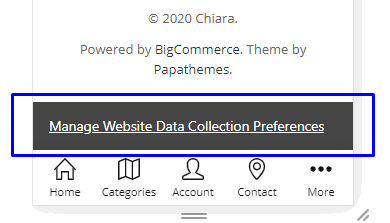

# FAQs

## Change text of BUY button on the product page on mobile

Add this custom code below into your **Storefront** > **Footer Scripts**:

```html
<style>
.productView-options-toggle { width: 110px; border-radius: 3px; }
.productView-options-toggle .on { font-size: 0; }
.productView-options-toggle .on:before { font-size: 12px; content: 'Customize'; }
</style>
```

Where `Customize` is an example text to change.


## Display the product options on the product page on mobile

To display the product options on the product page on mobile instead of having to click BUY button, add the code below into **Storefont** > **Footer Scripts**:

```html
<style>
@media (max-width: 800px) {
.productView-options-toggle { display: none }
.productView-options-content { position: static; right: 0; opacity: 1; box-shadow: none; border-top: 1px solid #ddd}
.productView-options-panel-body { position: static; padding-bottom: 0px; }
.productView-options-panel-heading ~ .mobile-panel-close { display: none; }
.productView-options-content .form-action { position: static; right: auto; }
.productView-options-panel-heading { display: none }
.productView-options { order: 6; }
}
</style>
```

## Hide the "Home" link on the main menu

Add the custom code below into **Storefront** > **Footer Scripts**:

```html
<style>
#navPages-main > .navPages-item:first-child { display: none }
</style>
```


## Fix Products Bought Together stop working after BigCommerce API changed

If you suddenly get a problem that the products also bought together stop working on your product pages. 
That is because BigCommerce has changed the content type of product ajax request.

To workaround this issue while waiting for the fix from BigCommerce or the theme update, please follow
this instruction.

Login to your store admin panel, go to **Storefront** > **Script Manager** > click on the button **Create a Script**.

Input:

- **Name of Script**: `Fix Also Bought Products stop working after BC API changed` or whatever.
- **Location of page**: `Footer`
- **Select pages where script will be added**: `Store pages`.
- **Script type**: `Script`.
- **Script contents**:

```html
<script>
window.chiarajQuery(document).ajaxSend((event, xhr, settings) => {
	if (settings.url.match(/\/products\.php/)) {
		xhr.setRequestHeader('x-requested-with', '');
	}
});
</script>
```

Then click **Save** button.

Your script should look like this screenshot:


## Add custom text on the orders page


Add the scripts below to **Footer Scripts**:

```html
<script>
(function () {
    var t = setInterval(function () {
        var $ = window.jQuerySupermarket || window.chiarajQuery || window.jQuery;
        if (typeof $ === 'undefined') {
            return;
        }
        clearInterval(t);

        if ($('body').is('.page-type-account_orderstatus, .papaSupermarket-pageType--account-orderstatus')) {
            $('.account').before('<p style="font-size:large;text-align:center">Click on your Order # to view details and tracking number</p>');
        }
    }, 200);
})();
</script>
```

Choose location = **Footer**.


## Collapse product description tab by default on product pages

Go to **Storefront** > **Script Manager**, click **Create a Script**, choose:

- **Location on page** = `Footer`
- **Select pages where script will be added** = `Store pages`
- **Script type** = `Script`

Enter the script below to **Scripts contents**: 

```html
<script>
(function($) {
    $('.productView-tab--description.is-active, .productView-desc.is-active').removeClass('is-active');
})(window.chiarajQuery || window.$);
</script>
```


## Make responsive top banner


Add the custom CSS below to **Storefront** > **Footer Scripts** or add to file `assets/scss/_chiara-custom.scss` if you prefer to edit theme files:

```html
<style>
.list-unstyled { display: block; list-style: none; margin: 0; padding: 0; }
.font-size-larger { font-size: larger }

@media (min-width: 801px) {
    .flex-desktop { display: flex }
    .flex-desktop > * { flex: 1 }
    .display-inline-desktop { display: inline }
    .ml-2-desktop { margin-left: 2rem }
}

@media (max-width: 550px) {
    .hide-mobile { display: none }
}

@media (min-width: 551px) and (max-width: 800px) {
    .hide-tablet { display: none }
}
</style>
```


### Banner 1

Create a new banner, open HTML source editor and add the code below:

```html
<ul class="list-unstyled flex-desktop">
    <li class="hide-mobile hide-tablet">EAST COAST STORES NOW OPEN</li>
    <li>FREE SHIPPING WITH ORDERS OVER $100</li>
    <li class="hide-mobile hide-tablet">FREE RETURNS ON ALL ORDERS</li>
</ul>
```

The banner will shows 3 column on desktop. On mobile and tablet, only "FREE SHIPPING WITH ORDERS OVER $100" is displayed.

CSS class explanation:

- `list-unstyled`: use to reset the UL element.
- `flex-desktop`: allow UL show as flex layout (columns) on desktop.
- `hide-mobile`: hide the element on mobile.
- `hide-mobile`: hide the element on tablet.


### Banner 2

Create a new banner, open HTML source editor and add the code below:

```html
<div>
    <p class="display-inline-desktop">One Day Only! Online Only</p>
    <p class="display-inline-desktop font-size-larger ml-2-desktop"><strong>HAPPY FRIDAY THE 13TH! · TAKE 13% OFF YOUR ENTIRE ORDER</strong></p>
</div>
```
The banner will shows 2 rows on mobile and tablet, but 1 row on desktop. Text "HAPPY FRIDAY THE 13TH! · TAKE 13% OFF YOUR ENTIRE ORDER" will have larger font size.

CSS class explanation:

- `display-inline-desktop`: display inline (same row) on desktop.
- `font-size-larger`: allow font size larger.
- `ml-2-desktop`: have a margin left 2rem on desktop.


## Show all the main navigation's items without (...) icon

Go to **Storefront** > **Script Manager**, click **Create a Script**, choose:

- **Location on page** = `Footer`
- **Select pages where script will be added** = `All pages`
- **Script type** = `Script`

Enter the script below to **Scripts contents**: 

```html
<script>
if (!window.chiaraSettings) window.chiaraSettings = {};
window.chiaraSettings.disableAutoSizeNavPages = true;
</script>
```


## Move product properties to show before Add to Cart button on PDP


Go to **Storefront** > **Script Manager**, click **Create a Script**, choose:

- **Location on page** = `Footer`
- **Select pages where script will be added** = `Store pages`
- **Script type** = `Script`

Enter the script below to **Scripts contents**: 

```html
<script>
(function($) {
    var $el = $('.productView-info--desktopOnly').css('margin-top', '1rem');
    $('.productView-options-content .form-action-group').before($el);
})(window.chiarajQuery || window.$);
</script>
```


## Show your site logo on all pages on mobile

According to our design intent, the site logo will be hidden on some pages and the main title of that page will appear in the header on mobile. If you want your logo to appear on every page, you can use the following custom code snippet.

Insert the code below to **Storefront** > **Footer Scripts**:

```html
<style>
@media (max-width: 800px) {
  .page-type-account_addressbook .page-heading-logo, .page-type-account_addressbook h1.page-heading, .page-type-account_inbox .page-heading-logo, .page-type-account_inbox h1.page-heading, .page-type-account_order .page-heading-logo, .page-type-account_order h1.page-heading, .page-type-account_orderstatus .page-heading-logo, .page-type-account_orderstatus h1.page-heading, .page-type-account_recentitems .page-heading-logo, .page-type-account_recentitems h1.page-heading, .page-type-account_returns .page-heading-logo, .page-type-account_returns h1.page-heading, .page-type-accountcreated .page-heading-logo, .page-type-accountcreated h1.page-heading, .page-type-blog .page-heading-logo, .page-type-blog h1.page-heading, .page-type-brand .page-heading-logo, .page-type-brand h1.page-heading, .page-type-brands .page-heading-logo, .page-type-brands h1.page-heading, .page-type-cart .page-heading-logo, .page-type-cart h1.page-heading, .page-type-category .page-heading-logo, .page-type-category h1.page-heading, .page-type-createaccount .page-heading-logo, .page-type-createaccount h1.page-heading, .page-type-editaccount .page-heading-logo, .page-type-editaccount h1.page-heading, .page-type-forgotpassword .page-heading-logo, .page-type-forgotpassword h1.page-heading, .page-type-giftcertificates .page-heading-logo, .page-type-giftcertificates h1.page-heading, .page-type-giftcertificates_balance .page-heading-logo, .page-type-giftcertificates_balance h1.page-heading, .page-type-giftcertificates_redeem .page-heading-logo, .page-type-giftcertificates_redeem h1.page-heading, .page-type-login .page-heading-logo, .page-type-login h1.page-heading, .page-type-newpassword .page-heading-logo, .page-type-newpassword h1.page-heading, .page-type-page_contact_form .page-heading-logo, .page-type-page_contact_form h1.page-heading, .page-type-wishlists .page-heading-logo, .page-type-wishlists h1.page-heading { display: none }
  .page-type-account_addressbook .header-logo, .page-type-account_inbox .header-logo, .page-type-account_order .header-logo, .page-type-account_orderstatus .header-logo, .page-type-account_recentitems .header-logo, .page-type-account_returns .header-logo, .page-type-accountcreated .header-logo, .page-type-blog .header-logo, .page-type-brand .header-logo, .page-type-brands .header-logo, .page-type-cart .header-logo, .page-type-category .header-logo, .page-type-createaccount .header-logo, .page-type-editaccount .header-logo, .page-type-forgotpassword .header-logo, .page-type-giftcertificates .header-logo, .page-type-giftcertificates_balance .header-logo, .page-type-giftcertificates_redeem .header-logo, .page-type-login .header-logo, .page-type-newpassword .header-logo, .page-type-page_contact_form .header-logo, .page-type-wishlists .header-logo { display: block }
}
</style>
```

## Add item units behind prices (i.e $19.95 lb)

Yes, it is possible. Simply add the custom code below to **Storefront** > **Footer Scripts**:

```html
<style>
.price:after { content: ' lb'; }
</style>
```


## Move Compare button to under Add to Cart button on product card items

Go to **Storefront** > **Script Manager**, click **Create a Script**, choose:

- **Location on page** = `Footer`
- **Select pages where script will be added** = `All pages`
- **Script type** = `Script`

Enter the script below to **Scripts contents**: 

```html
<script>
(function($) {
    function throttle(callback, wait, immediate = false) {
      let timeout = null 
      let initialCall = true

      return function() {
        const callNow = immediate && initialCall
        const next = () => {
          callback.apply(this, arguments)
          timeout = null
        }

        if (callNow) { 
          initialCall = false
          next()
        }

        if (!timeout) {
          timeout = setTimeout(next, wait)
        }
      }
    }

    function main() {
        $('.card').not('[data-compare-button-moved]').each(function(i, el) {
            var $card = $(el);
            var $btn = $card.find('.card-figcaption-body-alt .card-figcaption-button.compare');

            $btn.appendTo($card.find('.card-figcaption-body'))
                .addClass('button--small')
                .attr('data-compare-button-moved', true);

            $btn.find('span').removeClass('is-srOnly');
            $btn.find('.icon').remove();

        });
    }

    $(window).on('scroll resize load', throttle(main, 300, true));
})(window.chiarajQuery || window.jQuery);
</script>
```


## Rename related products tab

Go to **Storefront** > **Script Manager**, click **Create a Script**, choose:

- **Location on page** = `Footer`
- **Select pages where script will be added** = `Store pages`
- **Script type** = `Script`


Enter the script below to **Scripts contents**: 

```html
<script>
(function($) {
    $('.productView-productsList--related .productView-productsList-heading').text('RELATED PRODUCTS TITLE');
})(window.chiarajQuery || window.jQuery);
</script>
```

Replace `RELATED PRODUCTS TITLE` with your real title.


## Rename the tabs on product pages

Go to **Storefront** > **Script Manager**, click **Create a Script**, choose:

- **Location on page** = `Footer`
- **Select pages where script will be added** = `Store pages`
- **Script type** = `Script`

Enter the script below to **Scripts contents**: 

```html
<script>
(function($) {
    function update() {
        $('.productView-tab--desc .productView-tab-title, .productView-desc-heading').html('YOUR DESCRIPTION TITLE');
        $('.productView-tab--warranty .productView-tab-title, .productView-warranty-heading, .productView-warranty-panel-heading').html('YOUR WARRANTEY TITLE');
        $('.productView-tab--properties .productView-tab-title, .productView-properties-heading, .productView-properties-panel-heading').html('YOUR INFO TITLE');
        $('.productView-tab--addition .productView-tab-title, .productView-addition-heading, .productView-addition-panel-heading').html('YOUR FEATURES TITLE');
    }

    $(document).ajaxComplete(function(event, xhr, options) {
       if (options.headers['stencil-options'].match(/quick-view/)) {
            setTimeout(update, 500);
       }
    });
    update();
})(window.chiarajQuery || window.jQuery);
</script>
```

Replace `YOUR DESCRIPTION TITLE`, `YOUR INFO TITLE`, `YOUR FEATURES TITLE` as you wish.


## Tweak the checkout with PayPal buttons and other additional buttons on the cart page

Go to **Storefront** > **Script Manager**, click **Create a Script**, choose:

- **Location on page** = `Footer`
- **Select pages where script will be added** = `All Pages`
- **Script type** = `Script`

Enter the script below to **Scripts contents**: 

```html
<script>
    (function() {
        var css = document.createElement('style');
        css.innerHTML = ''
            + '#checkout-app .cart-additionalCheckoutButtons .PayPalExpressCheckout:before { text-align: left }'
        	+ '@media (max-width: 550px) {'
        	+ '.cart-additionalCheckoutButtons { margin-top: .75rem }'
        	+ '.cart-additionalCheckoutButtons .CheckoutButton { margin-bottom: .75rem }'
        	+ '.cart-additionalCheckoutButtons .FloatRight div { float: none; text-align: center; display: block }'
        	+ '.cart-additionalCheckoutButtons .FloatRight .or-use-label { display: none }'
        	+ '.cart-additionalCheckoutButtons .PayPalExpressCheckout:before { display: block; content: "Or continue with Express Checkout"; text-align: center; width: 100%; margin: .5rem 0 }'
        	+ '.paypal-smart-buttons { margin-top: 0 !important; margin-bottom: 0 !important; }'
        	+ '.paypal-smart-buttons .zoid-outlet { width: 100% !important }'
        	+ '.amazonpay-button-inner-image { width: 100%; max-height: none !important }'
    		+ '}'
			+ '@media (min-width: 501px) and (max-width: 800px) {'
        	+ '.cart-totals { float: none; margin: 0 auto; }'
        	+ '.cart-actions { text-align: center }'
        	+ '.cart-actions .button { float: none; min-width: 296px }'
        	+ '.cart-additionalCheckoutButtons { margin-top: .75rem }'
        	+ '.cart-additionalCheckoutButtons .CheckoutButton { text-align: center }'
        	+ '.cart-additionalCheckoutButtons .FloatRight div { float: none; margin: 0; display: block }'
        	+ '.cart-additionalCheckoutButtons .FloatRight .or-use-label { display: none }'
        	+ '.cart-additionalCheckoutButtons .PayPalExpressCheckout:before { display: block; content: "Or continue with Express Checkout"; text-align: center; width: 296px; margin: .5rem auto }'
        	+ '.paypal-smart-buttons .zoid-outlet { width: 296px !important }'
        	+ '.amazonpay-button-inner-image { width: 296px; max-height: none !important }'
    		+ '}'
    		+ '@media (min-width: 801px) {'
        	+ '.cart-actions .button { min-width: 296px }'
        	+ '.paypal-smart-buttons { margin: 0 !important }'
        	+ '.paypal-smart-buttons .zoid-outlet { width: 296px !important }'
        	+ '.cart-additionalCheckoutButtons { margin-top: .75rem }'
        	+ '.cart-additionalCheckoutButtons .FloatRight { display: block }'
        	+ '.cart-additionalCheckoutButtons .FloatRight .or-use-label { display: none }'
        	+ '.cart-additionalCheckoutButtons .PayPalExpressCheckout:before { display: block; content: "Or continue with Express Checkout"; text-align: center; width: 296px; margin: .5rem 0 .5rem auto }'
        	+ '.amazonpay-button-inner-image { width: 296px; max-height: none !important }'
    		+ '}';
        document.head.appendChild(css);
        
        var observer = new MutationObserver(function() {
            var img = document.querySelector('.amazonpay-button-inner-image');
            if (img) {
                img.src = img.src.replace(/small/, 'large');
            }
        });
        observer.observe(document.querySelector('.CheckoutButtonAmazon'), { childList: true });
    })();
</script>
```


# Display additional checkout buttons on the checkout page


Go to **Storefront** > **Script Manager**, click **Create a Script**, choose:

- **Location on page** = `Footer`
- **Select pages where script will be added** = `All Pages`
- **Script type** = `Script`

Enter the script below to **Scripts contents**: 

```html
<script type="text/javascript" src="https://static-na.payments-amazon.com/OffAmazonPayments/us/js/Widgets.js?sellerId=A3CUXN3OT1IR26" defer></script>
<script type="text/javascript" src="https://cdn11.bigcommerce.com/shared/bower/checkout-sdk/dist/checkout-button.umd-885565be8216c9c2857dcfce98505b42e97a9661.js" defer></script>
<script src="https://code.jquery.com/jquery-3.4.1.min.js" integrity="sha256-CSXorXvZcTkaix6Yvo6HppcZGetbYMGWSFlBw8HfCJo=" crossorigin="anonymous"></script>
<script src="https://cdnjs.cloudflare.com/ajax/libs/jquery-throttle-debounce/1.1/jquery.ba-throttle-debounce.min.js" integrity="sha256-+nuEu243+6BveXk5N+Vbr268G+4FHjUOEcfKaBqfPbc=" crossorigin="anonymous"></script>
<script>
(function($) {
    var css = document.createElement('style');
    css.innerHTML = ''
    	+ '#checkout-app .customerEmail-container { margin-bottom: 0 }'
    	+ '#checkout-app .customerEmail-container + p { display: none }';
    document.head.appendChild(css);
    
    function checkoutButtons() {
        var $checkoutRemote = $('.checkoutRemote');
        if ($checkoutRemote.length == 0 || $checkoutRemote.data('updated')) {
            return;
        }
        $.get('/cart.php', function(resp) {
            $resp = $(resp);
            $checkoutRemote.html('').append($resp.find('.cart-additionalCheckoutButtons'));
            $checkoutRemote.data('updated', true);
            var img = document.querySelector('.amazonpay-button-inner-image');
            if (img) {
                img.src = img.src.replace(/small/, 'large');
            }
        });
    }
    function customerSection() {
        var $section = $('#checkout-customer-guest');
        if ($section.length === 0 || $section.data('updated')) {
            return;
        }
        $section.data('updated', true);
        $section.find('.form-body > p:nth-child(3)').prependTo($section.find('.form-body'));
    }
    var observer = new MutationObserver($.debounce(200, function() {
        checkoutButtons();
        customerSection();
    }));
    observer.observe(document.querySelector('#checkout-app'), { childList: true, subtree: true })
})(window.jQuery);
</script>
```

Replace 2 lines in the script by your own code:

```html
<script type="text/javascript" src="https://static-na.payments-amazon.com/OffAmazonPayments/us/js/Widgets.js?sellerId=A3CUXN3OT1IR26" defer></script>
<script type="text/javascript" src="https://cdn11.bigcommerce.com/shared/bower/checkout-sdk/dist/checkout-button.umd-885565be8216c9c2857dcfce98505b42e97a9661.js" defer></script>
```

You can find it by going to your cart page after added some products to cart, right click > **View page source** (or **Ctrl + U**), search `checkout-button.umd` and copy 2 lines around like this example:


## Always show Add to Cart button on desktop screens

Add the custom CSS below to **Storefront** > **Footer Scripts**:

```html
<style>
@media (min-width: 801px) {
.card-img-container { position: relative }
.card-figcaption { position: static; display: block; opacity: 1; margin-top: .42857rem; overflow: visible }
.card-figcaption-body { position: static; transform: none; display: block }
.card-figcaption-body-alt { z-index: 2; display: none }
.card-figure:hover .card-figcaption-body-alt { display: block }
}
</style>
```

## Fix product variant image not change when click on product swatches on product card items if "Show Image Slider" is enabled

Go to **Storefront** > **Script Manager**, click **Create a Script**, choose:

- **Location on page** = `Footer`
- **Select pages where script will be added** = `All pages`
- **Script type** = `Script`

Enter the script below to **Scripts contents**: 


```html
<script>
(function($) {
    $('body').on('click', '.productCard-colorSwatch', function() {
        var $img = $(event.target).closest('.card').find('.card-image.first');
        if ($img.length > 0) {
            $img.siblings('.is-active').removeClass('is-active');
            $img.addClass('is-active');
        }
    });
})(window.chiarajQuery);
</script>
```


## Change "Already have an account? Sign in now" in Checkout page

Go to **Storefront** > **Script Manager**, click **Create a Script**, choose:

- **Location on page** = `Footer`
- **Select pages where script will be added** = `Checkout`
- **Script type** = `Script`

Enter the script below to **Scripts contents**:

```html
<script>
(function($) {
    var CREATE_ACCOUNT_HTML = '<a href="/login.php">Login</a> to your account or <a href="/login.php?action=create_account">Create an account</a> for faster checkout in the future';

    function debounce(func, wait, immediate) {
        var timeout;
        return function() {
            var context = this, args = arguments;
            var later = function() {
                timeout = null;
                if (!immediate) func.apply(context, args);
            };
            var callNow = immediate && !timeout;
            clearTimeout(timeout);
            timeout = setTimeout(later, wait);
            if (callNow) func.apply(context, args);
        };
    };

    function main() {
        var $orgSignin = $('.customerEmail-container + p');
        var $newSignin = $orgSignin.next('.customerEmail-signin');

        if ($orgSignin.length > 0 && $newSignin.length === 0) {
            $newSignin = $('<p class="customerEmail-signin">' + CREATE_ACCOUNT_HTML + '</p>');
            $orgSignin.hide().after($newSignin);
        }
    }

    var debounceMain = debounce(main, 200);

    (new MutationObserver(debounceMain)).observe(document.getElementById('checkout-app'), { childList: true, subtree: true });
})(window.chiarajQuery);
</script>
```

## Show all image thumbnails and display videos at third position on PDP

Add the custom CSS below to **Storefront** > **Footer Scripts**:

```html
<style>
.productView-imageCarousel-nav { height: auto !important; max-height: none !important }
.productView-imageCarousel-nav .slick-track { width: auto !important; transform: none !important; display: flex; flex-wrap: wrap }
.productView-imageCarousel-nav-item { margin: 0.1875rem !important; max-width: 100px !important; order: 5 }
.productView-imageCarousel-nav .productView-imageCarousel-nav-item:nth-child(1) { order: 1 }
.productView-imageCarousel-nav .productView-imageCarousel-nav-item:nth-child(2) { order: 2 }
.productView-imageCarousel-nav .productView-imageCarousel-nav-item--video { order: 3 }
</style>
```


## How to make the custom footer links open in the new window

Go to **Storefront** > **Script Manager**, click **Create a Script**, choose:

- **Location on page** = `Footer`
- **Select pages where script will be added** = `All Pages`
- **Script type** = `Script`

Enter the script below to **Scripts contents**:

```html
<script>
(function() {
   var links = document.querySelectorAll('#footer-info-list-custom1 a, #footer-info-list-custom2 a, #footer-info-list-custom3 a');
   for (var i in links) {
       links[i].target = '_blank';
   }
})();
</script>
```


## Fix Main Navigation dropdown error on Safari

This bug seems to appear on version 1.5.6 and lower.

Go to **Storefront** > **Script Manager**, click **Create a Script**, choose:

- **Location on page** = `Footer`
- **Select pages where script will be added** = `All Pages`
- **Script type** = `Script`

Enter the script below to **Scripts contents**:

```html
<script>
    (function() {
        var isSafari = /^((?!chrome|android).)*safari/i.test(navigator.userAgent);
        if (!isSafari) return;
		
        function main($) {
            var $nav = $('.navPages-container, .navPages-container .navPages');
            $(window).on('resize load', function() {
                $nav.css('overflow', '');
                if ($(window).width() >= 801) {
                    setTimeout(function() {
                        $nav.css('overflow', 'visible');
                    }, 500);
                }
            });
        }
        
        var ti = setInterval(function() {
            if (typeof window.chiarajQuery !== 'undefined') {
            	clearInterval(ti);
                main(window.chiarajQuery);
            }
        }, 200);
    })();
</script>
```


## Remove `imbypass=on` on PDP

Go to **Storefront** > **Script Manager**, click **Create a Script**, choose:

- **Location on page** = `Footer`
- **Select pages where script will be added** = `Store Pages`
- **Script type** = `Script`

Enter the script below to **Scripts contents**:

```html
<script>
(function($) {
    $('a[data-zoom-image]').each(function(i, el) {
        var $el = $(el);
        var href = $el.attr('href'),
            zoom = $el.attr('data-zoom-image');
        $el.attr('href', href.replace(/[?&]imbypass=on/g, ''))
            .attr('data-zoom-image', zoom.replace(/[?&]imbypass=on/g, ''));
    });
})(window.chiarajQuery || window.jQuery);
</script>
```


## Display Add to Cart button inline on PDP on mobile

Go to **Storefront** > **Script Manager**, click **Create a Script**, choose:

- **Location on page** = `Footer`
- **Select pages where script will be added** = `Store Pages`
- **Script type** = `Script`

Enter the script below to **Scripts contents**: 

```html
<script>
(function() {
    var css = document.createElement('style');
    css.innerHTML = '@media (max-width: 800px) {'
        + '.productView-options .form-action-group { position: static; border-top: 0; padding-left: 0; padding-right: 0; margin: 0 -5px }'
        + '.productView-options { display: block !important; height: auto }'
        + '.productView-options-panel-heading { display: none }'
        + '}';
    document.head.appendChild(css);
})();
</script>
```


## Hide Info section on PDP on mobile when it is empty

Go to **Storefront** > **Script Manager**, click **Create a Script**, choose:

- **Location on page** = `Footer`
- **Select pages where script will be added** = `Store Pages`
- **Script type** = `Script`

Enter the script below to **Scripts contents**: 

```html
<script>
(function() {
    if (document.querySelector('.productView-info').innerText.trim() === '') {
        document.querySelector('.productView-properties').style += ';display:none;';
    }
})();
</script>
```

## Display full warranty content on PDP on mobile

Go to **Storefront** > **Script Manager**, click **Create a Script**, choose:

- **Location on page** = `Footer`
- **Select pages where script will be added** = `Store Pages`
- **Script type** = `Script`

Enter the script below to **Scripts contents**: 

```html
<script>
(function() {
    var css = document.createElement('style');
    css.innerHTML = ''
        + '.productView-warranty-heading-toggle > .icon { display: none }'
        + '.productView-warranty-summary { display: none }'
        + '.productView-warranty-content { position: static; opacity: 1; background-color: transparent; box-shadow: none }'
        + '.productView-warranty-panel-body { position: static; }'
        + '.productView-warranty-panel-heading { display: none }';
    document.head.appendChild(css);
})();
</script>
```

## Display full product info and custom fields on mobile


Go to **Storefront** > **Script Manager**, click **Create a Script**, choose:

- **Location on page** = `Footer`
- **Select pages where script will be added** = `Store Pages`
- **Script type** = `Script`

Enter the script below to **Scripts contents**: 

```html
<script>
(function() {
    var css = document.createElement('style');
    css.innerHTML = ''
        + '.productView-properties-subheading { display: none }'
        + '.productView-properties-heading-toggle > .icon { display: none }'
        + '.productView-properties-summary { display: none }'
        + '.productView-properties-content { position: static; opacity: 1; background-color: transparent; box-shadow: none }'
        + '.productView-properties-panel-body { position: static; }'
        + '.productView-properties-panel-heading { display: none }';
    document.head.appendChild(css);
})();
</script>
```

## Display selected swatch option name on PDP

Go to **Storefront** > **Script Manager**, click **Create a Script**, choose:

- **Location on page** = `Footer`
- **Select pages where script will be added** = `Store Pages`
- **Script type** = `Script`

Enter the script below to **Scripts contents**: 

```html
<script>
(function() {
    var css = document.createElement('style');
    css.innerHTML = ''
        + '[data-product-attribute="swatch"] { position: relative; }'
        + '[data-product-attribute="swatch"] .form-option:not(.unavailable) { position: static; }'
        + '[data-product-attribute="swatch"] .form-option-expanded { left: auto; top: auto; margin-top: 25px; margin-left: 30px; }'
        + '[data-product-attribute="swatch"] .form-radio:checked+.form-option:not(.unavailable) .form-option-variant:after { content: attr(title); position: absolute; top: 0; left: 120px; }';
    document.head.appendChild(css);
})();  
</script>
```

You can adjust `left: 120px` if the option label is longer.

## Fix cart popup display overlapped by the main menu on Firefox


Go to **Storefront** > **Script Manager**, click **Create a Script**, choose:

- **Location on page** = `Footer`
- **Select pages where script will be added** = `All Pages`
- **Script type** = `Script`

Enter the script below to **Scripts contents**: 

```html
<script>
(function() {
    var css = document.createElement('style');
    css.innerHTML = ''
        + '@media (min-width: 801px) {'
        + '.navUser { z-index: 60 }'
        + '}';
    document.head.appendChild(css);
})();
</script>
```


## Hide phone number (Call Us) on mobile


Go to **Storefront** > **Script Manager**, click **Create a Script**, choose:

- **Location on page** = `Footer`
- **Select pages where script will be added** = `All Pages`
- **Script type** = `Script`

Enter the script below to **Scripts contents**: 

```html
<script>
(function() {
    var css = document.createElement('style');
    css.innerHTML = ''
        + '@media (max-width: 800px) {'
        + '.bottomBar-contactPanel .button[href^=tel] { display: none }'
        + '}';
    document.head.appendChild(css);
})();
</script>
```


## And a custom link on the main navigation

Go to **Storefront** > **Script Manager**, click **Create a Script**, choose:

- **Location on page** = `Footer`
- **Select pages where script will be added** = `All Pages`
- **Script type** = `Script`

Enter the script below to **Scripts contents**: 

```html
<script>
(function(link, title) {
    var lastEl = Array.from(document.querySelectorAll('.navPages .navPages-list--main > .navPages-item--category')).pop();
    var li = document.createElement('li');
    li.setAttribute('class', 'navPages-item navPages-item-page');
    li.innerHTML = '<a class="navPages-action is-root" href="' + link + '">' + title + '</a>';
    lastEl.parentNode.insertBefore(li, lastEl.nextSibling);
})(
    'YOUR CUSTOM LINK HERE',
    'YOUR LINK TITLE HERE'
);
</script>
```

- Replace `YOUR CUSTOM LINK HERE` by your link URL.
- Replace `YOUR LINK TITLE HERE` by your link title.


## Hide all MSRP price store wide

Go to **Storefront** > **Script Manager**, click **Create a Script**, choose:

- **Location on page** = `Footer`
- **Select pages where script will be added** = `All Pages`
- **Script type** = `Script`

Enter the script below to **Scripts contents**: 

```html
<script>
(function() {
    var css = document.createElement('style');
    css.innerHTML = '.price-section.rrp-price--withoutTax, .price-section.rrp-price--withTax { display: none !important }';
    document.head.appendChild(css);
})();
</script>
```

## Display AfterPay and ZIP payment icons

Go to **Storefront** > **Script Manager**, click **Create a Script**, choose:

- **Location on page** = `Footer`
- **Select pages where script will be added** = `All Pages`
- **Script type** = `Script`

Enter the script below to **Scripts contents**: 

```html
<script>
(function() {
    var img1 = document.createElement('img');
    img1.src = 'data:image/jpeg;base64,/9j/4AAQSkZJRgABAgAAZABkAAD/7AARRHVja3kAAQAEAAAAPAAA/+4ADkFkb2JlAGTAAAAAAf/bAIQABgQEBAUEBgUFBgkGBQYJCwgGBggLDAoKCwoKDBAMDAwMDAwQDA4PEA8ODBMTFBQTExwbGxscHx8fHx8fHx8fHwEHBwcNDA0YEBAYGhURFRofHx8fHx8fHx8fHx8fHx8fHx8fHx8fHx8fHx8fHx8fHx8fHx8fHx8fHx8fHx8fHx8f/8AAEQgAKAAyAwERAAIRAQMRAf/EAIoAAQADAQEAAAAAAAAAAAAAAAAFBgcECAEBAAIDAQAAAAAAAAAAAAAAAAMEAQUGAhAAAQMDAgQDBQkAAAAAAAAAAQIDBAAFBhESITFBB1FhEyIyUhQIcYGhYoIjMyQVEQACAgEDAgQEBwAAAAAAAAAAAQIDETEEBSESUWFxE0GRIhSxwTJCMxUG/9oADAMBAAIRAxEAPwD1TQCgFAKAUAoBQERNyuxwrgIEh/a+SArQEpSTyCj0rWX8xt6rfblL6vw9S9Vx11kO+K+kX/K7HYWW3Li/sLv8TSBuWrzCR0q3fuoVLMmNlx125bVa0+R22u6QbpBanQXQ9GdGqFj8QR0IqWuyM490dCvuNvOmbhNYkjqJABJ5DjXshK/huc2DL4cqXZlOqZhyFxHvWaU0fUb010CuY48DUllThqYTyT6lpQkqUQlI5knQVGZG5PiOWv3UBj/dS6Ypj10W7JurKLjL0dTblkbh+dXgnh1rk+S/zcrbXbDL7n1WDqOJ5GPaq7GoRj8Wygt5NGyW8gf6jMmc9oCtawENoHDj8KRVr+t3U5dYSN1LmuO2dP8AJCMF59W/zZudvxeLGwF60RrsuMiQw4pd4jqSlTanBqp1tR4Db0re7Sj2Eo6tHE8hyH3ljtX6Xp6GMds7Xl2RdwFS7Jlt3mYNY3QHrjNcH9+Q37zTKQOLevM+Fbe6UYww4ruZro5b8ituZrm0jt9HdYvj0KbIzF6GJiNqNjaykAK0A1QlSyrQ1L7UVPT9p5y8F5trOQ4V3ns+KO5BLyOzZLDW9MYnqDhbcRr+4nT3QSnhUDxOpyxhxPWjwb56Lfwj3dn6fCteSnmbut9PGe37uFcb1alMS7fdFpd9Z50IcY0SElspVzCdvs7a2m33cIwSfTBWuhLq0u7yO+ydh8os8T5eJCa3K4vPF1ve4fE8eXlVj76vxOM3vE7/AHM+6aXksrCNZtXb9Dnb53E728tTU1txEox1lCkJcOpQhfl9lay6/NndE6ritnKihVzeWQlh+nvCrHNhyrfOu7aYLqXmYvzqgwVJOuim0pSCD1rM93KS6pfIvqCRAZ52Cadx23WLFmy5Dcvhud2TKeAUG39A96atBySPZHOpKt11bl4YMSgXDCuy+J4ne3L4w9NuV2U36DMu4vmQtlr4GyQnQdKhs3MprGiMxgkX2q57FAKAUAoBQCgFAf/Z';
    img1.alt = 'ZIP';
    img1.classList.add('footer-payment-icon');

    var img2 = document.createElement('img');
    img2.src = 'data:image/jpeg;base64,/9j/4AAQSkZJRgABAgAAZABkAAD/7AARRHVja3kAAQAEAAAAPAAA/+4ADkFkb2JlAGTAAAAAAf/bAIQABgQEBAUEBgUFBgkGBQYJCwgGBggLDAoKCwoKDBAMDAwMDAwQDA4PEA8ODBMTFBQTExwbGxscHx8fHx8fHx8fHwEHBwcNDA0YEBAYGhURFRofHx8fHx8fHx8fHx8fHx8fHx8fHx8fHx8fHx8fHx8fHx8fHx8fHx8fHx8fHx8fHx8f/8AAEQgAKAAyAwERAAIRAQMRAf/EAHwAAAIDAQEBAAAAAAAAAAAAAAACAwQFBgEIAQEBAQEAAAAAAAAAAAAAAAAAAwQCEAACAgECBQMDAgcAAAAAAAACAwEEEQAFITESEwZBMgdhIxRRNKEiUmIzVFURAQACAQIHAQEAAAAAAAAAAAABAhFRAyExQXGhEgRhIv/aAAwDAQACEQMRAD8A+qc6AzoDOgM6AzoDOgM6Dkt/+QKe307xVatl70BZGo7slNZtiqszYuGZj2SsurlynGcaCvX8+/BfdTvanBFb8VaG9iFS1z090g6ZYUQXunGcRETx0E1j5P8AHFpW5Cbt1bnKq1yrVjZ3XvR+QK1xwkihfEv6fXQQl8t+JydeK8XLQvJCzaiswgS6yfbUh5T09thFGOmeXr6aBm/K/ikbRa3OuTrK6tavYlS1z3DZcIgRVGJmPvmQ46PT113t0m04hxe8VjMsmz8pby3bT3rbNqrns0rUdRlmxK7D2HgDQCRA/urd9shzwnWuny1mcTP9duTFufXeImYrHr35uz/P33/mj+x/I/zR+7/1uXL+/wDhrL6116+NWv3tp086KVrxLxR91xPiZazvEdabLIWM2gJbjFPX0DLBOczEeueepqpr3jvju4XWWGEUWy7cmSbBrKDXEwtkQBRg4ApHq59M45aDK8j8K2negoIRZhFenuQ3r8g9ouIlVSrRAtA4MDj+Tj1en10DR8beBDYqvVW7M7dKSAFWXAuTqH3Em8BPpaYFOepkTPHjoMza/jHZlpr2LlyEXU70/f2RRMQrk82T0AQsGeoFrwPpxzMYzrum5Nc46p324tj8aeyfHXidG2VrrPcbcbg/ckssME5TZfiGwsVwAwORz0zE8Yzz1SfotjEcIxhOPmpnM8Zicuv1BoUbmx7RdaTbVRbmlERJlHHEcuOgSfHNjIxZNFUmAiIlI8YgPbx+mgc9i2grE2JqB35golkRiZ65mSzjGZmSnjoET47sie7KqSgl4yDpgfeJcZgv1zoEnxXx2ee3I59XsjnoJkbFs6LUW001LsjnDRGIKOrOeP1zOgvaD3QGgNAaA0BoDQf/2Q==';
    img2.alt = 'AfterPay';
    img2.classList.add('footer-payment-icon');

    
    var el = document.querySelector('.footer-payment-icons');
    el.appendChild(img1);
    el.appendChild(img2);
})();
</script>
```


## Show the related products when Frequently Bought Together is enabled

If you want to show the related products for a specific products while Products Frequently Bought Together feature is enabled, follow the instruction below. Frequently Bought Together is also hidden for these products.

1. Create a custom field with name `ShowRelatedProducts` with value = `1` in a specific product.

2. Create a custom script in **Storefront** > **Script Manager**, click **Create a Script**, choose:

- **Location on page** = `Footer`
- **Select pages where script will be added** = `All Pages`
- **Script type** = `Script`

Enter the script below to **Scripts contents**: 

```html
<script>
    (function($) {
        function debounce(func, wait, immediate) {
            var timeout;
            return function() {
                var context = this, args = arguments;
                var later = function() {
                    timeout = null;
                    if (!immediate) func.apply(context, args);
                };
                var callNow = immediate && !timeout;
                clearTimeout(timeout);
                timeout = setTimeout(later, wait);
                if (callNow) func.apply(context, args);
            };
        };

        function init($scope) {
            if ($scope.find('.productView-info-name--cfShowrelatedproducts').length === 0) {
                return;
            }

            $scope.find('.productView-alsoBought').hide();
            
            var  productId = $scope.find('input[name=product_id]').val();
            if (!productId) {
                return;
            }

            stencilUtils.api.product.getById(productId, {
                template: 'products/tabs',
                config: {
                    product: {
                        related_products: true
                    }
                }
            }, function(err, resp) {
                if (err) {
                    return;
                }
                
                var $wrapper = $('<section class="productView-productsList productView-productsList--related"><h3 class="productView-productsList-heading">Related Products</h3><div class="productView-productsList-content" data-content></div></section>');
                var $content = $wrapper.find('[data-content]');

                $('<div>').append(resp).find('.productCarousel').first().appendTo($content);

                if ($content.children().length > 0) {
                    $scope.append($wrapper);

                    var $slick = $content.find('[data-slick]');
                    var opts = $slick.data('slick');

                    opts.responsive[0].settings.slidesToShow = 5;

                    $slick.slick(opts);
                }
            });
        }

        function css() {
            $('head').append(''
                + '<style>'
                + '.productView-info-name--cfShowrelatedproducts, .productView-info-value--cfShowrelatedproducts { display: none }'
                + '</style>');
        }

        $(document).ready(function() {
            css();

            $('.productView-container').each(function(i, el) {
                init($(el));
            });

            var ob = new MutationObserver(debounce(function() {
                $('.modal-body.quickView .productView').each(function(i, el) {
                    var $el = $(el);
                    if (!$el.data('initRelatedProducts')) {
                        $el.data('initRelatedProducts', true);
                        init($el);
                    }
                });
            }, 300));
            ob.observe(document.querySelector('body'), { childList: true, subtree: true });
        });
    })(window.chiarajQuery || window.jQuery);
</script>
```

Or enter the compressed code:

```html
<script>!function(t){function e(e){if(0!==e.find(".productView-info-name--cfShowrelatedproducts").length){e.find(".productView-alsoBought").hide();var i=e.find("input[name=product_id]").val();i&&stencilUtils.api.product.getById(i,{template:"products/tabs",config:{product:{related_products:!0}}},function(i,d){if(!i){var o=t('<section class="productView-productsList productView-productsList--related"><h3 class="productView-productsList-heading">Related Products</h3><div class="productView-productsList-content" data-content></div></section>'),n=o.find("[data-content]");if(t("<div>").append(d).find(".productCarousel").first().appendTo(n),n.children().length>0){e.append(o);var c=n.find("[data-slick]"),a=c.data("slick");a.responsive[0].settings.slidesToShow=5,c.slick(a)}}})}}t(document).ready(function(){var i,d,o,n;t("head").append("<style>.productView-info-name--cfShowrelatedproducts, .productView-info-value--cfShowrelatedproducts { display: none }</style>"),t(".productView-container").each(function(i,d){e(t(d))}),new MutationObserver((i=function(){t(".modal-body.quickView .productView").each(function(i,d){var o=t(d);o.data("initRelatedProducts")||(o.data("initRelatedProducts",!0),e(o))})},d=300,function(){var t=this,e=arguments,c=o&&!n;clearTimeout(n),n=setTimeout(function(){n=null,o||i.apply(t,e)},d),c&&i.apply(t,e)})).observe(document.querySelector("body"),{childList:!0,subtree:!0})})}(window.chiarajQuery||window.jQuery);</script>
```


## Fix Facebook box not reload when go to the next page if Faceted Filters is enabled

Go to **Storefront** > **Script Manager**, click **Create a Script**, choose:

- **Location on page** = `Footer`
- **Select pages where script will be added** = `All Pages`
- **Script type** = `Script`

Enter the script below to **Scripts contents**: 

```html
<script>
(function() {
    function debounce(func, wait, immediate) {
        var timeout;
        return function() {
            var context = this, args = arguments;
            var later = function() {
                timeout = null;
                if (!immediate) func.apply(context, args);
            };
            var callNow = immediate && !timeout;
            clearTimeout(timeout);
            timeout = setTimeout(later, wait);
            if (callNow) func.apply(context, args);
        };
    };

    var ob = new MutationObserver(debounce(function() {
        FB.XFBML.parse();
    }), 300);
    ob.observe(document.querySelector('#faceted-search-container'), { childList: true });
})();
</script>
```

## Display the top banner on Home page to all pages in Chiara Fashion

Go to **Storefront** > **Script Manager**, click **Create a Script**, choose:

- **Location on page** = `Footer`
- **Select pages where script will be added** = `All Pages`
- **Script type** = `Script`

Enter the script below to **Scripts contents**: 

```html
<script>
(function($) {
    if ($('.header-top-item--banner').length === 0) {
        stencilUtils.api.getPage('/', {}, function(err, resp) {
            var $content = $(resp).find('.header-top-item--banner');
            if ($content.length > 0) {
                $content.prependTo($('.header-top-list'));
                
                var $top = $('.banners[data-banner-location="top"]');
                if ($top.length === 0) {
                    $top = $('<div class="banners u-hiddenVisually-desktop" data-banner-location="top">');
                    $('.header').first().before($top);
                }
                $top.html($content.html());
            }
        });
    }
})(window.chiarajQuery);
</script>
```

## Display a better bulk discount rates table to show per piece price and savings


Edit file `templates/components/products/bulk-discount-rates.html` in **Edit Theme Files**.

Replace the table HTML:

``html
<table class="productView-bulkPricing-table table">
...
</table>
```

By the code below:

```html
{{#if product}}
    {{#if (merge this _price=product.price)}}{{/if}}
{{else}}
    {{#if (merge this _price=price)}}{{/if}}
{{/if}}
<table class="productView-bulkPricing-table table">
    <tbody class="table-tbody">
        <tr>
            <td>Quantity</td>
            {{#each bulk_discount_rates}}
                <td>{{lang 'products.bulk_pricing.range' min=min max=max}}</td>
            {{/each}}
        </tr>
        <tr>
            <td>Per Piece</td>
            {{#each bulk_discount_rates}}
                <td>
                    {{#if type '===' 'percent'}}
                        {{../../settings.money.currency_token}}{{divide (round (multiply ../../_price.without_tax.value (subtract 100 discount.value))) 100}}
                        <!-- {{../../_price.without_tax.value}} -->
                        <!-- {{discount.value}} -->
                    {{/if}}
                    {{#if type '===' 'fixed'}}
                        {{lang 'products.bulk_pricing.fixed' discount=discount.formatted}}
                    {{/if}}
                    {{#if type '===' 'price'}}
                        {{../../settings.money.currency_token}}{{divide (round (multiply (subtract ../../_price.without_tax.value discount.value) 100)) 100}}
                    {{/if}}
                </td>
            {{/each}}
        </tr>
        <tr>
            <td>Savings</td>
            {{#each bulk_discount_rates}}
                <td>
                    {{#if type '===' 'percent'}}
                        <!-- {{lang 'products.bulk_pricing.percent' discount=discount.formatted}} -->
                        {{discount.value}}% off
                    {{/if}}
                    {{#if type '===' 'fixed'}}
                        {{../../settings.money.currency_token}}{{subtract ../../_price.without_tax.value discount.value}}
                    {{/if}}
                    {{#if type '===' 'price'}}
                        <td>{{divide (round (multiply (divide discount.value ../../_price.without_tax.value) 10000) 2) 100}}%</td>
                    {{/if}}
                </td>
            {{/each}}
        </tr>
    </tbody>
</table>
```

## Add a custom label (HOT) on a main menu item

Go to **Storefront** > **Script Manager**, click **Create a Script**, choose:

- **Location on page** = `Footer`
- **Select pages where script will be added** = `All Pages`
- **Script type** = `Script`

Enter the script below to **Scripts contents**: 

```html
<script>
    (function() {
        var css = document.createElement('style');
        css.innerHTML = ".navPages-container .navPages > .navPages-list > .navPages-item:nth-child(5) > a:before { content: 'HOT'; display: block; position: absolute; top: calc(50% - 24px); right: 0; padding: 0px 4px; font-size: 10px; font-weight: bold; color: #ffffff; background-color: red; }";
        document.head.appendChild(css);
    })();
</script>
```

Update `nth-child(5)` coresponding to your menu item order number.


## Hide PayPal Express Checkout buttons

Go to **Storefront** > **Script Manager**, click **Create a Script**, choose:

- **Location on page** = `Footer`
- **Select pages where script will be added** = `All Pages`
- **Script type** = `Script`

Enter the script below to **Scripts contents**: 

```html
<script>
    (function() {
        var css = document.createElement('style');
        css.innerHTML = '.PayPalExpressCheckout { display: none !important }';
        document.head.appendChild(css);
    })();
</script>
```


## Fix icons disappeared recently due to the CORS policy changed from BigCommerce server

Go to **Storefront** > **Script Manager**, click **Create a Script**, choose:

- **Location on page** = `Footer`
- **Select pages where script will be added** = `All Pages`
- **Script type** = `Script`

Enter the script below to **Scripts contents**: 

```html
<script>
(function() {
    var i = 0;
    var t = setInterval(function() {
        if (window.chiarajQuery) {
            clearInterval(t);
        } else {
            return;
        }

        if (i++ > 100) {
            clearInterval(t);
            return;
        }

        var $ = window.chiarajQuery;
        stencilUtils.api.getPage('/', { template: 'amp/common/icon-defs' }, function(err, resp) {
           var $svg = $(resp);
           $svg.addClass('icons-svg-sprite').appendTo('body');
        });
    }, 200);
})();
</script>
```


## Move Cookie Consent notification to bottom of page

To move the notification bar **Manage Website Data Collection Preferences** to bottom of page, 

Go to **Storefront** > **Script Manager**, click **Create a Script**, choose:

- **Location on page** = `Footer`
- **Select pages where script will be added** = `All Pages`
- **Script type** = `Script`

Enter the script below to **Scripts contents**: 




```html
<script>
    (function() {
        var css = document.createElement('style');
        css.innerHTML = ''
            + '#consent-manager-update-banner { position: static !important; height: auto !important }'
            + '@media (max-width: 800px) {'
            + '#consent-manager-update-banner { padding-bottom: 55px; margin-top: -55px }'
            + '}';
        document.head.appendChild(css);
    })();
</script>
```


## Set position of the site logo always center on mobile

Go to **Storefront** > **Script Manager**, click **Create a Script**, choose:

- **Location on page** = `Footer`
- **Select pages where script will be added** = `All Pages`
- **Script type** = `Script`

Enter the script below to **Scripts contents**: 

```html
<script>
    (function() {
        var css = document.createElement('style');
        css.innerHTML = '@media (max-width: 800px) {'
            + '.header-logo-image-container { margin: auto !important }'
            + '}';
        document.head.appendChild(css);
    })();
</script>
```

## Display the social sharing icons inline and disable the dropdown

Go to **Storefront** > **Script Manager**, click **Create a Script**, choose:

- **Location on page** = `Footer`
- **Select pages where script will be added** = `Store Pages`
- **Script type** = `Script`

Enter the script below to **Scripts contents**: 

```html
<script>
    (function() {
        var css = document.createElement('style');
        css.innerHTML = ''
            + '.productView-priceShareWrapper { flex-wrap: wrap }'
            + '.productView-share-toggle { display: none }'
            + '.productView-share-dropdown { position: static !important; padding: 0; margin: 0; box-shadow: none }'
            + '.productView-share-dropdown .socialLinks { display: flex; flex-wrap: wrap; line-height: 1 }'
            + '.productView-share-dropdown .socialLinks-item { margin: .25rem }'
            + '.productView-share-dropdown .socialLinks .icon { width: 24px !important; height: 24px !important; border-radius: 12px; padding: 6px }'
            + '@media (max-width: 800px) {'
            + '.productView-otherButtons { margin-left: 0 }'
            + '}';
        document.head.appendChild(css);
    })();
</script>
```


## Add a custom link to the phone call position on the top header


Go to **Storefront** > **Script Manager**, click **Create a Script**, choose:

- **Location on page** = `Footer`
- **Select pages where script will be added** = `All Pages`
- **Script type** = `Script`

Enter the script below to **Scripts contents**: 

```html
<script>
    (function() {
        var el = document.querySelector('.header-top-item--phone');
        if (el) {
            var link = document.createElement('a');
            link.href = "ADD YOUR LINK URL HERE";
            link.innerHTML = "ADD YOUR LINK TEXT HERE";
            link.className = "header-top-action";
            el.appendChild(link);
        }
    })();
</script>
```

Replace `ADD YOUR LINK URL HERE` by your link URL and `ADD YOUR LINK TEXT HERE` by your link text.


## Insert AfterPay banner on product pages

Please follow this instruction: https://support.bigcommerce.com/s/article/Connecting-with-Afterpay#widget


## Display category images with original size

Go to **Storefront** > **Script Manager**, click **Create a Script**, choose:

- **Location on page** = `Footer`
- **Select pages where script will be added** = `Store Pages`
- **Script type** = `Script`

Enter the script below to **Scripts contents**: 

```html
<script>
    (function() {
        var el = document.querySelector('.chiara-category-mainImage img');
        if (el) {
            var url = el.getAttribute('data-src').replace(/stencil\/([^\/]+)\//, 'stencil/original/');
            el.setAttribute('data-src', url);
            el.src = url;
        }
    })();
</script>
```

## Display sub-category thumbnails on the category pages on desktop screen

1. Go to **Theme Editor** > **Products** > **Displaying products** > tick on **Show category images**.

2. Go to **Storefront** > **Script Manager**, click **Create a Script**, choose:

- **Location on page** = `Footer`
- **Select pages where script will be added** = `Store Pages`
- **Script type** = `Script`

Enter the script below to **Scripts contents**: 

```html
<script>
    (function() {
        var css = document.createElement('style');
        css.innerHTML = '.category-listing-container { display: block }';
        document.head.appendChild(css);
    })();
</script>
```


## Add reCaptcha on the login forms

Edit file `templates\pages\auth\login.html`

Insert the code below:

```
{{{forms.login.recaptcha.markup}}}
```

Before:

```html
<div class="form-actions">
    <input type="submit" class="button button--primary" value="{{lang 'login.submit_value' }}">
    <a class="forgot-password" href="{{urls.auth.forgot_password}}">{{lang 'login.forgot_password' }}</a>
</div>
```

Edit file `templates\layout\base.html`

Insert the code below:

```html
<script>
    (function($) {
        stencilUtils.api.getPage('/login.php', {}, function(err, resp) {
            if (err) {
                return;
            }
            var $el = $(resp).find('.g-recaptcha');
            if ($el.length > 0) {
                $('form[data-login-form] .form-actions').before($el.clone());
                $('head').append('<scr' + 'ipt src="https://www.google.com/recaptcha/api.js" async defer></scr' + 'ipt>');
            }
        });
    })(window.chiarajQuery);
</script>
```

Before:

```html
</body>
```

## Display store address, phone, and contact email in the footer

Go to **Storefront** > **Script Manager**, click **Create a Script**, choose:

- **Location on page** = `Footer`
- **Select pages where script will be added** = `All Pages`
- **Script type** = `Script`

Enter the script below to **Scripts contents**: 

```html
<script type="text/html" id="footer-address">
    <article class="footer-info-col" data-section-type="footer-webPages">
        <p><a href="{{urls.home}}"><span class="header-logo-text">{{settings.store_logo.title}}</span></a></p>
        <ul class="footer-info-col-contactList">
            <li><strong>A</strong> <a><address>{{settings.address}}</address></a></li>
            <li><strong>T</strong> <a href="tel:{{settings.phone_number}}">{{settings.phone_number}}</a></li>
            <li><strong>E</strong> <a href="mailto:contact@example.com">contact@example.com</a></li>
        </ul>
    </article>
</script>
<script type="text/html" id="footer-address-css">
    @media(min-width: 801px) {
        .footer-info-left .footer-info-col { width: 25% }
        .footer-info-col + .footer-info-col + .footer-info-col + .footer-info-col { margin-top: 0 }
    }
</script>
<script>
    (function() {
        var css = document.createElement('style');
        css.innerHTML = document.querySelector('#footer-address-css').innerHTML;
        document.head.appendChild(css);

        var div = document.createElement('div');
        div.innerHTML = document.querySelector('#footer-address').innerHTML;

        var firstCol = document.querySelector('.footer .footer-info-col');
        firstCol.parentNode.insertBefore(div.querySelector('.footer-info-col'), firstCol);
    })();
</script>
```


## Change color of the loading spinner image

Go to **Storefront** > **Script Manager**, click **Create a Script**, choose:

- **Location on page** = `Footer`
- **Select pages where script will be added** = `All Pages`
- **Script type** = `Script`

Enter the script below to **Scripts contents**: 

```html
<script>
(function() {
    var color = '#ff0000';

    function debounce(func, wait, immediate) {
    	var timeout;
    	return function() {
    		var context = this, args = arguments;
    		var later = function() {
    			timeout = null;
    			if (!immediate) func.apply(context, args);
    		};
    		var callNow = immediate && !timeout;
    		clearTimeout(timeout);
    		timeout = setTimeout(later, wait);
    		if (callNow) func.apply(context, args);
    	};
    };

    var main = debounce(function () {
        var els = document.querySelectorAll('img.lazyload');
        for (var i in els) {
            els[i].src = 'data:image/svg+xml;utf8,' + encodeURIComponent('<?xml version="1.0" encoding="utf-8"?><svg width="50px" height="50px" xmlns="http://www.w3.org/2000/svg" viewBox="0 0 100 100" preserveAspectRatio="xMidYMid" class="uil-ring"><rect x="0" y="0" width="100" height="100" fill="none" class="bk"></rect><defs><filter id="uil-ring-shadow" x="-100%" y="-100%" width="300%" height="300%"><feOffset result="offOut" in="SourceGraphic" dx="0" dy="0"></feOffset><feGaussianBlur result="blurOut" in="offOut" stdDeviation="0"></feGaussianBlur><feBlend in="SourceGraphic" in2="blurOut" mode="normal"></feBlend></filter></defs><path d="M10,50c0,0,0,0.5,0.1,1.4c0,0.5,0.1,1,0.2,1.7c0,0.3,0.1,0.7,0.1,1.1c0.1,0.4,0.1,0.8,0.2,1.2c0.2,0.8,0.3,1.8,0.5,2.8 c0.3,1,0.6,2.1,0.9,3.2c0.3,1.1,0.9,2.3,1.4,3.5c0.5,1.2,1.2,2.4,1.8,3.7c0.3,0.6,0.8,1.2,1.2,1.9c0.4,0.6,0.8,1.3,1.3,1.9 c1,1.2,1.9,2.6,3.1,3.7c2.2,2.5,5,4.7,7.9,6.7c3,2,6.5,3.4,10.1,4.6c3.6,1.1,7.5,1.5,11.2,1.6c4-0.1,7.7-0.6,11.3-1.6 c3.6-1.2,7-2.6,10-4.6c3-2,5.8-4.2,7.9-6.7c1.2-1.2,2.1-2.5,3.1-3.7c0.5-0.6,0.9-1.3,1.3-1.9c0.4-0.6,0.8-1.3,1.2-1.9 c0.6-1.3,1.3-2.5,1.8-3.7c0.5-1.2,1-2.4,1.4-3.5c0.3-1.1,0.6-2.2,0.9-3.2c0.2-1,0.4-1.9,0.5-2.8c0.1-0.4,0.1-0.8,0.2-1.2 c0-0.4,0.1-0.7,0.1-1.1c0.1-0.7,0.1-1.2,0.2-1.7C90,50.5,90,50,90,50s0,0.5,0,1.4c0,0.5,0,1,0,1.7c0,0.3,0,0.7,0,1.1 c0,0.4-0.1,0.8-0.1,1.2c-0.1,0.9-0.2,1.8-0.4,2.8c-0.2,1-0.5,2.1-0.7,3.3c-0.3,1.2-0.8,2.4-1.2,3.7c-0.2,0.7-0.5,1.3-0.8,1.9 c-0.3,0.7-0.6,1.3-0.9,2c-0.3,0.7-0.7,1.3-1.1,2c-0.4,0.7-0.7,1.4-1.2,2c-1,1.3-1.9,2.7-3.1,4c-2.2,2.7-5,5-8.1,7.1 c-0.8,0.5-1.6,1-2.4,1.5c-0.8,0.5-1.7,0.9-2.6,1.3L66,87.7l-1.4,0.5c-0.9,0.3-1.8,0.7-2.8,1c-3.8,1.1-7.9,1.7-11.8,1.8L47,90.8 c-1,0-2-0.2-3-0.3l-1.5-0.2l-0.7-0.1L41.1,90c-1-0.3-1.9-0.5-2.9-0.7c-0.9-0.3-1.9-0.7-2.8-1L34,87.7l-1.3-0.6 c-0.9-0.4-1.8-0.8-2.6-1.3c-0.8-0.5-1.6-1-2.4-1.5c-3.1-2.1-5.9-4.5-8.1-7.1c-1.2-1.2-2.1-2.7-3.1-4c-0.5-0.6-0.8-1.4-1.2-2 c-0.4-0.7-0.8-1.3-1.1-2c-0.3-0.7-0.6-1.3-0.9-2c-0.3-0.7-0.6-1.3-0.8-1.9c-0.4-1.3-0.9-2.5-1.2-3.7c-0.3-1.2-0.5-2.3-0.7-3.3 c-0.2-1-0.3-2-0.4-2.8c-0.1-0.4-0.1-0.8-0.1-1.2c0-0.4,0-0.7,0-1.1c0-0.7,0-1.2,0-1.7C10,50.5,10,50,10,50z" fill="' + color + '" filter="url(#uil-ring-shadow)"><animateTransform attributeName="transform" type="rotate" from="0 50 50" to="360 50 50" repeatCount="indefinite" dur="1s"></animateTransform></path></svg>');
        }
    }, 300);
    main();

    (new MutationObserver(main)).observe(document.body, { subtree: true, childList: true });
})()
</script>
```


Edit line:

`var color = '#ff0000';` 

Change `#ff0000` by the color hex code you want.