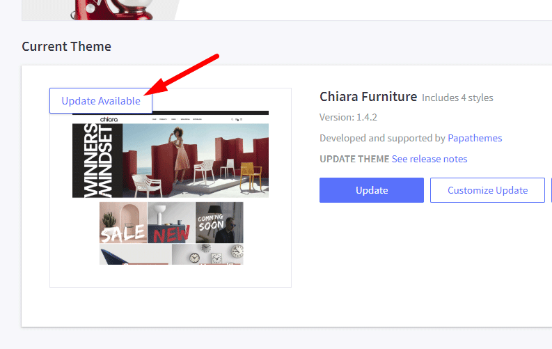
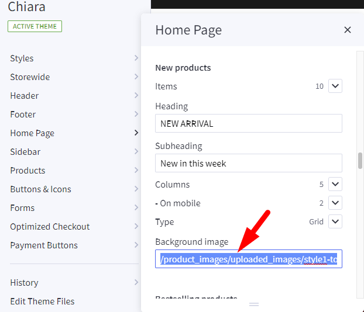

# How to update Chiara theme

Log into your admin panel, go to **Storefront** > **My Themes** > click **Update Available** button appears on the theme thumbnail.

## Additional note for updating 1.4 to 1.5

If you're updating your theme to version 1.5, you may need to update some theme settings manually.

If your New Products, Bestselling Products or Featured Products doesn't have background image previously, you may need to remove the default images from Theme Editor. Open **Theme Editor** > **Home Page** > **New Products** > Delete the default image in **Background image** text box. Same for Bestselling Products and Featured products.

## How to revert the ealier version

To restore the ealier version, Check this [instruction](https://support.bigcommerce.com/s/article/Marketplace-Theme-Updates#restore) or watch the video below:

<iframe width="560" height="315" src="https://www.youtube.com/embed/eZdmudDUrQE" frameborder="0" allow="accelerometer; autoplay; encrypted-media; gyroscope; picture-in-picture" allowfullscreen></iframe>

